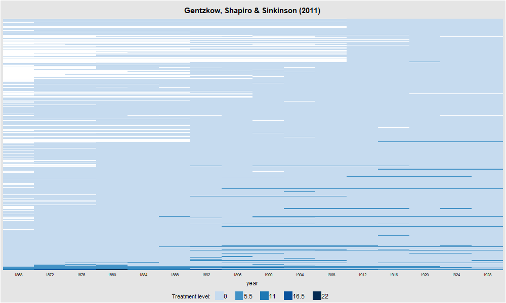
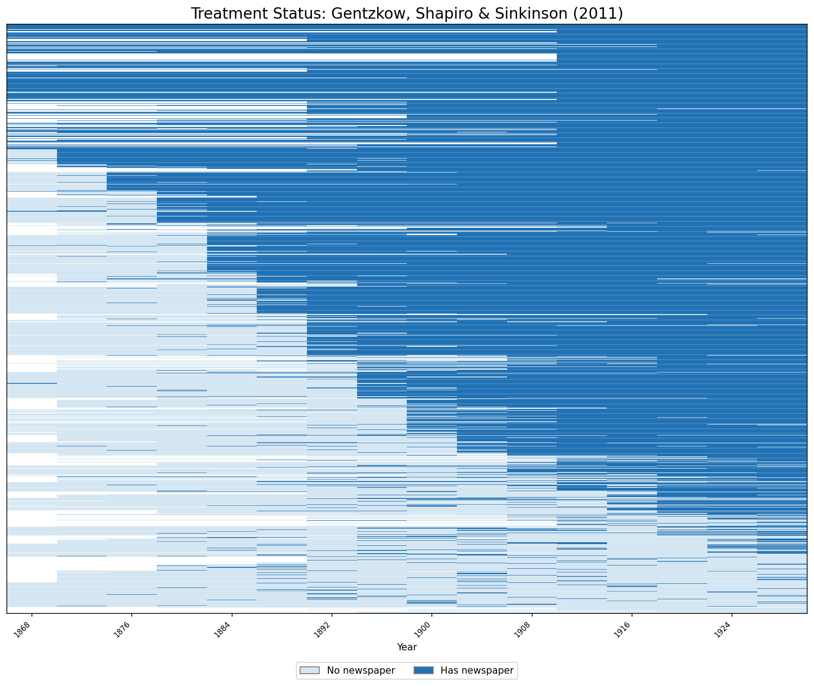

## Overview

Dataset: **Gentzkow, Shapiro & Sinkinson (2011)** — `gentzkowetal_didtextbook.dta`

This chapter investigates what the TWFE estimator $\hat{\beta}^{fe}$ estimates outside the classical design, using the effect of newspapers on voter turnout. The design features a non-binary treatment (number of newspapers), non-absorbing treatment changes, and variation in treatment timing across 1,195 US counties from 1872 to 1928.

Key tool: the `twowayfeweights` package (Stata/R) decomposes $\hat{\beta}^{fe}$ into a weighted sum of treatment effects, where some weights may be negative — meaning $\hat{\beta}^{fe}$ may not estimate a convex combination of effects.

No event-study plots in this chapter — only numerical outputs from regressions and decompositions.

---

## Panel View

::: {.panel-tabset}

### Stata

```stata
* ssc install panelview, replace
copy "https://raw.githubusercontent.com/anzonyquispe/did_book/main/cc_xd_didtextbook_2025_9_30/Data%20sets/Gentzkow%20et%20al%202011/gentzkowetal_didtextbook.dta" "gentzkowetal_didtextbook.dta", replace
use "gentzkowetal_didtextbook.dta", clear

panelview prestout has_newspaper, i(cnty90) t(year) type(treat) title("Treatment Status: Gentzkow, Shapiro & Sinkinson (2011)") legend(label(1 "No newspaper") label(2 "Has newspaper")) ylabel(none) ytitle("")
graph export "figures/ch05_panelview_stata.png", replace width(1200)
```


### R

```r
library(panelView)
load(url("https://raw.githubusercontent.com/anzonyquispe/did_book/main/cc_xd_didtextbook_2025_9_30/Data%20sets/Gentzkow%20et%20al%202011/gentzkowetal_didtextbook.RData"))
png("figures/ch05_panelview_R.png", width = 1000, height = 600)
panelview(prestout ~ numdailies, data = df, index = c("cnty90", "year"), type = "treat",
          main = "Gentzkow, Shapiro & Sinkinson (2011)", ylab = "")
dev.off()
```



### Python

```python
import pandas as pd
import matplotlib.pyplot as plt
import matplotlib.colors as mcolors
from matplotlib.patches import Patch

df = pd.read_parquet("https://raw.githubusercontent.com/anzonyquispe/did_book/main/cc_xd_didtextbook_2025_9_30/Data%20sets/Gentzkow%20et%20al%202011/gentzkowetal_didtextbook.parquet")
df["has_newspaper"] = (df["numdailies"] > 0).astype(int)
pv = df.pivot_table(index="cnty90", columns="year", values="has_newspaper", aggfunc="first")
pv_sorted = pv.loc[pv.mean(axis=1).sort_values(ascending=False).index]
cmap = mcolors.ListedColormap(["#D4E6F1", "#2171B5"])
fig, ax = plt.subplots(figsize=(12, 10))
ax.imshow(pv_sorted.values, aspect="auto", cmap=cmap, interpolation="nearest", vmin=0, vmax=1)
for i in range(0, len(pv_sorted), 10):
    ax.axhline(y=i - 0.5, color="white", linewidth=0.15)
ax.set_xticks(range(0, len(pv_sorted.columns), 2))
ax.set_xticklabels([int(c) for c in pv_sorted.columns[::2]], rotation=45, ha="right", fontsize=8)
ax.set_yticks([])
ax.set_xlabel("year")
ax.set_title("Treatment Status: Gentzkow, Shapiro & Sinkinson (2011)", fontsize=16)
ax.legend(handles=[Patch(facecolor="#D4E6F1", edgecolor="gray", label="No newspaper"),
                   Patch(facecolor="#2171B5", edgecolor="gray", label="Has newspaper")],
          loc="lower center", bbox_to_anchor=(0.5, -0.12), ncol=2)
plt.tight_layout()
plt.savefig("figures/ch05_panelview_Python.png", dpi=150, bbox_inches="tight")
plt.show()
```



:::

---

## 5.6.1 Basic TWFE Regression

Regress turnout on number of newspapers and county and year FEs, clustering standard errors at the county level. Then decompose $\hat{\beta}^{fe}$ using `twowayfeweights`.

::: {.panel-tabset}

### Stata

```stata
copy "https://raw.githubusercontent.com/anzonyquispe/did_book/main/cc_xd_didtextbook_2025_9_30/Data%20sets/Gentzkow%20et%20al%202011/gentzkowetal_didtextbook.dta" "gentzkowetal_didtextbook.dta", replace
use "gentzkowetal_didtextbook.dta", clear
areg prestout i.year numdailies, absorb(cnty90) cluster(cnty90)
```

```
Linear regression, absorbing indicators             Number of obs     = 16,872
Absorbed variable: cnty90                           No. of categories =  1,195
                                                    F(16, 1194)       = 310.47
                                                    Prob > F          = 0.0000
                                                    R-squared         = 0.7006
                                                    Adj R-squared     = 0.6774
                                                    Root MSE          = 0.1255

                             (Std. err. adjusted for 1,195 clusters in cnty90)
------------------------------------------------------------------------------
             |               Robust
    prestout | Coefficient  std. err.      t    P>|t|     [95% conf. interval]
-------------+----------------------------------------------------------------
        year |
       1872  |  -.0117399   .0084998    -1.38   0.167    -.0284162    .0049364
       1876  |   .0682968   .0079161     8.63   0.000     .0527658    .0838278
       1880  |   .0707524   .0084285     8.39   0.000     .0542160    .0872888
       1884  |   .0743330   .0093760     7.93   0.000     .0559377    .0927284
       1888  |   .0837409   .0095892     8.73   0.000     .0649273    .1025545
       1892  |   .0409980   .0096998     4.23   0.000     .0219675    .0600285
       1896  |   .0730286   .0106514     6.86   0.000     .0521311    .0939262
       1900  |   .0143816   .0112282     1.28   0.200    -.0076475    .0364107
       1904  |  -.0782734   .0109829    -7.13   0.000    -.0998212   -.0567255
       1908  |  -.0663333   .0111551    -5.95   0.000    -.0882192   -.0444474
       1912  |  -.1294217   .0110474   -11.72   0.000    -.1510962   -.1077473
       1916  |  -.0910842   .0111088    -8.20   0.000    -.1128791   -.0692893
       1920  |  -.1519845   .0108909   -13.96   0.000    -.1733520   -.1306170
       1924  |  -.1649369   .0109407   -15.08   0.000    -.1864020   -.1434718
       1928  |  -.1102546   .0108236   -10.19   0.000    -.1314900   -.0890193
             |
  numdailies |   .0029393   .0016283     1.81   0.071    -.0002553    .0061339
       _cons |   .6764326   .0082986    81.51   0.000     .6601511    .6927140
------------------------------------------------------------------------------
```

```stata
* ssc install twowayfeweights, replace
copy "https://raw.githubusercontent.com/anzonyquispe/did_book/main/cc_xd_didtextbook_2025_9_30/Data%20sets/Gentzkow%20et%20al%202011/gentzkowetal_didtextbook.dta" "gentzkowetal_didtextbook.dta", replace
use "gentzkowetal_didtextbook.dta", clear
twowayfeweights prestout cnty90 year numdailies, type(feTR)
```

```
Under the common trends assumption,
the TWFE coefficient beta, equal to 0.0029, estimates a weighted sum of 10378 ATTs.
6180 ATTs receive a positive weight, and 4198 receive a negative weight.
------------------------------------------------
Treat. var: numdailies  # ATTs      Σ weights
------------------------------------------------
Positive weights        6180        1.4740
Negative weights        4198        -0.4740
------------------------------------------------
Total                   10378       1.0000
------------------------------------------------
```

### R

```r
library(haven); library(fixest)
load(url("https://raw.githubusercontent.com/anzonyquispe/did_book/main/cc_xd_didtextbook_2025_9_30/Data%20sets/Gentzkow%20et%20al%202011/gentzkowetal_didtextbook.RData"))
model1 <- feols(prestout ~ numdailies + i(year) | cnty90,
                data = df, cluster = ~cnty90,
                ssc = ssc(fixef.K = "full"))
```

```
Dep. var.: prestout | Obs: 16872 | FE: cnty90 | Cluster: cnty90
------------------------------------------------------------------------------------------
Variable                   Coefficient    Std. Err.    t value   Pr(>|t|)         2.5%        97.5%
------------------------------------------------------------------------------------------
numdailies                   0.0029393    0.0016283       1.81      0.071   -0.0002553    0.0061339
year::1872                  -0.0117399    0.0084998      -1.38      0.167   -0.0284162    0.0049364
year::1876                   0.0682968    0.0079161       8.63      0.000    0.0527658    0.0838278
year::1880                   0.0707524    0.0084285       8.39      0.000    0.0542160    0.0872888
year::1884                   0.0743330    0.0093760       7.93      0.000    0.0559377    0.0927284
year::1888                   0.0837409    0.0095892       8.73      0.000    0.0649273    0.1025545
year::1892                   0.0409980    0.0096998       4.23      0.000    0.0219675    0.0600285
year::1896                   0.0730286    0.0106514       6.86      0.000    0.0521311    0.0939262
year::1900                   0.0143816    0.0112282       1.28      0.200   -0.0076475    0.0364107
year::1904                  -0.0782734    0.0109829      -7.13      0.000   -0.0998212   -0.0567255
year::1908                  -0.0663333    0.0111551      -5.95      0.000   -0.0882192   -0.0444474
year::1912                  -0.1294217    0.0110474     -11.72      0.000   -0.1510962   -0.1077473
year::1916                  -0.0910842    0.0111088      -8.20      0.000   -0.1128791   -0.0692893
year::1920                  -0.1519845    0.0108909     -13.96      0.000   -0.1733520   -0.1306170
year::1924                  -0.1649369    0.0109407     -15.08      0.000   -0.1864020   -0.1434718
year::1928                  -0.1102546    0.0108236     -10.19      0.000   -0.1314900   -0.0890193
------------------------------------------------------------------------------------------
```

```r
library(haven); library(TwoWayFEWeights)
load(url("https://raw.githubusercontent.com/anzonyquispe/did_book/main/cc_xd_didtextbook_2025_9_30/Data%20sets/Gentzkow%20et%20al%202011/gentzkowetal_didtextbook.RData"))
decomp1 <- twowayfeweights(df, "prestout", "cnty90", "year",
                            "numdailies", type = "feTR")
```

```
Under the common trends assumption,
the TWFE coefficient beta, equal to 0.0029, estimates a weighted sum of 10378 ATTs.
6180 ATTs receive a positive weight, and 4198 receive a negative weight.

Treat. var: numdailies     ATTs    Σ weights
Positive weights           6180        1.474
Negative weights           4198       -0.474
Total                     10378            1
```

### Python

```python
import pandas as pd
import pyfixest as pf
df = pd.read_parquet("https://raw.githubusercontent.com/anzonyquispe/did_book/main/cc_xd_didtextbook_2025_9_30/Data%20sets/Gentzkow%20et%20al%202011/gentzkowetal_didtextbook.parquet")
m1 = pf.feols(
    "prestout ~ numdailies + C(year) | cnty90",
    data=df,
    vcov={"CRV1": "cnty90"},
    ssc=pf.ssc(adj=True, fixef_k="full", cluster_adj=True)
)
```

```
Dep. var.:      prestout
Observations:   16872
Fixed effects:  cnty90
Cluster var:    cnty90
--------------------------------------------------------------------------------
Variable              Coefficient    Std. Err.          t      P>|t|                 [95% CI]
--------------------------------------------------------------------------------
numdailies              0.0029393    0.0016283       1.81      0.071 [-0.0002521,  0.0061308]
year::1872             -0.0117399    0.0084998      -1.38      0.167 [-0.0283996,  0.0049198]
year::1876              0.0682968    0.0079161       8.63      0.000 [ 0.0527813,  0.0838123]
year::1880              0.0707524    0.0084285       8.39      0.000 [ 0.0542325,  0.0872723]
year::1884              0.0743330    0.0093760       7.93      0.000 [ 0.0559560,  0.0927101]
year::1888              0.0837409    0.0095892       8.73      0.000 [ 0.0649460,  0.1025357]
year::1892              0.0409980    0.0096998       4.23      0.000 [ 0.0219864,  0.0600096]
year::1896              0.0730286    0.0106514       6.86      0.000 [ 0.0521519,  0.0939054]
year::1900              0.0143816    0.0112282       1.28      0.200 [-0.0076256,  0.0363888]
year::1904             -0.0782734    0.0109829      -7.13      0.000 [-0.0997998, -0.0567469]
year::1908             -0.0663333    0.0111551      -5.95      0.000 [-0.0881974, -0.0444692]
year::1912             -0.1294217    0.0110474     -11.72      0.000 [-0.1510746, -0.1077688]
year::1916             -0.0910842    0.0111088      -8.20      0.000 [-0.1128574, -0.0693110]
year::1920             -0.1519845    0.0108909     -13.96      0.000 [-0.1733307, -0.1306383]
year::1924             -0.1649369    0.0109407     -15.08      0.000 [-0.1863807, -0.1434932]
year::1928             -0.1102546    0.0108236     -10.19      0.000 [-0.1314688, -0.0890405]
--------------------------------------------------------------------------------
```

```python
import pandas as pd
from twowayfeweights import twowayfeweights
df = pd.read_parquet("https://raw.githubusercontent.com/anzonyquispe/did_book/main/cc_xd_didtextbook_2025_9_30/Data%20sets/Gentzkow%20et%20al%202011/gentzkowetal_didtextbook.parquet")
result = twowayfeweights(df, "prestout", "cnty90", "year", "numdailies",
                          type="feTR")
```

```
Under the common trends assumption,
beta estimates a weighted sum of 10378 ATTs.
6180 ATTs receive a positive weight, and 4198 receive a negative weight.
------------------------------------------------
Treat. var: numdailies  # ATTs      Σ weights
------------------------------------------------
Positive weights        6180        1.4740
Negative weights        4198        -0.4740
------------------------------------------------
Total                   10378       1.0000
------------------------------------------------
```

:::

---

## 5.6.2 TWFE Regression with State-Year FEs

Regress turnout on number of newspapers and county, year, and state-year FEs. Then decompose using `twowayfeweights` with the controls option.

::: {.panel-tabset}

### Stata

```stata
copy "https://raw.githubusercontent.com/anzonyquispe/did_book/main/cc_xd_didtextbook_2025_9_30/Data%20sets/Gentzkow%20et%20al%202011/gentzkowetal_didtextbook.dta" "gentzkowetal_didtextbook.dta", replace
use "gentzkowetal_didtextbook.dta", clear
qui tab styr, gen(styr)
qui areg prestout i.year i.styr numdailies, absorb(cnty90) cluster(cnty90)
display "numdailies:  coef = " %12.7f _b[numdailies] "  se = " %12.7f _se[numdailies]
```

```
numdailies:  coef =   -0.0012122  se =    0.0010962  t =   -1.10578
```

```stata
* ssc install twowayfeweights, replace
copy "https://raw.githubusercontent.com/anzonyquispe/did_book/main/cc_xd_didtextbook_2025_9_30/Data%20sets/Gentzkow%20et%20al%202011/gentzkowetal_didtextbook.dta" "gentzkowetal_didtextbook.dta", replace
use "gentzkowetal_didtextbook.dta", clear
twowayfeweights prestout cnty90 year numdailies, type(feTR) controls(styr1-styr683)
```

```
Under the common trends assumption,
the TWFE coefficient beta, equal to -0.0012, estimates a weighted sum of 10342 ATTs.
6195 ATTs receive a positive weight, and 4147 receive a negative weight.
10378 (g,t) cells receive the treatment, but the ATTs of 36 cells receive a weight equal to zero.
------------------------------------------------
Treat. var: numdailies  # ATTs      Σ weights
------------------------------------------------
Positive weights        6195        1.5331
Negative weights        4147        -0.5331
------------------------------------------------
Total                   10342       1.0000
------------------------------------------------
```

### R

```r
library(haven)
load(url("https://raw.githubusercontent.com/anzonyquispe/did_book/main/cc_xd_didtextbook_2025_9_30/Data%20sets/Gentzkow%20et%20al%202011/gentzkowetal_didtextbook.RData"))
model2 <- feols(prestout ~ numdailies + i(year) + i(styr) | cnty90,
                data = df, cluster = ~cnty90,
                ssc = ssc(fixef.K = "full"))
```

```
numdailies:  coef =   -0.0012122  se =    0.0010962  t =   -1.10578
```

```r
library(haven)
load(url("https://raw.githubusercontent.com/anzonyquispe/did_book/main/cc_xd_didtextbook_2025_9_30/Data%20sets/Gentzkow%20et%20al%202011/gentzkowetal_didtextbook.RData"))
decomp2 <- twowayfeweights(df, "prestout", "cnty90", "year",
                            "numdailies", type = "feTR",
                            controls = styr_cols)
```

```
Under the common trends assumption,
the TWFE coefficient beta, equal to -0.0012, estimates a weighted sum of 10342 ATTs.
6195 ATTs receive a positive weight, and 4147 receive a negative weight.
10378 (g,t) cells receive the treatment, but the ATTs of 36 cells receive a weight equal to zero.

Treat. var: numdailies     ATTs    Σ weights
Positive weights           6195       1.5331
Negative weights           4147      -0.5331
Total                     10342            1
```

### Python

```python
import pandas as pd
df = pd.read_parquet("https://raw.githubusercontent.com/anzonyquispe/did_book/main/cc_xd_didtextbook_2025_9_30/Data%20sets/Gentzkow%20et%20al%202011/gentzkowetal_didtextbook.parquet")
m2 = pf.feols(
    "prestout ~ numdailies + C(year) + C(styr) | cnty90",
    data=df,
    vcov={"CRV1": "cnty90"},
    ssc=pf.ssc(adj=True, fixef_k="full", cluster_adj=True)
)
```

```
numdailies:  coef =   -0.0012122  se =    0.0010962  t =   -1.10578
(year and state-year FEs absorbed, not shown)
```

```python
import pandas as pd
df = pd.read_parquet("https://raw.githubusercontent.com/anzonyquispe/did_book/main/cc_xd_didtextbook_2025_9_30/Data%20sets/Gentzkow%20et%20al%202011/gentzkowetal_didtextbook.parquet")
# Decomposition with state-year controls
styr_cols = sorted([c for c in df.columns if c.startswith("styr") and c != "styr"])
result = twowayfeweights(df, "prestout", "cnty90", "year", "numdailies",
                          type="feTR", controls=styr_cols)
```

```
Under the common trends assumption,
beta estimates a weighted sum of 10342 ATTs.
6195 ATTs receive a positive weight, and 4147 receive a negative weight.
36 ATTs receive a weight equal to 0.
------------------------------------------------
Treat. var: numdailies  # ATTs      Σ weights
------------------------------------------------
Positive weights        6195        1.5331
Negative weights        4147        -0.5331
------------------------------------------------
Total                   10342       1.0000
------------------------------------------------
```

:::

---

## 5.6.3 FD Regression with State-Year FEs

Regress the change in turnout on the change in number of newspapers and state-year FEs. Decompose using `twowayfeweights` with `type(fdTR)`, and test if weights are correlated with the year variable.

::: {.panel-tabset}

### Stata

```stata
copy "https://raw.githubusercontent.com/anzonyquispe/did_book/main/cc_xd_didtextbook_2025_9_30/Data%20sets/Gentzkow%20et%20al%202011/gentzkowetal_didtextbook.dta" "gentzkowetal_didtextbook.dta", replace
use "gentzkowetal_didtextbook.dta", clear
areg changeprestout changedailies, absorb(styr) cluster(cnty90)
```

```
Linear regression, absorbing indicators             Number of obs     = 15,627
Absorbed variable: styr                             No. of categories =    634
                                                    F(1, 1194)        =   7.68
                                                    Prob > F          = 0.0057
                                                    R-squared         = 0.5690
                                                    Adj R-squared     = 0.5507
                                                    Root MSE          = 0.0816

                              (Std. err. adjusted for 1,195 clusters in cnty90)
-------------------------------------------------------------------------------
              |               Robust
changeprest~t | Coefficient  std. err.      t    P>|t|     [95% conf. interval]
--------------+----------------------------------------------------------------
changedailies |   .0025907   .0009351     2.77   0.006     .0007561    .0044252
        _cons |  -.0072455   .0003658   -19.81   0.000    -.0079632   -.0065278
-------------------------------------------------------------------------------
```

```stata
* ssc install twowayfeweights, replace
copy "https://raw.githubusercontent.com/anzonyquispe/did_book/main/cc_xd_didtextbook_2025_9_30/Data%20sets/Gentzkow%20et%20al%202011/gentzkowetal_didtextbook.dta" "gentzkowetal_didtextbook.dta", replace
use "gentzkowetal_didtextbook.dta", clear
twowayfeweights changeprestout cnty90 year changedailies numdailies, type(fdTR) controls(styr1-styr683)
```

```
Under the common trends assumption,
the TWFE coefficient beta, equal to 0.0026, estimates a weighted sum of 9876 ATTs.
5371 ATTs receive a positive weight, and 4505 receive a negative weight.
10378 (g,t) cells receive the treatment, but the ATTs of 502 cells receive a weight equal to zero.
------------------------------------------------
Treat. var: changedailies  # ATTs      Σ weights
------------------------------------------------
Positive weights           5371        2.4271
Negative weights           4505        -1.4271
------------------------------------------------
Total                      9876        1.0000
------------------------------------------------
```

```stata
* ssc install twowayfeweights, replace
copy "https://raw.githubusercontent.com/anzonyquispe/did_book/main/cc_xd_didtextbook_2025_9_30/Data%20sets/Gentzkow%20et%20al%202011/gentzkowetal_didtextbook.dta" "gentzkowetal_didtextbook.dta", replace
use "gentzkowetal_didtextbook.dta", clear
twowayfeweights changeprestout cnty90 year changedailies numdailies, type(fdTR) controls(styr1-styr683) test_random_weights(year)
```

```
Regression of variables possibly correlated with the treatment effect on the weights

             Coef           SE       t-stat  Correlation
year    -.1674271    .05101171   -3.2821307    -.0631614
```

### R

```r
library(haven)
load(url("https://raw.githubusercontent.com/anzonyquispe/did_book/main/cc_xd_didtextbook_2025_9_30/Data%20sets/Gentzkow%20et%20al%202011/gentzkowetal_didtextbook.RData"))
model3 <- feols(changeprestout ~ changedailies | styr,
                data = df, cluster = ~cnty90,
                ssc = ssc(fixef.K = "full"))
```

```
Dep. var.: changeprestout | Obs: 15607 | FE: styr | Cluster: cnty90
------------------------------------------------------------------------------------------
Variable                   Coefficient    Std. Err.    t value   Pr(>|t|)         2.5%        97.5%
------------------------------------------------------------------------------------------
changedailies                0.0025907    0.0009345       2.77     0.0057    0.0007573    0.0044241
------------------------------------------------------------------------------------------
```

```r
library(haven)
load(url("https://raw.githubusercontent.com/anzonyquispe/did_book/main/cc_xd_didtextbook_2025_9_30/Data%20sets/Gentzkow%20et%20al%202011/gentzkowetal_didtextbook.RData"))
decomp3 <- twowayfeweights(df, "changeprestout", "cnty90", "year",
                            "changedailies", D0 = "numdailies",
                            type = "fdTR", controls = styr_cols)
```

```
Under the common trends assumption,
the TWFE coefficient beta, equal to 0.0026, estimates a weighted sum of 9876 ATTs.
5371 ATTs receive a positive weight, and 4505 receive a negative weight.
10378 (g,t) cells receive the treatment, but the ATTs of 502 cells receive a weight equal to zero.

Treat. var: changedailies    ATTs    Σ weights
Positive weights             5371       2.4271
Negative weights             4505      -1.4271
Total                        9876            1
```

```r
library(haven)
load(url("https://raw.githubusercontent.com/anzonyquispe/did_book/main/cc_xd_didtextbook_2025_9_30/Data%20sets/Gentzkow%20et%20al%202011/gentzkowetal_didtextbook.RData"))
decomp3_test <- twowayfeweights(df, "changeprestout", "cnty90", "year",
                                 "changedailies", D0 = "numdailies",
                                 type = "fdTR", controls = styr_cols,
                                 test_random_weights = "year")
```

```
Regression of variables possibly correlated with the treatment effect on the weights:
              Coef         SE    t-stat Correlation
RW_year -0.1674271 0.05101171 -3.282131  -0.0631614
```

### Python

```python
import pandas as pd
df = pd.read_parquet("https://raw.githubusercontent.com/anzonyquispe/did_book/main/cc_xd_didtextbook_2025_9_30/Data%20sets/Gentzkow%20et%20al%202011/gentzkowetal_didtextbook.parquet")
m3 = pf.feols(
    "changeprestout ~ changedailies | styr",
    data=df,
    vcov={"CRV1": "cnty90"},
    ssc=pf.ssc(adj=True, fixef_k="full", cluster_adj=True),
    fixef_rm="none"
)
```

```
Dep. var.:      changeprestout
Observations:   15627
Fixed effects:  styr
Cluster var:    cnty90
--------------------------------------------------------------------------------
Variable              Coefficient    Std. Err.          t      P>|t|                 [95% CI]
--------------------------------------------------------------------------------
changedailies           0.0025907    0.0009351       2.77     0.0057 [ 0.0007580,  0.0044234]
--------------------------------------------------------------------------------
```

```python
import pandas as pd
df = pd.read_parquet("https://raw.githubusercontent.com/anzonyquispe/did_book/main/cc_xd_didtextbook_2025_9_30/Data%20sets/Gentzkow%20et%20al%202011/gentzkowetal_didtextbook.parquet")
# FD weight decomposition (fdTR type)
result3 = twowayfeweights(df, "changeprestout", "cnty90", "year",
                           "changedailies", type="fdTR", D0="numdailies",
                           controls=styr_cols)
```

```
Under the common trends assumption,
beta estimates a weighted sum of 9876 ATTs.
5371 ATTs receive a positive weight, and 4505 receive a negative weight.
502 ATTs receive a weight equal to 0.
------------------------------------------------
Treat. var: changedailies # ATTs     Σ weights
------------------------------------------------
Positive weights        5371        2.4271
Negative weights        4505        -1.4271
------------------------------------------------
Total                   9876        1.0000
------------------------------------------------
```

```python
import pandas as pd
df = pd.read_parquet("https://raw.githubusercontent.com/anzonyquispe/did_book/main/cc_xd_didtextbook_2025_9_30/Data%20sets/Gentzkow%20et%20al%202011/gentzkowetal_didtextbook.parquet")
# Test random weights (year)
result3b = twowayfeweights(df, "changeprestout", "cnty90", "year",
                            "changedailies", type="fdTR", D0="numdailies",
                            controls=styr_cols, test_random_weights="year")
```

```
Regression of variables possibly correlated with the treatment effect on the weights

             Coef           SE       t-stat  Correlation
year   -0.1674271    0.0510117   -3.2821306   -0.0631614
```

:::
