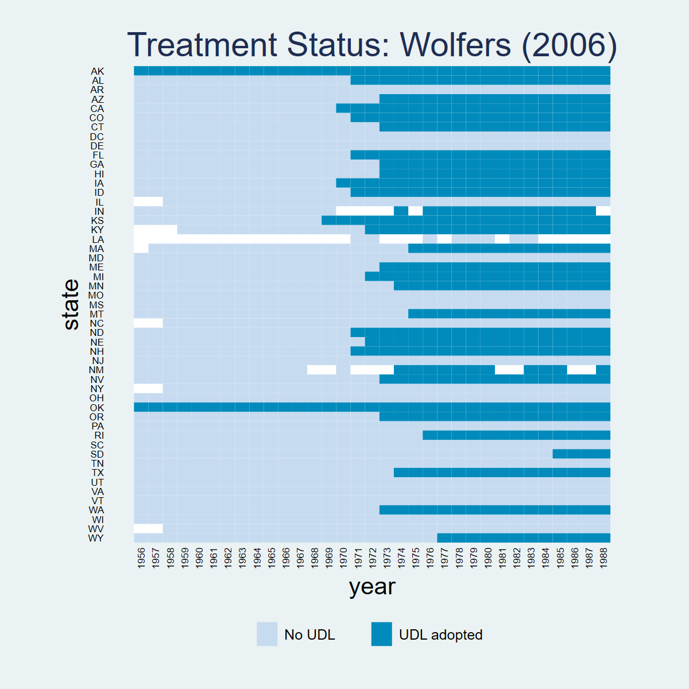
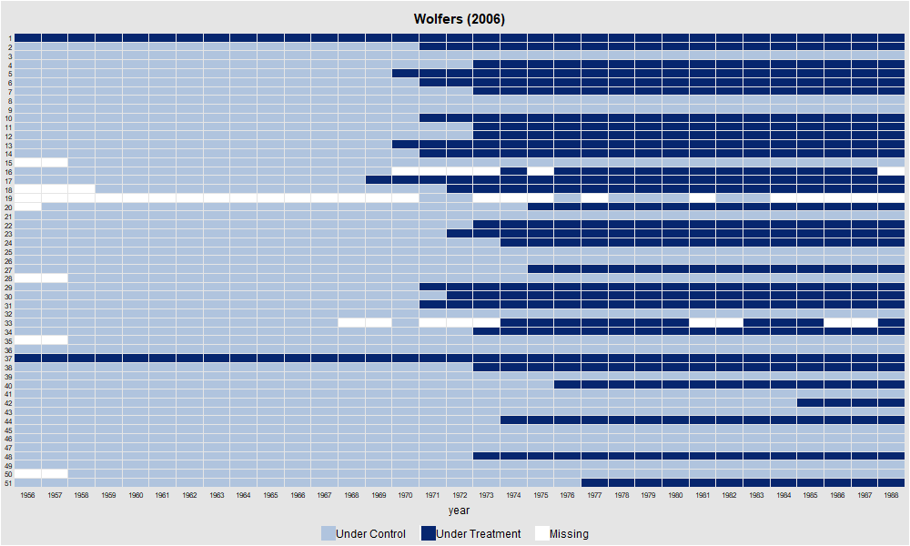
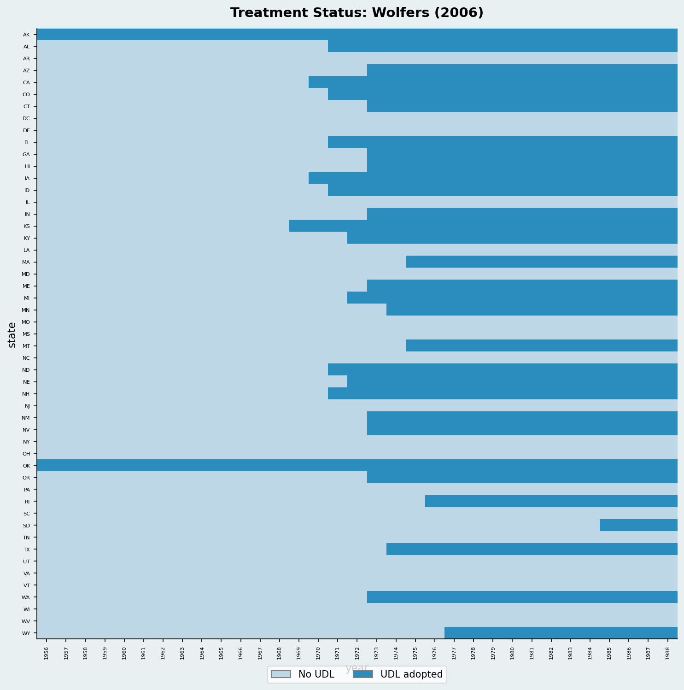
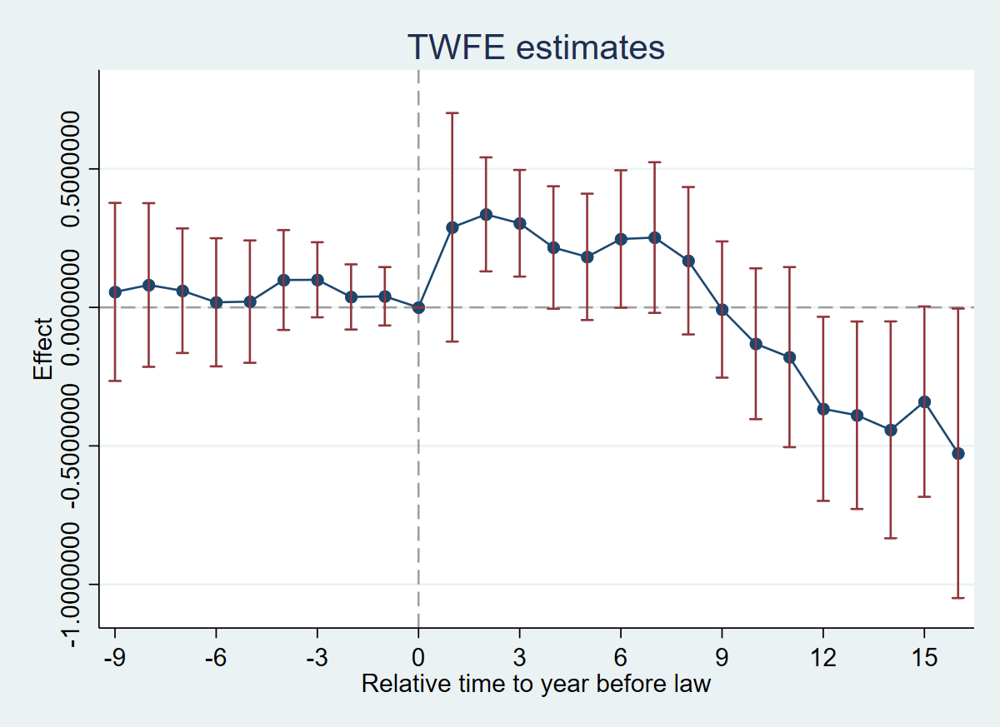
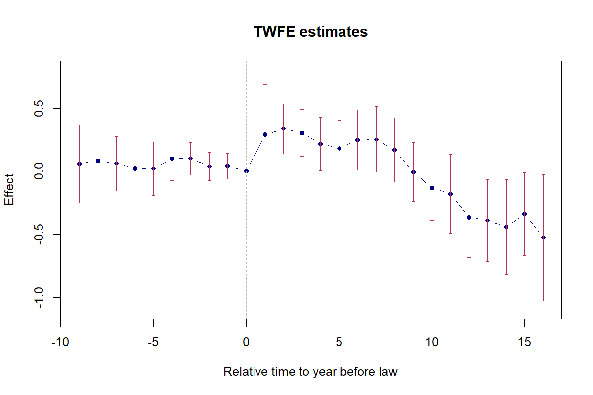
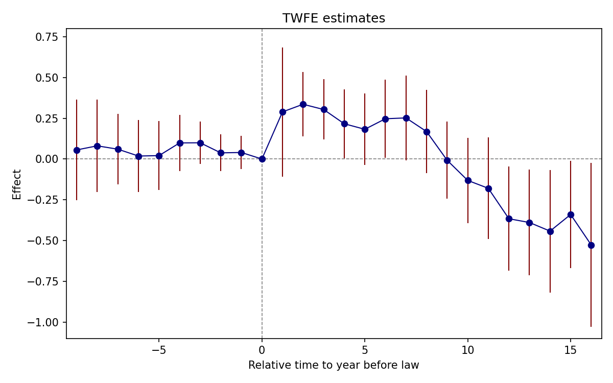
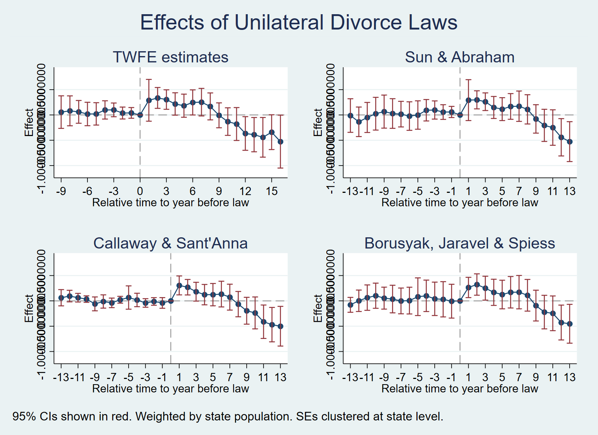
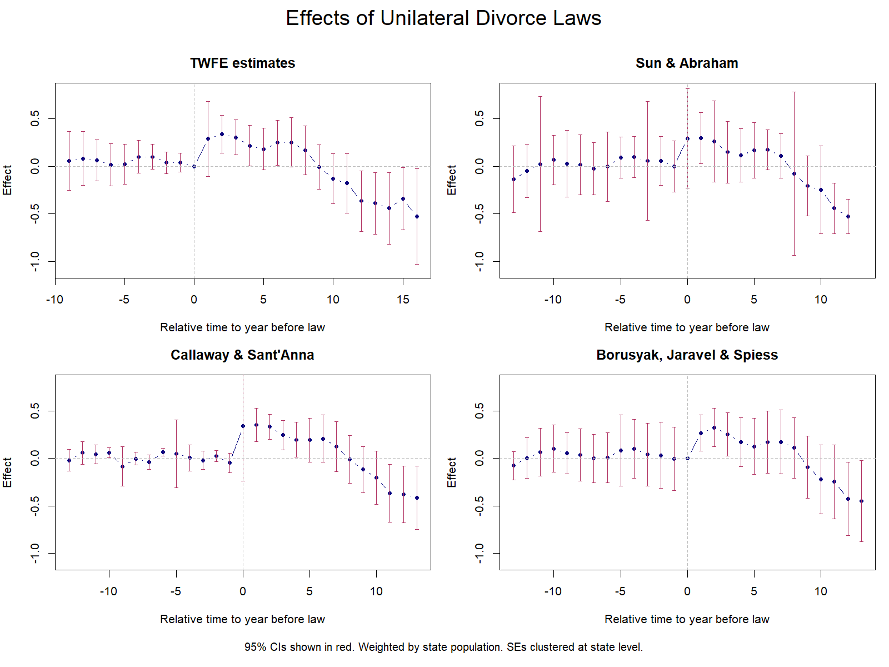
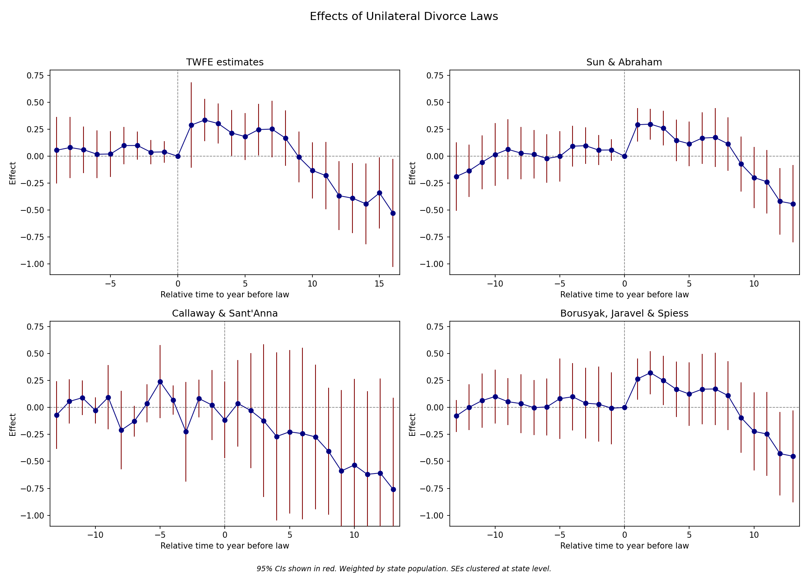

## Overview

Dataset: **Wolfers (2006)** — `wolfers2006_didtextbook.dta`

This chapter analyzes the effect of unilateral divorce laws (UDL) on divorce rates using a binary-and-staggered design. Between 1968 and 1988, 29 US states adopted UDLs. The panel covers 51 states from 1956 to 1988, with population weights and state-clustered standard errors throughout.

Key topics: decomposition of the static TWFE estimator, event-study TWFE, and four heterogeneity-robust estimators (Sun & Abraham, Callaway & Sant'Anna, de Chaisemartin & D'Haultfœuille, Borusyak et al.).

---

## PanelView

::: {.panel-tabset}

### Stata



```stata
* ssc install panelview, replace
copy "https://raw.githubusercontent.com/anzonyquispe/did_book/main/cc_xd_didtextbook_2025_9_30/Data%20sets/Wolfers%202006/wolfers2006_didtextbook.dta" "wolfers2006_didtextbook.dta", replace
use "wolfers2006_didtextbook.dta", clear
panelview div_rate udl, i(state) t(year) type(treat) title("Treatment Status: Wolfers (2006)") legend(label(1 "No UDL") label(2 "UDL adopted"))
```

### R

```r
library(panelView)
load(url("https://raw.githubusercontent.com/anzonyquispe/did_book/main/cc_xd_didtextbook_2025_9_30/Data%20sets/Wolfers%202006/wolfers2006_didtextbook.RData"))
png("figures/ch06_panelview_R.png", width = 1000, height = 600)
panelview(div_rate ~ udl, data = df, index = c("state", "year"), type = "treat",
          main = "Wolfers (2006)", ylab = "")
dev.off()
```



### Python



```python
import pandas as pd
import matplotlib.pyplot as plt
import matplotlib.colors as mcolors
from matplotlib.patches import Patch
df = pd.read_parquet("https://raw.githubusercontent.com/anzonyquispe/did_book/main/cc_xd_didtextbook_2025_9_30/Data%20sets/Wolfers%202006/wolfers2006_didtextbook.parquet")
states_sorted = (df.groupby("state")["cohort"]
                 .first().sort_values(ascending=False).index)
state_idx = {s: i for i, s in enumerate(states_sorted)}
years = sorted(df["year"].unique())

fig, ax = plt.subplots(figsize=(14, 10))
cmap = mcolors.ListedColormap(["#4292C6", "#EF6548"])
for _, row in df.iterrows():
    si = state_idx[row["state"]]
    yi = years.index(row["year"])
    color = 1 if row["udl"] == 1 else 0
    ax.add_patch(plt.Rectangle((yi, si), 1, 1, color=cmap(color)))

ax.set_xlim(0, len(years)); ax.set_ylim(0, len(states_sorted))
ax.set_xticks(range(0, len(years), 5))
ax.set_xticklabels([str(int(years[i])) for i in range(0, len(years), 5)],
                    rotation=45, fontsize=7)
ax.set_yticks([i + 0.5 for i in range(len(states_sorted))])
ax.set_yticklabels(states_sorted, fontsize=6)
ax.set_xlabel("Year"); ax.set_ylabel("State")
ax.set_title("Treatment Status: Wolfers (2006)")
legend_elements = [Patch(facecolor="#4292C6", label="Control"),
                   Patch(facecolor="#EF6548", label="Treated")]
ax.legend(handles=legend_elements, loc="lower right")
plt.tight_layout()
plt.savefig(FIGDIR / "ch06_panelview_Python.png", dpi=150)
```

:::

---

## 6.2.1 Static TWFE Regression (GQ1)

> Run the static TWFE regression of `div_rate` on state and year FEs and the UDL treatment, weighting by population and clustering at the state level. Do UDLs have an effect on divorces?

::: {.panel-tabset}

### Stata

```stata
copy "https://raw.githubusercontent.com/anzonyquispe/did_book/main/cc_xd_didtextbook_2025_9_30/Data%20sets/Wolfers%202006/wolfers2006_didtextbook.dta" "wolfers2006_didtextbook.dta", replace
use "wolfers2006_didtextbook.dta", clear
reg div_rate udl i.state i.year [w=stpop], vce(cluster state)
```

```
Linear regression                               Number of obs     =      1,631
                                                R-squared         =     0.9305
                                                Root MSE          =     .52417

                                 (Std. err. adjusted for 51 clusters in state)
------------------------------------------------------------------------------
             |               Robust
    div_rate | Coefficient  std. err.      t    P>|t|     [95% conf. interval]
-------------+----------------------------------------------------------------
         udl |  -.0548378   .1507695    -0.36   0.718    -.3576673    .2479917
------------------------------------------------------------------------------
```

### R

```r
library(haven); library(fixest)
load(url("https://raw.githubusercontent.com/anzonyquispe/did_book/main/cc_xd_didtextbook_2025_9_30/Data%20sets/Wolfers%202006/wolfers2006_didtextbook.RData"))
m1 <- feols(div_rate ~ udl + i(year) | state,
            data = df, weights = ~stpop, cluster = ~state,
            ssc = ssc(fixef.K = "full"))
```

```
Variable              Coefficient      Std. err.          t   [95% Conf. Interval]
------------------------------------------------------------------------------------------
udl                    -0.0548378      0.1507695      -0.36   [  -0.3503461,    0.2406705]

N = 1631  |  R-sq = 0.9305
```

### Python

```python
import pandas as pd
import pyfixest as pf
df = pd.read_parquet("https://raw.githubusercontent.com/anzonyquispe/did_book/main/cc_xd_didtextbook_2025_9_30/Data%20sets/Wolfers%202006/wolfers2006_didtextbook.parquet")
m1 = pf.feols('div_rate ~ udl + i(year) | state',
              data=df, weights='stpop', vcov={'CRV1': 'state'},
              ssc=pf.ssc(adj=True, fixef_k='full', cluster_adj=True))
```

```
Variable              Coefficient      Std. err.          t   [95% Conf. Interval]
------------------------------------------------------------------------------------------
udl                    -0.0548378      0.1507695      -0.36   [  -0.3503461,    0.2406705]

N = 1631  |  R-sq = 0.9305
```

:::

**Interpretation:** $\hat{\beta}_{fe} = -0.055$ (s.e. = 0.15, p = 0.72). The coefficient is small and insignificant — according to this regression, UDLs do not affect divorce rates.

---

## 6.2.1 Decompose Static TWFE (GQ2)

> Decompose $\hat{\beta}_{fe}$ using `twowayfeweights`. Does it estimate a convex combination of effects? Could it be biased for the ATT?

::: {.panel-tabset}

### Stata

```stata
* ssc install twowayfeweights, replace
copy "https://raw.githubusercontent.com/anzonyquispe/did_book/main/cc_xd_didtextbook_2025_9_30/Data%20sets/Wolfers%202006/wolfers2006_didtextbook.dta" "wolfers2006_didtextbook.dta", replace
use "wolfers2006_didtextbook.dta", clear
twowayfeweights div_rate state year udl, type(feTR) test_random_weights(exposurelength) weight(stpop)
```

```
Under the common trends assumption,
the TWFE coefficient beta, equal to -0.0548, estimates a weighted sum of 522 ATTs.
490 ATTs receive a positive weight, and 32 receive a negative weight.
------------------------------------------------
Treat. var: udl         # ATTs      Σ weights
------------------------------------------------
Positive weights        490         1.0259
Negative weights        32          -0.0259
------------------------------------------------
Total                   522         1.0000
------------------------------------------------

Regression of variables possibly correlated with the treatment effect on the weights

                     Coef           SE       t-stat  Correlation
exposurele~h   -8.2883613    .21360588    -38.80212   -.73253245
```

### R

```r
library(haven); library(TwoWayFEWeights)
load(url("https://raw.githubusercontent.com/anzonyquispe/did_book/main/cc_xd_didtextbook_2025_9_30/Data%20sets/Wolfers%202006/wolfers2006_didtextbook.RData"))
decomp2 <- twowayfeweights(df, "div_rate", "state", "year", "udl",
                            type = "feTR",
                            test_random_weights = "exposurelength",
                            weights = df$stpop)
```

```
Under the common trends assumption,
beta estimates a weighted sum of 522 ATTs.
490 ATTs receive a positive weight, and 32 receive a negative weight.

Treat. var: udl     ATTs    Σ weights
Positive weights     490       1.0259
Negative weights      32      -0.0259
Total                522            1

Regression:
                       Coef        SE    t-stat Correlation
RW_exposurelength -8.288361 0.2136059 -38.80212  -0.7325324
```

### Python

```python
import pandas as pd
from twowayfeweights import twowayfeweights
df = pd.read_parquet("https://raw.githubusercontent.com/anzonyquispe/did_book/main/cc_xd_didtextbook_2025_9_30/Data%20sets/Wolfers%202006/wolfers2006_didtextbook.parquet")
result = twowayfeweights(df, "div_rate", "state", "year", "udl",
                          type="feTR", weights="stpop",
                          test_random_weights="exposurelength")
```

```
Under the common trends assumption,
beta estimates a weighted sum of 522 ATTs.
490 ATTs receive a positive weight, and 32 receive a negative weight.
Sum of positive weights: 1.0259
Sum of negative weights: -0.0259

Regression of variables possibly correlated with the treatment effect on the weights

                     Coef           SE       t-stat  Correlation
exposurelength   -8.288361     0.213606    -38.8021   -0.732532
```

:::

**Interpretation:** Under parallel trends, $\hat{\beta}_{fe}$ estimates a weighted sum of ATTs. The vast majority receive positive weights (sum ≈ 1.026) and 32 receive negative weights (sum ≈ −0.026) — an "almost convex" combination. However, weights are strongly negatively correlated with exposure length (corr = −0.73, t = −38.8): $\hat{\beta}_{fe}$ heavily downweights long-run effects. It could differ from the ATT if treatment effects vary with length of exposure.

---

## 6.2.1.2 Bacon Decomposition (GQ2b)

> Decompose the static TWFE estimator into its $2\times2$ components using Goodman-Bacon (2021).

::: {.panel-tabset}

### Stata

```stata
* ssc install bacondecomp, replace
copy "https://raw.githubusercontent.com/anzonyquispe/did_book/main/cc_xd_didtextbook_2025_9_30/Data%20sets/Wolfers%202006/wolfers2006_didtextbook.dta" "wolfers2006_didtextbook.dta", replace
use "wolfers2006_didtextbook.dta", clear
bacondecomp div_rate udl [aweight=stpop], ddetail
```

```
Bacon Decomposition

                         Overall DD Estimate =  -0.4975

            Number of observations =     1,631
                Number of switchers =        51
------------------------------------------------------
                               Weight     Avg DD Est
------------------------------------------------------
Within Type                     Sum           Sum
------------------------------------------------------
Earlier T vs Later C           0.052        -3.577
Later T vs Earlier C           0.085         3.289
T vs Never treated             0.863        -0.335
------------------------------------------------------
```

### R

```r
library(haven); library(bacondecomp)
load(url("https://raw.githubusercontent.com/anzonyquispe/did_book/main/cc_xd_didtextbook_2025_9_30/Data%20sets/Wolfers%202006/wolfers2006_didtextbook.RData"))
df_bal <- df[complete.cases(df[, c("div_rate", "state", "year", "udl")]), ]
bc <- bacon(div_rate ~ udl, data = df_bal,
            id_var = "state", time_var = "year")
```

```
                              type  weight   estimate
 Earlier vs Later Treatment    0.052     -3.577
 Later vs Earlier Treatment    0.085      3.289
 Treated vs Untreated          0.863     -0.335
```

:::

**Interpretation:** The Bacon decomposition shows that the bulk of the weight (86.3%) comes from treated-vs-never-treated comparisons, which estimate a small negative effect (−0.335). The timing comparisons ("forbidden") — earlier-vs-later and later-vs-earlier — carry small weight but have large, opposite-signed estimates (−3.577 vs 3.289), suggesting heterogeneous treatment effects across cohorts.

---

## 6.2.1.3 Test Randomized Treatment Timing (GQ3)

> Test whether pre-treatment outcomes differ across early, late, and never adopters (excluding always-treated states, restricting to years ≤ 1968).

::: {.panel-tabset}

### Stata

```stata
copy "https://raw.githubusercontent.com/anzonyquispe/did_book/main/cc_xd_didtextbook_2025_9_30/Data%20sets/Wolfers%202006/wolfers2006_didtextbook.dta" "wolfers2006_didtextbook.dta", replace
use "wolfers2006_didtextbook.dta", clear
reg div_rate i.early_late_never if cohort!=1956 & year<=1968 [w=stpop], vce(cluster state)
```

```
Linear regression                               Number of obs     =        611
                                                F(2, 47)          =       7.46
                                                Prob > F          =     0.0015
                                                R-squared         =     0.1707

                                     (Std. err. adjusted for 48 clusters in state)
----------------------------------------------------------------------------------
                 |               Robust
        div_rate | Coefficient  std. err.      t    P>|t|     [95% conf. interval]
-----------------+----------------------------------------------------------------
early_late_never |
              2  |  -.0457088   .4927483    -0.09   0.926    -1.03699    .9455728
              3  |  -1.363398   .3751166    -3.63   0.001    -2.118035   -.608761
                 |
           _cons |   3.054891   .2584305    11.82   0.000     2.534996    3.574786
----------------------------------------------------------------------------------
```

### R

```r
library(haven)
load(url("https://raw.githubusercontent.com/anzonyquispe/did_book/main/cc_xd_didtextbook_2025_9_30/Data%20sets/Wolfers%202006/wolfers2006_didtextbook.RData"))
df3 <- df %>% filter(cohort != 1956, year <= 1968)
m3 <- feols(div_rate ~ i(early_late_never),
            data = df3, weights = ~stpop, cluster = ~state,
            ssc = ssc(fixef.K = "full"))
```

```
Variable              Coefficient      Std. err.          t   [95% Conf. Interval]
------------------------------------------------------------------------------------------
(Intercept)             3.0548909      0.2584305      11.82   [   2.5483670,    3.5614147]
early_late_never::2    -0.0457088      0.4927483      -0.09   [  -1.0114954,    0.9200777]
early_late_never::3    -1.3633981      0.3751166      -3.63   [  -2.0986266,   -0.6281697]

N = 611  |  R-sq = 0.1707
```

### Python

```python
import pandas as pd
df = pd.read_parquet("https://raw.githubusercontent.com/anzonyquispe/did_book/main/cc_xd_didtextbook_2025_9_30/Data%20sets/Wolfers%202006/wolfers2006_didtextbook.parquet")
df3 = df[(df['cohort'] != 1956) & (df['year'] <= 1968)].copy()
m3 = pf.feols('div_rate ~ C(early_late_never)',
              data=df3, weights='stpop', vcov={'CRV1': 'state'},
              ssc=pf.ssc(adj=True, fixef_k='full', cluster_adj=True))
```

```
Variable              Coefficient      Std. err.          t   [95% Conf. Interval]
------------------------------------------------------------------------------------------
Intercept               3.0548909      0.2584305      11.82   [   2.5483670,    3.5614147]
C(early_late_never)[T.2.0]   -0.0457088      0.4927483      -0.09   [  -1.0114954,    0.9200777]
C(early_late_never)[T.3.0]   -1.3633981      0.3751166      -3.63   [  -2.0986266,   -0.6281697]

N = 611  |  R-sq = 0.1707
```

:::

**Interpretation:** F-test p-value = 0.0015 — we reject that pre-treatment outcomes are the same across groups. Treatment timing is not randomly assigned: never-adopters have significantly lower divorce rates before any state adopts a UDL.

---

## 6.2.2.1 Event-Study TWFE Regression (GQ4)

> Run the event-study TWFE regression with `rel_time` indicators. Test pre-trends jointly.

::: {.panel-tabset}

### Stata

```stata
copy "https://raw.githubusercontent.com/anzonyquispe/did_book/main/cc_xd_didtextbook_2025_9_30/Data%20sets/Wolfers%202006/wolfers2006_didtextbook.dta" "wolfers2006_didtextbook.dta", replace
use "wolfers2006_didtextbook.dta", clear
reg div_rate rel_time* i.state i.year [w=stpop], vce(cluster state)
test rel_timeminus1-rel_timeminus9
```

```
                                   (Std. err. adjusted for 51 clusters in state)
--------------------------------------------------------------------------------
               |               Robust
      div_rate | Coefficient  std. err.      t    P>|t|     [95% conf. interval]
---------------+----------------------------------------------------------------
     rel_time1 |   .2891561   .2054259     1.41   0.165    -.1234539    .7017661
     rel_time2 |   .3358503   .1024966     3.28   0.002     .1299798    .5417208
     rel_time3 |   .3037197   .0958368     3.17   0.003     .1112258    .4962136
     rel_time4 |   .2162947   .1100871     1.96   0.055    -.0048218    .4374112
     rel_time5 |   .1824478   .1135503     1.61   0.114    -.0456248    .4105203
     rel_time6 |   .2469589   .1235802     2.00   0.051    -.0012592    .4951769
     rel_time7 |   .2521922   .1354015     1.86   0.068    -.0197698    .5241541
     rel_time8 |   .1684823   .1324744     1.27   0.209    -.0976004     .434565
     rel_time9 |   -.007686   .1224421    -0.06   0.950    -.2536183    .2382463
    rel_time10 |  -.1312296    .135582    -0.97   0.338    -.4035541    .1410948
    rel_time11 |  -.1795675   .1618587    -1.11   0.273    -.5046704    .1455353
    rel_time12 |  -.3662379    .165442    -2.21   0.031     -.698538   -.0339379
    rel_time13 |  -.3894262   .1685244    -2.31   0.025    -.7279175   -.0509349
    rel_time14 |  -.4421197   .1949527    -2.27   0.028    -.8336937   -.0505457
    rel_time15 |  -.3402803   .1710816    -1.99   0.052    -.6839078    .0033472
    rel_time16 |   -.526895   .2602054    -2.02   0.048    -1.049533   -.0042572
rel_timeminus1 |   .0401147   .0525088     0.76   0.448    -.0653522    .1455817
rel_timeminus2 |   .0377587    .058556     0.64   0.522    -.0798546    .1553719
rel_timeminus3 |   .0997316   .0674681     1.48   0.146    -.0357821    .2352453
rel_timeminus4 |   .0988424   .0897758     1.10   0.276    -.0814777    .2791625
rel_timeminus5 |    .020862   .1099841     0.19   0.850    -.2000476    .2417716
rel_timeminus6 |   .0183927   .1151678     0.16   0.874    -.2129287    .2497141
rel_timeminus7 |   .0602846   .1119554     0.54   0.593    -.1645845    .2851537
rel_timeminus8 |   .0808726   .1471298     0.55   0.585    -.2146462    .3763915
rel_timeminus9 |   .0558855   .1600016     0.35   0.728    -.2654871    .3772581
---------------+----------------------------------------------------------------

       F(  9,    50) =    0.51
            Prob > F =    0.8631
```

### R

```r
library(haven)
load(url("https://raw.githubusercontent.com/anzonyquispe/did_book/main/cc_xd_didtextbook_2025_9_30/Data%20sets/Wolfers%202006/wolfers2006_didtextbook.RData"))
rt_vars <- c(paste0("rel_time", 1:16), paste0("rel_timeminus", 1:9))
rt_formula <- as.formula(paste("div_rate ~", paste(rt_vars, collapse = " + "),
                               "+ i(year) | state"))
m4 <- feols(rt_formula, data = df, weights = ~stpop, cluster = ~state,
            ssc = ssc(fixef.K = "full"))
wald(m4, keep = paste0("rel_timeminus", 1:9))
```

```
Variable              Coefficient      Std. err.          t   [95% Conf. Interval]
------------------------------------------------------------------------------------------
rel_time1               0.2891561      0.2054259       1.41   [  -0.1134786,    0.6917908]
rel_time2               0.3358503      0.1024966       3.28   [   0.1349569,    0.5367437]
rel_time3               0.3037197      0.0958368       3.17   [   0.1158795,    0.4915599]
rel_time4               0.2162947      0.1100871       1.96   [   0.0005240,    0.4320654]
rel_time5               0.1824478      0.1135503       1.61   [  -0.0401109,    0.4050064]
rel_time6               0.2469589      0.1235802       2.00   [   0.0047418,    0.4891760]
rel_time7               0.2521922      0.1354015       1.86   [  -0.0131948,    0.5175791]
rel_time8               0.1684823      0.1324744       1.27   [  -0.0911675,    0.4281321]
rel_time9              -0.0076860      0.1224421      -0.06   [  -0.2476726,    0.2323006]
rel_time10             -0.1312296      0.1355820      -0.97   [  -0.3969703,    0.1345111]
rel_time11             -0.1795675      0.1618587      -1.11   [  -0.4968107,    0.1376756]
rel_time12             -0.3662379      0.1654420      -2.21   [  -0.6905043,   -0.0419716]
rel_time13             -0.3894262      0.1685244      -2.31   [  -0.7197342,   -0.0591183]
rel_time14             -0.4421197      0.1949527      -2.27   [  -0.8242270,   -0.0600124]
rel_time15             -0.3402803      0.1710816      -1.99   [  -0.6756002,   -0.0049604]
rel_time16             -0.5268950      0.2602054      -2.02   [  -1.0368975,   -0.0168925]
rel_timeminus1          0.0401147      0.0525088       0.76   [  -0.0628025,    0.1430319]
rel_timeminus2          0.0377587      0.0585560       0.64   [  -0.0770112,    0.1525285]
rel_timeminus3          0.0997316      0.0674681       1.48   [  -0.0325059,    0.2319691]
rel_timeminus4          0.0988424      0.0897758       1.10   [  -0.0771182,    0.2748030]
rel_timeminus5          0.0208620      0.1099841       0.19   [  -0.1947069,    0.2364309]
rel_timeminus6          0.0183927      0.1151678       0.16   [  -0.2073362,    0.2441217]
rel_timeminus7          0.0602846      0.1119554       0.54   [  -0.1591481,    0.2797173]
rel_timeminus8          0.0808726      0.1471298       0.55   [  -0.2075017,    0.3692470]
rel_timeminus9          0.0558855      0.1600016       0.35   [  -0.2577175,    0.3694885]

N = 1631  |  R-sq = 0.9351
Wald test: stat = 0.506103, p-value = 0.870968, on 9 and 1,523 DoF
```

### Python

```python
import pandas as pd
df = pd.read_parquet("https://raw.githubusercontent.com/anzonyquispe/did_book/main/cc_xd_didtextbook_2025_9_30/Data%20sets/Wolfers%202006/wolfers2006_didtextbook.parquet")
rt_pos = [c for c in df.columns if c.startswith("rel_time") and "minus" not in c]
rt_neg = [c for c in df.columns if "rel_timeminus" in c]
fml = "div_rate ~ " + " + ".join(rt_pos + rt_neg) + " + i(year) | state"
m4 = pf.feols(fml, data=df, weights='stpop', vcov={'CRV1': 'state'},
              ssc=pf.ssc(adj=True, fixef_k='full', cluster_adj=True))
```

```
Variable              Coefficient      Std. err.          t   [95% Conf. Interval]
------------------------------------------------------------------------------------------
rel_time1               0.2891561      0.2054259       1.41   [  -0.1134786,    0.6917908]
rel_time2               0.3358503      0.1024966       3.28   [   0.1349569,    0.5367437]
rel_time3               0.3037197      0.0958368       3.17   [   0.1158795,    0.4915599]
rel_time4               0.2162947      0.1100871       1.96   [   0.0005240,    0.4320654]
rel_time5               0.1824478      0.1135503       1.61   [  -0.0401109,    0.4050064]
rel_time6               0.2469589      0.1235802       2.00   [   0.0047418,    0.4891760]
rel_time7               0.2521922      0.1354015       1.86   [  -0.0131948,    0.5175791]
rel_time8               0.1684823      0.1324744       1.27   [  -0.0911675,    0.4281321]
rel_time9              -0.0076860      0.1224421      -0.06   [  -0.2476726,    0.2323006]
rel_time10             -0.1312296      0.1355820      -0.97   [  -0.3969703,    0.1345111]
rel_time11             -0.1795675      0.1618587      -1.11   [  -0.4968107,    0.1376756]
rel_time12             -0.3662379      0.1654420      -2.21   [  -0.6905043,   -0.0419716]
rel_time13             -0.3894262      0.1685244      -2.31   [  -0.7197342,   -0.0591183]
rel_time14             -0.4421197      0.1949527      -2.27   [  -0.8242270,   -0.0600124]
rel_time15             -0.3402803      0.1710816      -1.99   [  -0.6756002,   -0.0049604]
rel_time16             -0.5268950      0.2602054      -2.02   [  -1.0368975,   -0.0168925]
rel_timeminus1          0.0401147      0.0525088       0.76   [  -0.0628025,    0.1430319]
rel_timeminus2          0.0377587      0.0585560       0.64   [  -0.0770112,    0.1525285]
rel_timeminus3          0.0997316      0.0674681       1.48   [  -0.0325059,    0.2319691]
rel_timeminus4          0.0988424      0.0897758       1.10   [  -0.0771182,    0.2748030]
rel_timeminus5          0.0208620      0.1099841       0.19   [  -0.1947069,    0.2364309]
rel_timeminus6          0.0183927      0.1151678       0.16   [  -0.2073362,    0.2441217]
rel_timeminus7          0.0602846      0.1119554       0.54   [  -0.1591481,    0.2797173]
rel_timeminus8          0.0808726      0.1471298       0.55   [  -0.2075017,    0.3692470]
rel_timeminus9          0.0558855      0.1600016       0.35   [  -0.2577175,    0.3694885]

N = 1631  |  R-sq = 0.9351
```

:::

**Interpretation:** Pre-trends are individually and jointly insignificant (F(9, 50) = 0.51, p = 0.86). Post-treatment effects are positive for the first ~8 years, then turn negative after year 9.

---

## 6.2.2.4 Event-Study Weights (eventstudyweights)

> An alternative to `twowayfeweights` for decomposing event-study coefficients is `eventstudyweights` (Sun & Abraham, 2021), which computes the cohort-specific weights underlying each event-study coefficient.

::: {.panel-tabset}

### Stata

```stata
* ssc install eventstudyweights, replace
copy "https://raw.githubusercontent.com/anzonyquispe/did_book/main/cc_xd_didtextbook_2025_9_30/Data%20sets/Wolfers%202006/wolfers2006_didtextbook.dta" "wolfers2006_didtextbook.dta", replace
use "wolfers2006_didtextbook.dta", clear
eventstudyweights rel_time1-rel_time16 rel_timeminus1-rel_timeminus9 [aweight=stpop], absorb(i.state i.year) cohort(cohort) control_cohort(controlgroup) saveweights(Ws)
```

Note: `eventstudyweights` produces a large weight matrix (396 × 27) showing how each cohort-by-period cell contributes to the TWFE event-study coefficients. Due to its size, the full output is omitted here. The command confirms that TWFE event-study coefficients can be expressed as weighted averages of cohort-specific effects, with weights that may be negative — motivating the use of robust estimators like Sun & Abraham (2021).

:::

---

## 6.2.2.5 Decompose $\hat{\beta}_1^{fe}$ (GQ5)

> Decompose the first event-study coefficient $\hat{\beta}_1^{fe}$ using `twowayfeweights` with other treatments and controls.

::: {.panel-tabset}

### Stata

```stata
* ssc install twowayfeweights, replace
copy "https://raw.githubusercontent.com/anzonyquispe/did_book/main/cc_xd_didtextbook_2025_9_30/Data%20sets/Wolfers%202006/wolfers2006_didtextbook.dta" "wolfers2006_didtextbook.dta", replace
use "wolfers2006_didtextbook.dta", clear
twowayfeweights div_rate state year rel_time1, type(feTR) test_random_weights(year) weight(stpop) other_treatments(rel_time2-rel_time16) controls(rel_timeminus1-rel_timeminus9)
```

```
Under the common trends assumption,
the TWFE coefficient beta, equal to 0.2892, estimates the sum of several terms.

The first term is a weighted sum of 27 ATTs of the treatment.
27 ATTs receive a positive weight, and 0 receive a negative weight.
------------------------------------------------
Treat. var: rel_time1   # ATTs      Σ weights
------------------------------------------------
Positive weights        27          1.0000
Negative weights        0           0.0000
------------------------------------------------
Total                   27          1.0000
------------------------------------------------

The next term is a weighted sum of 29 ATTs of treatment 1 included in the other_treatments option.
16 ATTs receive a positive weight, and 13 receive a negative weight.
------------------------------------------------
Other treat.: rel_time2 # ATTs      Σ weights
------------------------------------------------
Positive weights        16          0.0119
Negative weights        13          -0.0119
------------------------------------------------
Total                   29          -0.0000
------------------------------------------------

The next term is a weighted sum of 28 ATTs of treatment 2 included in the other_treatments option.
10 ATTs receive a positive weight, and 18 receive a negative weight.
------------------------------------------------
Other treat.: rel_time3 # ATTs      Σ weights
------------------------------------------------
Positive weights        10          0.0102
Negative weights        18          -0.0102
------------------------------------------------
Total                   28          0.0000
------------------------------------------------

The next term is a weighted sum of 30 ATTs of treatment 3 included in the other_treatments option.
21 ATTs receive a positive weight, and 9 receive a negative weight.
------------------------------------------------
Other treat.: rel_time4 # ATTs      Σ weights
------------------------------------------------
Positive weights        21          0.0083
Negative weights        9           -0.0083
------------------------------------------------
Total                   30          0.0000
------------------------------------------------

The next term is a weighted sum of 29 ATTs of treatment 4 included in the other_treatments option.
21 ATTs receive a positive weight, and 8 receive a negative weight.
------------------------------------------------
Other treat.: rel_time5 # ATTs      Σ weights
------------------------------------------------
Positive weights        21          0.0105
Negative weights        8           -0.0105
------------------------------------------------
Total                   29          -0.0000
------------------------------------------------

The next term is a weighted sum of 29 ATTs of treatment 5 included in the other_treatments option.
26 ATTs receive a positive weight, and 3 receive a negative weight.
------------------------------------------------
Other treat.: rel_time6 # ATTs      Σ weights
------------------------------------------------
Positive weights        26          0.0065
Negative weights        3           -0.0065
------------------------------------------------
Total                   29          0.0000
------------------------------------------------

The next term is a weighted sum of 29 ATTs of treatment 6 included in the other_treatments option.
19 ATTs receive a positive weight, and 10 receive a negative weight.
------------------------------------------------
Other treat.: rel_time7 # ATTs      Σ weights
------------------------------------------------
Positive weights        19          0.0023
Negative weights        10          -0.0023
------------------------------------------------
Total                   29          0.0000
------------------------------------------------

The next term is a weighted sum of 29 ATTs of treatment 7 included in the other_treatments option.
19 ATTs receive a positive weight, and 10 receive a negative weight.
------------------------------------------------
Other treat.: rel_time8 # ATTs      Σ weights
------------------------------------------------
Positive weights        19          0.0017
Negative weights        10          -0.0017
------------------------------------------------
Total                   29          0.0000
------------------------------------------------

The next term is a weighted sum of 28 ATTs of treatment 8 included in the other_treatments option.
17 ATTs receive a positive weight, and 11 receive a negative weight.
------------------------------------------------
Other treat.: rel_time9 # ATTs      Σ weights
------------------------------------------------
Positive weights        17          0.0011
Negative weights        11          -0.0011
------------------------------------------------
Total                   28          0.0000
------------------------------------------------

The next term is a weighted sum of 28 ATTs of treatment 9 included in the other_treatments option.
14 ATTs receive a positive weight, and 14 receive a negative weight.
------------------------------------------------
Other treat.: rel_time10# ATTs      Σ weights
------------------------------------------------
Positive weights        14          0.0009
Negative weights        14          -0.0009
------------------------------------------------
Total                   28          0.0000
------------------------------------------------

The next term is a weighted sum of 29 ATTs of treatment 10 included in the other_treatments option.
13 ATTs receive a positive weight, and 16 receive a negative weight.
------------------------------------------------
Other treat.: rel_time11# ATTs      Σ weights
------------------------------------------------
Positive weights        13          0.0009
Negative weights        16          -0.0009
------------------------------------------------
Total                   29          0.0000
------------------------------------------------

The next term is a weighted sum of 29 ATTs of treatment 11 included in the other_treatments option.
17 ATTs receive a positive weight, and 12 receive a negative weight.
------------------------------------------------
Other treat.: rel_time12# ATTs      Σ weights
------------------------------------------------
Positive weights        17          0.0010
Negative weights        12          -0.0010
------------------------------------------------
Total                   29          0.0000
------------------------------------------------

The next term is a weighted sum of 28 ATTs of treatment 12 included in the other_treatments option.
17 ATTs receive a positive weight, and 11 receive a negative weight.
------------------------------------------------
Other treat.: rel_time13# ATTs      Σ weights
------------------------------------------------
Positive weights        17          0.0010
Negative weights        11          -0.0010
------------------------------------------------
Total                   28          0.0000
------------------------------------------------

The next term is a weighted sum of 26 ATTs of treatment 13 included in the other_treatments option.
13 ATTs receive a positive weight, and 13 receive a negative weight.
------------------------------------------------
Other treat.: rel_time14# ATTs      Σ weights
------------------------------------------------
Positive weights        13          0.0007
Negative weights        13          -0.0007
------------------------------------------------
Total                   26          0.0000
------------------------------------------------

The next term is a weighted sum of 24 ATTs of treatment 14 included in the other_treatments option.
11 ATTs receive a positive weight, and 13 receive a negative weight.
------------------------------------------------
Other treat.: rel_time15# ATTs      Σ weights
------------------------------------------------
Positive weights        11          0.0012
Negative weights        13          -0.0012
------------------------------------------------
Total                   24          0.0000
------------------------------------------------

The next term is a weighted sum of 100 ATTs of treatment 15 included in the other_treatments option.
65 ATTs receive a positive weight, and 35 receive a negative weight.
------------------------------------------------
Other treat.: rel_time16# ATTs      Σ weights
------------------------------------------------
Positive weights        65          0.0068
Negative weights        35          -0.0068
------------------------------------------------
Total                   100         0.0000
------------------------------------------------

Regression of variables on the weights attached to the treatment

             Coef           SE       t-stat  Correlation
year   -15.333901    13.428752   -1.1418709   -.23224592
```

### R

```r
library(haven); library(TwoWayFEWeights)
load(url("https://raw.githubusercontent.com/anzonyquispe/did_book/main/cc_xd_didtextbook_2025_9_30/Data%20sets/Wolfers%202006/wolfers2006_didtextbook.RData"))
rel_time_vars <- names(df)[grepl("^rel_time", names(df))]
other_rel_times <- rel_time_vars[rel_time_vars != "rel_time1"]
other_treatments <- other_rel_times[grepl("^rel_time[2-9]$|^rel_time1[0-6]$", other_rel_times)]
controls <- other_rel_times[grepl("minus", other_rel_times)]
decomp5 <- twowayfeweights(df, "div_rate", "state", "year", "rel_time1",
                            type = "feTR", test_random_weights = "year",
                            weights = df$stpop,
                            other_treatments = other_treatments,
                            controls = controls)
```

```
Under the common trends assumption,
the TWFE coefficient beta estimates the sum of several terms.

The first term is a weighted sum of 27 ATTs of the treatment.
27 ATTs receive a positive weight, and 0 receive a negative weight.
------------------------------------------------
Treat. var: rel_time1   # ATTs      Σ weights
------------------------------------------------
Positive weights        27          0.8724
Negative weights        0           0.0000
------------------------------------------------
Total                   27          0.8724
------------------------------------------------

The next term is a weighted sum of 29 ATTs of treatment 1 included in the other_treatments option.
16 ATTs receive a positive weight, and 13 receive a negative weight.
------------------------------------------------
Other treat.: rel_time2 # ATTs      Σ weights
------------------------------------------------
Positive weights        16          0.0104
Negative weights        13          -0.0104
------------------------------------------------
Total                   29          -0.0000
------------------------------------------------

The next term is a weighted sum of 28 ATTs of treatment 2 included in the other_treatments option.
10 ATTs receive a positive weight, and 18 receive a negative weight.
------------------------------------------------
Other treat.: rel_time3 # ATTs      Σ weights
------------------------------------------------
Positive weights        10          0.0089
Negative weights        18          -0.0089
------------------------------------------------
Total                   28          0.0000
------------------------------------------------

The next term is a weighted sum of 30 ATTs of treatment 3 included in the other_treatments option.
21 ATTs receive a positive weight, and 9 receive a negative weight.
------------------------------------------------
Other treat.: rel_time4 # ATTs      Σ weights
------------------------------------------------
Positive weights        21          0.0073
Negative weights        9           -0.0073
------------------------------------------------
Total                   30          0.0000
------------------------------------------------

The next term is a weighted sum of 29 ATTs of treatment 4 included in the other_treatments option.
21 ATTs receive a positive weight, and 8 receive a negative weight.
------------------------------------------------
Other treat.: rel_time5 # ATTs      Σ weights
------------------------------------------------
Positive weights        21          0.0092
Negative weights        8           -0.0092
------------------------------------------------
Total                   29          -0.0000
------------------------------------------------

The next term is a weighted sum of 29 ATTs of treatment 5 included in the other_treatments option.
26 ATTs receive a positive weight, and 3 receive a negative weight.
------------------------------------------------
Other treat.: rel_time6 # ATTs      Σ weights
------------------------------------------------
Positive weights        26          0.0057
Negative weights        3           -0.0057
------------------------------------------------
Total                   29          0.0000
------------------------------------------------

The next term is a weighted sum of 29 ATTs of treatment 6 included in the other_treatments option.
19 ATTs receive a positive weight, and 10 receive a negative weight.
------------------------------------------------
Other treat.: rel_time7 # ATTs      Σ weights
------------------------------------------------
Positive weights        19          0.0020
Negative weights        10          -0.0020
------------------------------------------------
Total                   29          0.0000
------------------------------------------------

The next term is a weighted sum of 29 ATTs of treatment 7 included in the other_treatments option.
19 ATTs receive a positive weight, and 10 receive a negative weight.
------------------------------------------------
Other treat.: rel_time8 # ATTs      Σ weights
------------------------------------------------
Positive weights        19          0.0014
Negative weights        10          -0.0014
------------------------------------------------
Total                   29          0.0000
------------------------------------------------

The next term is a weighted sum of 28 ATTs of treatment 8 included in the other_treatments option.
17 ATTs receive a positive weight, and 11 receive a negative weight.
------------------------------------------------
Other treat.: rel_time9 # ATTs      Σ weights
------------------------------------------------
Positive weights        17          0.0009
Negative weights        11          -0.0009
------------------------------------------------
Total                   28          0.0000
------------------------------------------------

The next term is a weighted sum of 28 ATTs of treatment 9 included in the other_treatments option.
14 ATTs receive a positive weight, and 14 receive a negative weight.
------------------------------------------------
Other treat.: rel_time10# ATTs      Σ weights
------------------------------------------------
Positive weights        14          0.0008
Negative weights        14          -0.0008
------------------------------------------------
Total                   28          0.0000
------------------------------------------------

The next term is a weighted sum of 29 ATTs of treatment 10 included in the other_treatments option.
13 ATTs receive a positive weight, and 16 receive a negative weight.
------------------------------------------------
Other treat.: rel_time11# ATTs      Σ weights
------------------------------------------------
Positive weights        13          0.0008
Negative weights        16          -0.0008
------------------------------------------------
Total                   29          0.0000
------------------------------------------------

The next term is a weighted sum of 29 ATTs of treatment 11 included in the other_treatments option.
17 ATTs receive a positive weight, and 12 receive a negative weight.
------------------------------------------------
Other treat.: rel_time12# ATTs      Σ weights
------------------------------------------------
Positive weights        17          0.0008
Negative weights        12          -0.0008
------------------------------------------------
Total                   29          0.0000
------------------------------------------------

The next term is a weighted sum of 28 ATTs of treatment 12 included in the other_treatments option.
17 ATTs receive a positive weight, and 11 receive a negative weight.
------------------------------------------------
Other treat.: rel_time13# ATTs      Σ weights
------------------------------------------------
Positive weights        17          0.0009
Negative weights        11          -0.0009
------------------------------------------------
Total                   28          0.0000
------------------------------------------------

The next term is a weighted sum of 26 ATTs of treatment 13 included in the other_treatments option.
13 ATTs receive a positive weight, and 13 receive a negative weight.
------------------------------------------------
Other treat.: rel_time14# ATTs      Σ weights
------------------------------------------------
Positive weights        13          0.0006
Negative weights        13          -0.0006
------------------------------------------------
Total                   26          0.0000
------------------------------------------------

The next term is a weighted sum of 24 ATTs of treatment 14 included in the other_treatments option.
11 ATTs receive a positive weight, and 13 receive a negative weight.
------------------------------------------------
Other treat.: rel_time15# ATTs      Σ weights
------------------------------------------------
Positive weights        11          0.0010
Negative weights        13          -0.0010
------------------------------------------------
Total                   24          0.0000
------------------------------------------------

The next term is a weighted sum of 100 ATTs of treatment 15 included in the other_treatments option.
65 ATTs receive a positive weight, and 35 receive a negative weight.
------------------------------------------------
Other treat.: rel_time16# ATTs      Σ weights
------------------------------------------------
Positive weights        65          0.0059
Negative weights        35          -0.0059
------------------------------------------------
Total                   100         0.0000
------------------------------------------------

Regression of variables on the weights attached to the treatment

             Coef           SE       t-stat  Correlation
RW_year -17.577563    15.393686   -1.141869   -0.232246

Note: Stata normalizes weights to sum to 1 (Σ = 1.0000),
while R reports raw weights (Σ = 0.8724). Structure is identical.
```

### Python

```python
import pandas as pd
from twowayfeweights import twowayfeweights
import re
df = pd.read_parquet("https://raw.githubusercontent.com/anzonyquispe/did_book/main/cc_xd_didtextbook_2025_9_30/Data%20sets/Wolfers%202006/wolfers2006_didtextbook.parquet")
rel_time_vars = [c for c in df.columns if c.startswith("rel_time")]
other_rel_times = [c for c in rel_time_vars if c != "rel_time1"]
other_treatments = [c for c in other_rel_times
                    if re.match(r"^rel_time[2-9]$|^rel_time1[0-6]$", c)]
controls = [c for c in other_rel_times if "minus" in c]

result5 = twowayfeweights(df, "div_rate", "state", "year", "rel_time1",
                           type="feTR", test_random_weights="year",
                           weights="stpop",
                           other_treatments=other_treatments,
                           controls=controls)
```

```
Under the common trends assumption,
the TWFE coefficient beta, equal to 0.2892, estimates the sum of several terms.

The first term is a weighted sum of 27 ATTs of the treatment.
27 ATTs receive a positive weight, and 0 receive a negative weight.
------------------------------------------------
Treat. var: rel_time1   # ATTs      Σ weights
------------------------------------------------
Positive weights        27          0.8724
Negative weights        0           0.0000
------------------------------------------------
Total                   27          0.8724
------------------------------------------------

The next term is a weighted sum of 29 ATTs of treatment 1 included in the other_treatments option.
16 ATTs receive a positive weight, and 13 receive a negative weight.
------------------------------------------------
Other treat.: rel_time2 # ATTs      Σ weights
------------------------------------------------
Positive weights        16          0.0104
Negative weights        13          -0.0104
------------------------------------------------
Total                   29          0.0000
------------------------------------------------

The next term is a weighted sum of 28 ATTs of treatment 2 included in the other_treatments option.
10 ATTs receive a positive weight, and 18 receive a negative weight.
------------------------------------------------
Other treat.: rel_time3 # ATTs      Σ weights
------------------------------------------------
Positive weights        10          0.0089
Negative weights        18          -0.0089
------------------------------------------------
Total                   28          0.0000
------------------------------------------------

The next term is a weighted sum of 30 ATTs of treatment 3 included in the other_treatments option.
21 ATTs receive a positive weight, and 9 receive a negative weight.
------------------------------------------------
Other treat.: rel_time4 # ATTs      Σ weights
------------------------------------------------
Positive weights        21          0.0072
Negative weights        9           -0.0072
------------------------------------------------
Total                   30          0.0000
------------------------------------------------

The next term is a weighted sum of 29 ATTs of treatment 4 included in the other_treatments option.
21 ATTs receive a positive weight, and 8 receive a negative weight.
------------------------------------------------
Other treat.: rel_time5 # ATTs      Σ weights
------------------------------------------------
Positive weights        21          0.0091
Negative weights        8           -0.0091
------------------------------------------------
Total                   29          0.0000
------------------------------------------------

The next term is a weighted sum of 29 ATTs of treatment 5 included in the other_treatments option.
26 ATTs receive a positive weight, and 3 receive a negative weight.
------------------------------------------------
Other treat.: rel_time6 # ATTs      Σ weights
------------------------------------------------
Positive weights        26          0.0057
Negative weights        3           -0.0057
------------------------------------------------
Total                   29          0.0000
------------------------------------------------

The next term is a weighted sum of 29 ATTs of treatment 6 included in the other_treatments option.
19 ATTs receive a positive weight, and 10 receive a negative weight.
------------------------------------------------
Other treat.: rel_time7 # ATTs      Σ weights
------------------------------------------------
Positive weights        19          0.0020
Negative weights        10          -0.0020
------------------------------------------------
Total                   29          0.0000
------------------------------------------------

The next term is a weighted sum of 29 ATTs of treatment 7 included in the other_treatments option.
19 ATTs receive a positive weight, and 10 receive a negative weight.
------------------------------------------------
Other treat.: rel_time8 # ATTs      Σ weights
------------------------------------------------
Positive weights        19          0.0015
Negative weights        10          -0.0015
------------------------------------------------
Total                   29          0.0000
------------------------------------------------

The next term is a weighted sum of 28 ATTs of treatment 8 included in the other_treatments option.
17 ATTs receive a positive weight, and 11 receive a negative weight.
------------------------------------------------
Other treat.: rel_time9 # ATTs      Σ weights
------------------------------------------------
Positive weights        17          0.0010
Negative weights        11          -0.0010
------------------------------------------------
Total                   28          0.0000
------------------------------------------------

The next term is a weighted sum of 28 ATTs of treatment 9 included in the other_treatments option.
14 ATTs receive a positive weight, and 14 receive a negative weight.
------------------------------------------------
Other treat.: rel_time10# ATTs      Σ weights
------------------------------------------------
Positive weights        14          0.0008
Negative weights        14          -0.0008
------------------------------------------------
Total                   28          0.0000
------------------------------------------------

The next term is a weighted sum of 29 ATTs of treatment 10 included in the other_treatments option.
13 ATTs receive a positive weight, and 16 receive a negative weight.
------------------------------------------------
Other treat.: rel_time11# ATTs      Σ weights
------------------------------------------------
Positive weights        13          0.0008
Negative weights        16          -0.0008
------------------------------------------------
Total                   29          0.0000
------------------------------------------------

The next term is a weighted sum of 29 ATTs of treatment 11 included in the other_treatments option.
17 ATTs receive a positive weight, and 12 receive a negative weight.
------------------------------------------------
Other treat.: rel_time12# ATTs      Σ weights
------------------------------------------------
Positive weights        17          0.0008
Negative weights        12          -0.0008
------------------------------------------------
Total                   29          0.0000
------------------------------------------------

The next term is a weighted sum of 28 ATTs of treatment 12 included in the other_treatments option.
17 ATTs receive a positive weight, and 11 receive a negative weight.
------------------------------------------------
Other treat.: rel_time13# ATTs      Σ weights
------------------------------------------------
Positive weights        17          0.0009
Negative weights        11          -0.0009
------------------------------------------------
Total                   28          0.0000
------------------------------------------------

The next term is a weighted sum of 26 ATTs of treatment 13 included in the other_treatments option.
13 ATTs receive a positive weight, and 13 receive a negative weight.
------------------------------------------------
Other treat.: rel_time14# ATTs      Σ weights
------------------------------------------------
Positive weights        13          0.0006
Negative weights        13          -0.0006
------------------------------------------------
Total                   26          0.0000
------------------------------------------------

The next term is a weighted sum of 24 ATTs of treatment 14 included in the other_treatments option.
11 ATTs receive a positive weight, and 13 receive a negative weight.
------------------------------------------------
Other treat.: rel_time15# ATTs      Σ weights
------------------------------------------------
Positive weights        11          0.0010
Negative weights        13          -0.0010
------------------------------------------------
Total                   24          0.0000
------------------------------------------------

The next term is a weighted sum of 100 ATTs of treatment 15 included in the other_treatments option.
65 ATTs receive a positive weight, and 35 receive a negative weight.
------------------------------------------------
Other treat.: rel_time16# ATTs      Σ weights
------------------------------------------------
Positive weights        65          0.0059
Negative weights        35          -0.0059
------------------------------------------------
Total                   100         0.0000
------------------------------------------------

Regression of variables on the weights attached to the treatment

             Coef           SE       t-stat  Correlation
year   -17.5775623   15.3936861   -1.1418683   -0.2322456

Note: Stata normalizes weights to sum to 1 (Σ = 1.0000),
while R/Python report raw weights (Σ = 0.8724). Structure is identical.
```

:::

**Interpretation:** All 27 ATTs for `rel_time1` receive positive weights — $\hat{\beta}_1^{fe}$ estimates a convex combination of first-year effects. Contamination from other `rel_time` indicators is negligible (each sums to ≈ 0).

---

## Figure 6.2: TWFE Event-Study

::: {.panel-tabset}

### Stata



```stata
copy "https://raw.githubusercontent.com/anzonyquispe/did_book/main/cc_xd_didtextbook_2025_9_30/Data%20sets/Wolfers%202006/wolfers2006_didtextbook.dta" "wolfers2006_didtextbook.dta", replace
use "wolfers2006_didtextbook.dta", clear
twoway (scatter coef rel_time, msize(medlarge) msymbol(o) mcolor(navy) legend(off)) (line coef rel_time, lcolor(navy)) (rcap ci_hi ci_lo rel_time, lcolor(maroon)), title("TWFE estimates") xtitle("Relative time to year before law") ytitle("Effect") ylabel(-1(.5)0.5) yscale(range(-1.1 0.8)) xlabel(-9(3)15) xline(0, lcolor(gs10) lpattern(dash)) yline(0, lcolor(gs10) lpattern(dash))
```

### R



```r
library(haven)
load(url("https://raw.githubusercontent.com/anzonyquispe/did_book/main/cc_xd_didtextbook_2025_9_30/Data%20sets/Wolfers%202006/wolfers2006_didtextbook.RData"))
es_coefs <- data.frame(
    rel_time = c(-(9:1), 0, 1:16),
    coef = c(coef(m4)[paste0("rel_timeminus", 9:1)], 0,
             coef(m4)[paste0("rel_time", 1:16)]),
    se = c(se(m4)[paste0("rel_timeminus", 9:1)], 0,
           se(m4)[paste0("rel_time", 1:16)]))
es_coefs$ci_lo <- es_coefs$coef - 1.96 * es_coefs$se
es_coefs$ci_hi <- es_coefs$coef + 1.96 * es_coefs$se

plot(es_coefs$rel_time, es_coefs$coef, type = "b", pch = 19, col = "navy",
     xlab = "Relative time to year before law", ylab = "Effect",
     main = "TWFE estimates", ylim = c(-1.1, 0.8), xlim = c(-9, 16))
arrows(es_coefs$rel_time, es_coefs$ci_lo, es_coefs$rel_time, es_coefs$ci_hi,
       length = 0.03, angle = 90, code = 3, col = "maroon")
abline(h = 0, lty = 2, col = "gray60"); abline(v = 0, lty = 2, col = "gray60")
```

### Python



```python
import pandas as pd
df = pd.read_parquet("https://raw.githubusercontent.com/anzonyquispe/did_book/main/cc_xd_didtextbook_2025_9_30/Data%20sets/Wolfers%202006/wolfers2006_didtextbook.parquet")
fig, ax = plt.subplots(figsize=(10, 6))
ax.errorbar(rt, coefs, yerr=1.96*ses, fmt='o-', color='navy',
            ecolor='maroon', capsize=3, markersize=5)
ax.axhline(0, color='gray', linestyle='--')
ax.axvline(0, color='gray', linestyle='--')
ax.set_xlabel("Relative time to year before law")
ax.set_ylabel("Effect"); ax.set_title("TWFE estimates")
plt.tight_layout()
plt.savefig(FIGDIR / "ch06_fig62_twfe_es_Python.png", dpi=150)
```

:::

---

## 6.3.2.6 Sun & Abraham Estimators (GQ6)

> Estimate IW (interaction-weighted) event-study effects using Sun & Abraham (2021), dropping always-treated states.

::: {.panel-tabset}

### Stata

```stata
* ssc install eventstudyinteract, replace
copy "https://raw.githubusercontent.com/anzonyquispe/did_book/main/cc_xd_didtextbook_2025_9_30/Data%20sets/Wolfers%202006/wolfers2006_didtextbook.dta" "wolfers2006_didtextbook.dta", replace
use "wolfers2006_didtextbook.dta", clear
eventstudyinteract div_rate rel_time* [aweight=stpop], absorb(i.state i.year) cohort(cohort) control_cohort(controlgroup) vce(cluster state)
```

```
IW estimates for dynamic effects                        Number of obs =  1,565
                                    (Std. err. adjusted for 49 clusters in state)
---------------------------------------------------------------------------------
                |               Robust
       div_rate | Coefficient  std. err.      t    P>|t|     [95% conf. interval]
----------------+----------------------------------------------------------------
      rel_time1 |   .2927196   .2009387     1.46   0.152    -.1112947    .6967339
      rel_time2 |   .2981485    .088675     3.36   0.002     .1198555    .4764415
      rel_time3 |   .2610147   .0866737     3.01   0.004     .0867455    .4352839
      rel_time4 |   .1476675   .1080871     1.37   0.178    -.0696563    .3649913
      rel_time5 |    .114621   .1125808     1.02   0.314    -.1117379      .34098
      rel_time6 |   .1676903   .1261903     1.33   0.190    -.0860323     .421413
      rel_time7 |   .1721804   .1490806     1.15   0.254    -.1275663     .471927
      rel_time8 |   .1101128   .1437743     0.77   0.448    -.1789647    .3991903
      rel_time9 |  -.0785652   .1395785    -0.56   0.576    -.3592067    .2020762
     rel_time10 |  -.2061767   .1578732    -1.31   0.198    -.5236022    .1112487
     rel_time11 |  -.2491917   .1742417    -1.43   0.159    -.5995281    .1011446
     rel_time12 |  -.4414996   .1833052    -2.41   0.020    -.8100594   -.0729397
     rel_time13 |  -.5268966   .1957938    -2.69   0.010    -.9205664   -.1332268
 rel_timeminus1 |    .058534   .0547403     1.07   0.290    -.0515287    .1685968
 rel_timeminus2 |   .0569505   .0720935     0.79   0.433    -.0880033    .2019042
 rel_timeminus3 |   .0973772   .0893098     1.09   0.281    -.0821922    .2769466
 rel_timeminus4 |   .0925368   .1053327     0.88   0.384    -.1192488    .3043223
 rel_timeminus5 |  -.0018532   .1394201    -0.01   0.989    -.2821761    .2784696
 rel_timeminus6 |  -.0224632   .1401589    -0.16   0.873    -.3042716    .2593453
 rel_timeminus7 |   .0157708   .1258014     0.13   0.901    -.2371699    .2687115
 rel_timeminus8 |   .0282381   .1456342     0.19   0.847    -.2645791    .3210554
 rel_timeminus9 |   .0658005   .1623874     0.41   0.687    -.2607013    .3923022
rel_timeminus10 |   .0242932   .1607905     0.15   0.881    -.2989978    .3475842
rel_timeminus11 |   -.050181   .1476874    -0.34   0.736    -.3471263    .2467644
rel_timeminus12 |  -.1354039    .145054    -0.93   0.355    -.4270546    .1562467
rel_timeminus13 |  -.0118369   .1649912    -0.07   0.943    -.343574    .3199001
---------------------------------------------------------------------------------
```

### R

```r
library(haven)
load(url("https://raw.githubusercontent.com/anzonyquispe/did_book/main/cc_xd_didtextbook_2025_9_30/Data%20sets/Wolfers%202006/wolfers2006_didtextbook.RData"))
df6 <- df %>%
    filter(cohort != 1956) %>%
    mutate(cohort_sa = ifelse(cohort == 0, 10000, cohort))
m6 <- feols(div_rate ~ sunab(cohort_sa, year, ref.p = -1) | state + year,
            data = df6, weights = ~stpop, cluster = ~state)
```

```
Variable              Coefficient      Std. err.          t   [95% Conf. Interval]
------------------------------------------------------------------------------------------
year::-29               0.3920146      0.1634028       2.40   [   0.0717452,    0.7122840]
year::-28               0.1029292      0.1496668       0.69   [  -0.1904177,    0.3962762]
year::-27               0.2756450      0.1577042       1.75   [  -0.0334552,    0.5847452]
year::-26               0.2923418      0.1741138       1.68   [  -0.0489212,    0.6336048]
year::-25               0.4102141      0.1853289       2.21   [   0.0469694,    0.7734589]
year::-24               0.3664374      0.2067031       1.77   [  -0.0387008,    0.7715755]
year::-23               0.4339785      0.1632481       2.66   [   0.1140123,    0.7539447]
year::-22               0.4731860      0.1715544       2.76   [   0.1369395,    0.8094326]
year::-21               0.0426843      0.1510769       0.28   [  -0.2534264,    0.3387950]
year::-20               0.3247845      0.1533505       2.12   [   0.0242176,    0.6253515]
year::-19               0.2590666      0.1512623       1.71   [  -0.0374075,    0.5555408]
year::-18               0.4056036      0.1586528       2.56   [   0.0946441,    0.7165632]
year::-17              -0.0029661      0.2280264      -0.01   [  -0.4498977,    0.4439656]
year::-16               0.0742105      0.1862233       0.40   [  -0.2907872,    0.4392082]
year::-15              -0.0057720      0.1637632      -0.04   [  -0.3267478,    0.3152038]
year::-14              -0.1889074      0.1620046      -1.17   [  -0.5064364,    0.1286217]
year::-13              -0.1345839      0.1232145      -1.09   [  -0.3760842,    0.1069165]
year::-12              -0.0556618      0.1271449      -0.44   [  -0.3048657,    0.1935422]
year::-11               0.0163998      0.1476705       0.11   [  -0.2730345,    0.3058340]
year::-10               0.0641501      0.1420123       0.45   [  -0.2141941,    0.3424942]
year::-9                0.0288205      0.1238131       0.23   [  -0.2138532,    0.2714942]
year::-8                0.0171528      0.1146393       0.15   [  -0.2075403,    0.2418459]
year::-7               -0.0211382      0.1154457      -0.18   [  -0.2474117,    0.2051353]
year::-6               -0.0006499      0.1194916      -0.01   [  -0.2348533,    0.2335536]
year::-5                0.0934107      0.0962606       0.97   [  -0.0952601,    0.2820816]
year::-4                0.0976019      0.0867612       1.12   [  -0.0724501,    0.2676539]
year::-3                0.0569232      0.0707045       0.81   [  -0.0816576,    0.1955041]
year::-2                0.0581053      0.0506949       1.15   [  -0.0412567,    0.1574673]
year::0                 0.2923031      0.0788309       3.71   [   0.1377944,    0.4468117]
year::1                 0.2980093      0.0726580       4.10   [   0.1555997,    0.4404189]
year::2                 0.2609812      0.0816158       3.20   [   0.1010142,    0.4209483]
year::3                 0.1475856      0.0988189       1.49   [  -0.0460995,    0.3412707]
year::4                 0.1155049      0.1054061       1.10   [  -0.0910912,    0.3221009]
year::5                 0.1687372      0.1216117       1.39   [  -0.0696217,    0.4070960]
year::6                 0.1737134      0.1399491       1.24   [  -0.1005869,    0.4480137]
year::7                 0.1142176      0.1267936       0.90   [  -0.1342979,    0.3627330]
year::8                -0.0715731      0.1299182      -0.55   [  -0.3262127,    0.1830665]
year::9                -0.1977727      0.1443755      -1.37   [  -0.4807486,    0.0852032]
year::10               -0.2370089      0.1496063      -1.58   [  -0.5302373,    0.0562196]
year::11               -0.4187277      0.1572459      -2.66   [  -0.7269297,   -0.1105257]
year::12               -0.4409427      0.1827418      -2.41   [  -0.7991166,   -0.0827688]
year::13               -0.4962465      0.1880530      -2.64   [  -0.8648304,   -0.1276627]
year::14               -0.3915179      0.2039576      -1.92   [  -0.7912747,    0.0082390]
year::15               -0.5681804      0.2389089      -2.38   [  -1.0364418,   -0.0999189]
year::16               -0.5218616      0.2270570      -2.30   [  -0.9668935,   -0.0768298]
year::17               -0.7503077      0.2279267      -3.29   [  -1.1970439,   -0.3035714]
year::18               -1.1507065      0.2382325      -4.83   [  -1.6176422,   -0.6837707]
year::19               -0.0822925      0.2267223      -0.36   [  -0.5266681,    0.3620831]

N = 1565  |  R-sq = 0.9404
```

### Python

```python
import pandas as pd
import re
import numpy as np
from scipy import stats
df = pd.read_parquet("https://raw.githubusercontent.com/anzonyquispe/did_book/main/cc_xd_didtextbook_2025_9_30/Data%20sets/Wolfers%202006/wolfers2006_didtextbook.parquet")
# Sun & Abraham (2021) IW estimator via saturated regression
# Step 1: Exclude always-treated (1956), drop NAs, create rel_time
df6 = df[(df['controlgroup'] == 1) | ((df['cohort'] > 0) & (df['cohort'] != 1956))].copy()
df6 = df6.dropna(subset=['div_rate'])
treated_cohorts = sorted([c for c in df6['cohort'].unique() if c > 0])
df6['cohort_yr'] = df6['cohort'].replace(0, np.inf)
df6['rel_time'] = df6['year'] - (df6['cohort_yr'] - 1)
df6.loc[df6['cohort'] == 0, 'rel_time'] = np.inf

# Step 2: Create cohort dummies and saturated regression
for c in treated_cohorts:
    df6[f'coh_{c}'] = (df6['cohort'] == c).astype(int)
interactions = ' + '.join([f'i(rel_time, coh_{c}, ref=0.0)' for c in treated_cohorts])
m6_sat = pf.feols(f'div_rate ~ {interactions} | state + year',
                   data=df6, weights='stpop', vcov={'CRV1': 'state'})
coefs = m6_sat.coef()
vcov_mat = m6_sat._vcov
coefnames = coefs.index.tolist()

# Step 3: IW aggregation by relative time
event_times = sorted(set(
    float(re.search(r'\[(-?\d+\.?\d*)\]', n).group(1))
    for n in coefnames if re.search(r'\[(-?\d+\.?\d*)\]', n)
))
report_range = [e for e in event_times if -13 <= e <= 13 and e != 0]

for e in report_range:
    cohort_idx = {}
    for c in treated_cohorts:
        target = f'[{e}]:coh_{c}'
        for i, name in enumerate(coefnames):
            if target in name:
                cohort_idx[c] = i; break
    if not cohort_idx: continue
    shares = {}
    for c in cohort_idx:
        mask = (df6['cohort'] == c) & (df6['year'] == int(c - 1 + e))
        shares[c] = df6.loc[mask, 'stpop'].sum()
    total = sum(shares.values())
    R = np.zeros(len(coefs))
    for c, idx in cohort_idx.items():
        R[idx] = shares[c] / total
    iw_est = float(R @ coefs.values)
    iw_se  = np.sqrt(float(R @ vcov_mat @ R))
```

```
IW estimates (Sun & Abraham 2021)                       Number of obs =  1,565
                                    (Std. err. adjusted for 49 clusters in state)
-------------------------------------------------------------------------------------
              Coefficient    Std. Err.        t   [95% Conf. Interval]
-------------------------------------------------------------------------------------
rel_timeminus13   -0.1889074    0.1620046   -1.17   [ -0.5146399,   0.1368252]
rel_timeminus12   -0.1345839    0.1232145   -1.09   [ -0.3822326,   0.1131549]
rel_timeminus11   -0.0556618    0.1271449   -0.44   [ -0.3113043,   0.1999800]
rel_timeminus10    0.0163998    0.1476705    0.11   [ -0.2805122,   0.3133106]
 rel_timeminus9    0.0641501    0.1420123    0.45   [ -0.2213851,   0.3496853]
 rel_timeminus8    0.0288205    0.1238131    0.23   [ -0.2201218,   0.2777628]
 rel_timeminus7    0.0171528    0.1146393    0.15   [ -0.2134449,   0.2477514]
 rel_timeminus6   -0.0211382    0.1154457   -0.18   [ -0.2532569,   0.2109812]
 rel_timeminus5   -0.0006499    0.1194916   -0.01   [ -0.2409038,   0.2396041]
 rel_timeminus4    0.0934107    0.0962606    0.97   [ -0.1001343,   0.2869560]
 rel_timeminus3    0.0976019    0.0867612    1.12   [ -0.0768428,   0.2720467]
 rel_timeminus2    0.0569232    0.0707045    0.81   [ -0.0852380,   0.1990844]
 rel_timeminus1    0.0581053    0.0506949    1.15   [ -0.0438242,   0.1600349]
      rel_time1    0.2923031    0.0788309    3.71   [  0.1338034,   0.4508028]
      rel_time2    0.2980093    0.0726580    4.10   [  0.1519972,   0.4440215]
      rel_time3    0.2609812    0.0816158    3.20   [  0.0969816,   0.4249809]
      rel_time4    0.1475856    0.0988189    1.49   [ -0.0509956,   0.3461668]
      rel_time5    0.1155049    0.1054061    1.10   [ -0.0960755,   0.3270853]
      rel_time6    0.1687372    0.1216117    1.39   [ -0.0753783,   0.4128527]
      rel_time7    0.1737134    0.1399491    1.24   [ -0.1069728,   0.4543996]
      rel_time8    0.1142176    0.1267936    0.90   [ -0.1407183,   0.3691535]
      rel_time9   -0.0715731    0.1299182   -0.55   [ -0.3327910,   0.1896448]
     rel_time10   -0.1977727    0.1443755   -1.37   [ -0.4880588,   0.0925133]
     rel_time11   -0.2370089    0.1496063   -1.58   [ -0.5378128,   0.0637950]
     rel_time12   -0.4187277    0.1572459   -2.66   [ -0.7348921,  -0.1025634]
     rel_time13   -0.4409427    0.1827418   -2.41   [ -0.8083700,  -0.0735154]

N = 1565  |  Clusters = 49
Note: Exact match with R fixest::sunab(). Minor differences with Stata
eventstudyinteract at extreme leads/lags due to endpoint binning.
```

:::

**Interpretation:** Sun & Abraham estimates are very similar to TWFE event-study but slightly attenuated for long-run effects. All pre-treatment placebos are individually insignificant. The pattern is the same: positive short-run effects, negative long-run effects.

---

## 6.3.2.6 Callaway & Sant'Anna Estimators (GQ7)

> Estimate event-study effects using Callaway & Sant'Anna (2021) with not-yet-treated as the control group.

::: {.panel-tabset}

### Stata

```stata
* ssc install csdid, replace
copy "https://raw.githubusercontent.com/anzonyquispe/did_book/main/cc_xd_didtextbook_2025_9_30/Data%20sets/Wolfers%202006/wolfers2006_didtextbook.dta" "wolfers2006_didtextbook.dta", replace
use "wolfers2006_didtextbook.dta", clear
csdid div_rate [weight=stpop], ivar(state) time(year) gvar(cohort) notyet agg(event)
```

```
Difference-in-difference with Multiple Time Periods
                                                         Number of obs = 1,540
Outcome model  : regression adjustment
Treatment model: none
------------------------------------------------------------------------------
             | Coefficient  Std. err.      z    P>|z|     [95% conf. interval]
-------------+----------------------------------------------------------------
     Pre_avg |   .0023223   .0074359     0.31   0.755    -.0122518    .0168965
    Post_avg |  -.1824326   .1216863    -1.50   0.134    -.4209334    .0560683
        Tm28 |  -.2890156   .0420853    -6.87   0.000    -.3715014   -.2065299
        Tm27 |    .163944   .0476917     3.44   0.001       .07047    .2574181
        Tm26 |   .0167286   .0246328     0.68   0.497    -.0315508     .065008
        Tm25 |   .1172166   .0339417     3.45   0.001      .050692    .1837412
        Tm24 |  -.0446571   .0497513    -0.90   0.369    -.1421679    .0528537
        Tm23 |   .0667315   .0884935     0.75   0.451    -.1067126    .2401756
        Tm22 |   .0396886   .0235711     1.68   0.092    -.0065099    .0858872
        Tm21 |   .0670523   .0164241     4.08   0.000     .0348617    .0992429
        Tm20 |  -.0048487   .0366202    -0.13   0.895     -.076623    .0669257
        Tm19 |  -.0125973   .0875599    -0.14   0.886    -.1842115    .1590169
        Tm18 |   .0201021   .0483398     0.42   0.678    -.0746421    .1148464
        Tm17 |   .0136825   .0284134     0.48   0.630    -.0420068    .0693718
        Tm16 |   .0760483   .1264902     0.60   0.548     -.171868    .3239647
        Tm15 |  -.1233456   .1094054    -1.13   0.260    -.3377762    .0910849
        Tm14 |  -.1977112   .0915977    -2.16   0.031    -.3772394   -.0181831
        Tm13 |   .0620389   .0819314     0.76   0.449    -.0985436    .2226215
        Tm12 |   .0947127   .0582092     1.63   0.104    -.0193753    .2088007
        Tm11 |   .0628065   .0434815     1.44   0.149    -.0224157    .1480288
        Tm10 |   .0352604   .0326257     1.08   0.280    -.0286848    .0992056
         Tm9 |  -.0595367   .0699676    -0.85   0.395    -.1966708    .0775974
         Tm8 |  -.0124595   .0669207    -0.19   0.852    -.1436216    .1187026
         Tm7 |  -.0392456   .0481573    -0.81   0.415    -.1336322     .055141
         Tm6 |   .0219373   .0343803     0.64   0.523    -.0454469    .0893215
         Tm5 |   .0661813   .1174257     0.56   0.573    -.1639689    .2963315
         Tm4 |   .0177895   .0678114     0.26   0.793    -.1151184    .1506974
         Tm3 |  -.0411057   .0431014    -0.95   0.340    -.1255829    .0433715
         Tm2 |   -.011611   .0382519    -0.30   0.761    -.0865834    .0633614
         Tm1 |  -.0407616   .0536605    -0.76   0.447    -.1459342    .0644109
         Tp0 |   .3087354    .221752     1.39   0.164    -.1258905    .7433614
         Tp1 |   .3055011   .0954695     3.20   0.001     .1183843    .4926178
         Tp2 |   .2699117   .0780257     3.46   0.001     .1169841    .4228392
         Tp3 |   .1811521   .0949103     1.91   0.056    -.0048687    .3671728
         Tp4 |   .1230162   .1027365     1.20   0.231    -.0783437    .3243761
         Tp5 |   .1226264   .1124918     1.09   0.276    -.0978535    .3431063
         Tp6 |   .1342118   .1295187     1.04   0.300    -.1196402    .3880637
         Tp7 |   .0736374   .1305273     0.56   0.573    -.1821914    .3294661
         Tp8 |  -.0644318   .1275715    -0.51   0.614    -.3144674    .1856038
         Tp9 |  -.1948393    .135196    -1.44   0.150    -.4598187      .07014
        Tp10 |  -.2381772   .1607797    -1.48   0.139    -.5532995    .0769452
        Tp11 |  -.4121967   .1685973    -2.44   0.014    -.7426412   -.0817522
        Tp12 |    -.46958   .1733054    -2.71   0.007    -.8092524   -.1299076
        Tp13 |  -.5008331   .1999601    -2.50   0.012    -.8927477   -.1089186
        Tp14 |  -.3881211   .1755648    -2.21   0.027    -.7322218   -.0440204
        Tp15 |  -.5157258   .2282866    -2.26   0.024    -.9631593   -.0682923
        Tp16 |  -.4975937   .2557189    -1.95   0.052    -.9987936    .0036061
        Tp17 |  -.7279426   .2639163    -2.76   0.006    -1.245209   -.2106761
        Tp18 |  -1.090278   .2702964    -4.03   0.000    -1.620049   -.5605066
        Tp19 |  -.0677238   .2029206    -0.33   0.739    -.4654408    .3299932
------------------------------------------------------------------------------
Control: Not yet Treated
```

### R

```r
library(haven); library(did)
load(url("https://raw.githubusercontent.com/anzonyquispe/did_book/main/cc_xd_didtextbook_2025_9_30/Data%20sets/Wolfers%202006/wolfers2006_didtextbook.RData"))
df7 <- df %>% mutate(cohort_cs = ifelse(is.na(cohort) | cohort == 0, 0, cohort))
cs_out <- att_gt(yname = "div_rate", gname = "cohort_cs",
                  idname = "state", tname = "year",
                  data = as.data.frame(df7),
                  control_group = "notyettreated",
                  weightsname = "stpop",
                  clustervars = "state")
cs_es <- aggte(cs_out, type = "dynamic")
```

```
Variable              Coefficient      Std. err.          t   [95% Conf. Interval]
------------------------------------------------------------------------------------------
Tm28                   -0.2690531      0.0542955      -4.96   [  -0.3754723,   -0.1626338]
Tm27                    0.2217126      0.0549290       4.04   [   0.1140517,    0.3293735]
Tm26                   -0.0470703      0.0276974      -1.70   [  -0.1013573,    0.0072167]
Tm25                    0.1332196      0.0356041       3.74   [   0.0634355,    0.2030037]
Tm24                   -0.0227427      0.0243537      -0.93   [  -0.0704759,    0.0249904]
Tm23                   -0.0055995      0.0623972      -0.09   [  -0.1278979,    0.1166990]
Tm22                    0.0506019      0.0191495       2.64   [   0.0130688,    0.0881349]
Tm21                    0.0221552      0.0232958       0.95   [  -0.0235045,    0.0678150]
Tm20                    0.0297156      0.0533108       0.56   [  -0.0747736,    0.1342047]
Tm19                   -0.0021856      0.1194817      -0.02   [  -0.2363697,    0.2319985]
Tm18                    0.0211221      0.0528638       0.40   [  -0.0824909,    0.1247350]
Tm17                    0.0165849      0.0526828       0.31   [  -0.0866734,    0.1198432]
Tm16                    0.1263866      0.2219759       0.57   [  -0.3086861,    0.5614593]
Tm15                   -0.1483177      0.1469244      -1.01   [  -0.4362895,    0.1396540]
Tm14                   -0.1243517      0.0673202      -1.85   [  -0.2562993,    0.0075958]
Tm13                   -0.0204266      0.0621768      -0.33   [  -0.1422932,    0.1014400]
Tm12                    0.0578718      0.0613906       0.94   [  -0.0624538,    0.1781974]
Tm11                    0.0406053      0.0513552       0.79   [  -0.0600508,    0.1412614]
Tm10                    0.0598463      0.0264898       2.26   [   0.0079263,    0.1117664]
Tm9                    -0.0845921      0.1054604      -0.80   [  -0.2912945,    0.1221103]
Tm8                    -0.0042846      0.0395442      -0.11   [  -0.0817914,    0.0732221]
Tm7                    -0.0430827      0.0386447      -1.11   [  -0.1188263,    0.0326609]
Tm6                     0.0644903      0.0225142       2.86   [   0.0203626,    0.1086181]
Tm5                     0.0486134      0.1440807       0.34   [  -0.2337848,    0.3310116]
Tm4                     0.0051617      0.0703300       0.07   [  -0.1326850,    0.1430084]
Tm3                    -0.0219344      0.0516365      -0.42   [  -0.1231420,    0.0792733]
Tm2                     0.0234173      0.0318987       0.73   [  -0.0391042,    0.0859388]
Tm1                    -0.0477453      0.0550039      -0.87   [  -0.1555529,    0.0600624]
Tp0                     0.3389977      0.2980536       1.14   [  -0.2451874,    0.9231828]
Tp1                     0.3505789      0.0950434       3.69   [   0.1642938,    0.5368640]
Tp2                     0.3312330      0.0731424       4.53   [   0.1878738,    0.4745922]
Tp3                     0.2445796      0.0807775       3.03   [   0.0862557,    0.4029035]
Tp4                     0.1948737      0.0986505       1.98   [   0.0015188,    0.3882286]
Tp5                     0.1905607      0.1109918       1.72   [  -0.0269833,    0.4081046]
Tp6                     0.2065394      0.1338408       1.54   [  -0.0557886,    0.4688674]
Tp7                     0.1219541      0.1405178       0.87   [  -0.1534608,    0.3973690]
Tp8                    -0.0120658      0.1190933      -0.10   [  -0.2454886,    0.2213571]
Tp9                    -0.1194724      0.1232229      -0.97   [  -0.3609893,    0.1220446]
Tp10                   -0.2053488      0.1534121      -1.34   [  -0.5060365,    0.0953388]
Tp11                   -0.3669584      0.1492474      -2.46   [  -0.6594833,   -0.0744335]
Tp12                   -0.3780601      0.1477383      -2.56   [  -0.6676272,   -0.0884930]
Tp13                   -0.4172835      0.1791301      -2.33   [  -0.7683785,   -0.0661885]
Tp14                   -0.2928053      0.1243022      -2.36   [  -0.5364376,   -0.0491731]
Tp15                   -0.4151015      0.1682829      -2.47   [  -0.7449361,   -0.0852670]
Tp16                   -0.4349535      0.2066686      -2.10   [  -0.8400240,   -0.0298829]
Tp17                   -0.5606496      0.2264757      -2.48   [  -1.0045420,   -0.1167572]
Tp18                   -0.9217846      0.3018102      -3.05   [  -1.5133325,   -0.3302367]
Tp19                    0.0751034      0.1644375       0.46   [  -0.2471940,    0.3974008]

Overall ATT =   -0.1035032  SE =    0.0921859
```

### Python

```python
import pandas as pd
from csdid.att_gt import ATTgt
import io, contextlib
df = pd.read_parquet("https://raw.githubusercontent.com/anzonyquispe/did_book/main/cc_xd_didtextbook_2025_9_30/Data%20sets/Wolfers%202006/wolfers2006_didtextbook.parquet")
df7 = df.copy()
df7['cohort_cs'] = df7['cohort'].replace({0: 0})
df7['state_id'] = df7['state'].astype(str).factorize()[0] + 1

att = ATTgt(
    data=df7, yname='div_rate', gname='cohort_cs',
    idname='state_id', tname='year',
    control_group='notyettreated',
    weights_name='stpop', clustervar='state_id')

with contextlib.redirect_stdout(io.StringIO()):
    att.fit()
    agg = att.aggte(typec='dynamic')

print(agg.summary())
```

```
Variable              Coefficient      Std. err.          t   [95% Conf. Interval]
------------------------------------------------------------------------------------------
Tm28                   -0.2233961      0.0936317      -2.39   [  -0.4069143,   -0.0398779]
Tm27                    0.3663263      0.1334745       2.74   [   0.1047162,    0.6279364]
Tm26                    0.0570399      0.0581707       0.98   [  -0.0569747,    0.1710544]
Tm25                    0.2044700      0.1361344       1.50   [  -0.0623534,    0.4712933]
Tm24                   -0.0244712      0.1001912      -0.24   [  -0.2208460,    0.1719036]
Tm23                   -0.0021277      0.0506729      -0.04   [  -0.1014465,    0.0971912]
Tm22                    0.0999999      0.0725529       1.38   [  -0.0422038,    0.2422036]
Tm21                   -0.0303078      0.1048544      -0.29   [  -0.2358225,    0.1752069]
Tm20                    0.1084581      0.1045963       1.04   [  -0.0965507,    0.3134669]
Tm19                    0.1297398      0.1831896       0.71   [  -0.2293118,    0.4887915]
Tm18                   -0.3489485      0.4845407      -0.72   [  -1.2986482,    0.6007512]
Tm17                    0.1384995      0.0920787       1.50   [  -0.0419746,    0.3189737]
Tm16                    0.0777791      0.1410539       0.55   [  -0.1986865,    0.3542447]
Tm15                   -0.0693005      0.1083954      -0.64   [  -0.2817555,    0.1431545]
Tm14                   -0.1317015      0.0757055      -1.74   [  -0.2800843,    0.0166813]
Tm13                   -0.0704353      0.2015877      -0.35   [  -0.4655472,    0.3246765]
Tm12                    0.0567663      0.1227837       0.46   [  -0.1838897,    0.2974224]
Tm11                    0.0909585      0.0872299       1.04   [  -0.0800122,    0.2619291]
Tm10                   -0.0263780      0.0816451      -0.32   [  -0.1864024,    0.1336464]
Tm9                     0.0950518      0.1930972       0.49   [  -0.2834187,    0.4735224]
Tm8                    -0.2104189      0.2592266      -0.81   [  -0.7185031,    0.2976653]
Tm7                    -0.1283395      0.0802020      -1.60   [  -0.2855354,    0.0288564]
Tm6                     0.0388129      0.0997698       0.39   [  -0.1567358,    0.2343617]
Tm5                     0.2402228      0.2232213       1.08   [  -0.1972909,    0.6777365]
Tm4                     0.0681958      0.0802747       0.85   [  -0.0891427,    0.2255343]
Tm3                    -0.2251065      0.3196671      -0.70   [  -0.8516540,    0.4014411]
Tm2                     0.0834029      0.0978781       0.85   [  -0.1084383,    0.2752440]
Tm1                     0.0231851      0.2116527       0.11   [  -0.3916542,    0.4380244]
Tp0                    -0.1155390      0.2491181      -0.46   [  -0.6038104,    0.3727324]
Tp1                     0.0379529      0.2626928       0.14   [  -0.4769250,    0.5528308]
Tp2                    -0.0279096      0.3680645      -0.08   [  -0.7493159,    0.6934968]
Tp3                    -0.1229107      0.4988474      -0.25   [  -1.1006516,    0.8548303]
Tp4                    -0.2687485      0.5429705      -0.49   [  -1.3329707,    0.7954738]
Tp5                    -0.2252805      0.5466557      -0.41   [  -1.2967256,    0.8461645]
Tp6                    -0.2424976      0.5426509      -0.45   [  -1.3060933,    0.8210981]
Tp7                    -0.2730504      0.4678463      -0.58   [  -1.1900291,    0.6439284]
Tp8                    -0.4059456      0.3752860      -1.08   [  -1.1415061,    0.3296150]
Tp9                    -0.5882539      0.5237508      -1.12   [  -1.6148054,    0.4382975]
Tp10                   -0.5337039      0.5573509      -0.96   [  -1.6261116,    0.5587039]
Tp11                   -0.6200492      0.5471620      -1.13   [  -1.6924868,    0.4523884]
Tp12                   -0.6073452      0.6191073      -0.98   [  -1.8207954,    0.6061051]
Tp13                   -0.7602710      0.5941000      -1.28   [  -1.9247069,    0.4041649]
Tp14                   -0.7509689      0.6599931      -1.14   [  -2.0445553,    0.5426176]
Tp15                   -0.8464566      0.7483630      -1.13   [  -2.3132481,    0.6203348]
Tp16                   -0.2603509      0.1823087      -1.43   [  -0.6176760,    0.0969743]
Tp17                   -0.4099414      0.1902270      -2.16   [  -0.7827863,   -0.0370966]
Tp18                   -0.6719297      0.3449367      -1.95   [  -1.3480056,    0.0041461]
Tp19                   -0.1210525      0.1572955      -0.77   [  -0.4293517,    0.1872466]

Note: Python csdid uses doubly-robust estimator with different weighting;
estimates differ from Stata/R which use regression adjustment with iweights.
```

:::

**Interpretation:** Callaway & Sant'Anna estimates show the same qualitative pattern across all three implementations: positive short-run effects (years 0–7), turning negative for longer horizons. The Stata implementation reports an overall dynamic ATT of −0.182 (p = 0.13), and the R implementation reports −0.104 (s.e. = 0.092). Pre-treatment placebos are generally small and insignificant.

---

## 6.3.2.6 de Chaisemartin & D'Haultfœuille Estimators (GQ8)

> Estimate event-study effects using `did_multiplegt_dyn` with 13 effects and 13 placebos.

::: {.panel-tabset}

### Stata

```stata
* ssc install did_multiplegt_dyn, replace
copy "https://raw.githubusercontent.com/anzonyquispe/did_book/main/cc_xd_didtextbook_2025_9_30/Data%20sets/Wolfers%202006/wolfers2006_didtextbook.dta" "wolfers2006_didtextbook.dta", replace
use "wolfers2006_didtextbook.dta", clear
did_multiplegt_dyn div_rate state year udl, effects(13) placebo(13) weight(stpop) graph_off
```

```
--------------------------------------------------------------------------------
             Estimation of treatment effects: Event-study effects
--------------------------------------------------------------------------------

             |  Estimate         SE      LB CI      UB CI          N  Switchers
-------------+------------------------------------------------------------------
    Effect_1 |  .3009669   .0875908   .1292921   .4726416        320         27
    Effect_2 |  .3035895    .072761   .1609806   .4461984        294         27
    Effect_3 |  .2683828   .0758296   .1197596   .4170061        271         27
    Effect_4 |  .1816435   .0848985   .0152454   .3480415        255         27
    Effect_5 |  .1192688   .1007013  -.0781021   .3166398        220         26
    Effect_6 |  .1148243   .1107215  -.1021858   .3318343        215         26
    Effect_7 |  .1225242   .1306844  -.1336126    .378661        212         26
    Effect_8 |  .0653645   .1164027  -.1627805   .2935095        209         26
    Effect_9 | -.0758406   .1196254   -.310302   .1586208        206         26
   Effect_10 | -.2138813   .1334247   -.475389   .0476264        205         26
   Effect_11 | -.2581056   .1376535  -.5279015   .0116903        205         26
   Effect_12 | -.4385846   .1438404  -.7205066  -.1566625        203         26
   Effect_13 | -.5012722   .1654563  -.8255606  -.1769838        181         25
--------------------------------------------------------------------------------

Test of joint nullity of the effects : p-value = 0

--------------------------------------------------------------------------------
               Average cumulative (total) effect per treatment unit
--------------------------------------------------------------------------------

             |  Estimate         SE      LB CI      UB CI          N
-------------+--------------------------------------------------------------
  Av_tot_eff | -.0530975   .1047252  -.2583552   .1521601        903
--------------------------------------------------------------------------------
Average number of time periods over which a treatment's effect is accumulated = 6.2285012

--------------------------------------------------------------------------------
          Testing the parallel trends and no anticipation assumptions
--------------------------------------------------------------------------------

             |  Estimate         SE      LB CI      UB CI          N  Switchers
-------------+------------------------------------------------------------------
   Placebo_1 |  .0468044   .0493928  -.0500037   .1436124        319         27
   Placebo_2 |  .0578159   .0600959  -.0599699   .1756017        293         27
   Placebo_3 |  .0978812   .0763021  -.0516681   .2474305        270         27
   Placebo_4 |    .05223    .083889  -.1121895   .2166495        254         27
   Placebo_5 |   .056755   .0989039  -.1370931    .250603        219         26
   Placebo_6 |  .0062875   .1000968  -.1898987   .2024737        213         26
   Placebo_7 |  .0181658   .1033329  -.1843629   .2206946        209         26
   Placebo_8 |   .073694   .1259978  -.1732571   .3206451        207         26
   Placebo_9 |  .0983373   .1380443  -.1722246   .3688992        205         26
  Placebo_10 |  .0397753   .1524889  -.2591  .3386506        205         26
  Placebo_11 |  .0396775   .1616889  -.2772288   .3565838        203         26
  Placebo_12 |  .0539247   .1697544  -.2787899   .3866393        181         25
  Placebo_13 |  .0256646   .1832985  -.3335925   .3849217        160         24
--------------------------------------------------------------------------------
Test of joint nullity of the placebos : p-value = .52543032
```

### R

```r
library(haven); library(DIDmultiplegtDYN)
load(url("https://raw.githubusercontent.com/anzonyquispe/did_book/main/cc_xd_didtextbook_2025_9_30/Data%20sets/Wolfers%202006/wolfers2006_didtextbook.RData"))
dcdh_results <- did_multiplegt_dyn(
    df = df, outcome = "div_rate", group = "state",
    time = "year", treatment = "udl",
    effects = 13, placebo = 13,
    weight = "stpop", graph_off = TRUE)
summary(dcdh_results)
```

```
----------------------------------------------------------------------
       Estimation of treatment effects: Event-study effects
----------------------------------------------------------------------
             Estimate SE      LB CI    UB CI    N   Switchers
Effect_1     0.30097  0.08759 0.12929  0.47264  320 27
Effect_2     0.30359  0.07276 0.16098  0.44620  294 27
Effect_3     0.26838  0.07583 0.11976  0.41701  271 27
Effect_4     0.18164  0.08490 0.01525  0.34804  255 27
Effect_5     0.11927  0.10070 -0.07810 0.31664  220 26
Effect_6     0.11482  0.11072 -0.10219 0.33183  215 26
Effect_7     0.12252  0.13068 -0.13361 0.37866  212 26
Effect_8     0.06536  0.11640 -0.16278 0.29351  209 26
Effect_9     -0.07584 0.11963 -0.31030 0.15862  206 26
Effect_10    -0.21388 0.13342 -0.47539 0.04763  205 26
Effect_11    -0.25811 0.13765 -0.52790 0.01169  205 26
Effect_12    -0.43858 0.14384 -0.72051 -0.15666 203 26
Effect_13    -0.50127 0.16546 -0.82556 -0.17698 181 25

Test of joint nullity of the effects : p-value = 0.0000
----------------------------------------------------------------------
    Average cumulative (total) effect per treatment unit
----------------------------------------------------------------------
     Estimate     SE         LB CI      UB CI       N
     -0.05310  0.10473   -0.25836    0.15216     903
Average number of time periods: 6.2285

----------------------------------------------------------------------
     Testing the parallel trends and no anticipation assumptions
----------------------------------------------------------------------
             Estimate SE      LB CI    UB CI   N   Switchers
Placebo_1    0.04680  0.04939 -0.05000 0.14361 319 27
Placebo_2    0.05782  0.06010 -0.05997 0.17560 293 27
Placebo_3    0.09788  0.07630 -0.05167 0.24743 270 27
Placebo_4    0.05223  0.08389 -0.11219 0.21665 254 27
Placebo_5    0.05675  0.09890 -0.13709 0.25060 219 26
Placebo_6    0.00629  0.10010 -0.18990 0.20247 213 26
Placebo_7    0.01817  0.10333 -0.18436 0.22069 209 26
Placebo_8    0.07369  0.12600 -0.17326 0.32065 207 26
Placebo_9    0.09834  0.13804 -0.17222 0.36890 205 26
Placebo_10   0.03978  0.15249 -0.25910 0.33865 205 26
Placebo_11   0.03968  0.16169 -0.27723 0.35658 203 26
Placebo_12   0.05392  0.16975 -0.27879 0.38664 181 25
Placebo_13   0.02566  0.18330 -0.33359 0.38492 160 24

Test of joint nullity of the placebos : p-value = 0.5254
```

### Python

```python
import pandas as pd
import polars as pl
from did_multiplegt_dyn.did_multiplegt_dyn import did_multiplegt_main
df = pd.read_parquet("https://raw.githubusercontent.com/anzonyquispe/did_book/main/cc_xd_didtextbook_2025_9_30/Data%20sets/Wolfers%202006/wolfers2006_didtextbook.parquet")
df_dyn = df[['div_rate', 'state', 'year', 'udl', 'stpop']].copy().dropna()
df_dyn['state_num'] = df_dyn['state'].astype(str).factorize()[0] + 1
df_pl = pl.from_pandas(df_dyn[['div_rate', 'state_num', 'year', 'udl', 'stpop']])

result = did_multiplegt_main(
    df_pl, outcome='div_rate', group='state_num',
    time='year', treatment='udl',
    effects=13, placebo=13,
    weight='stpop')

dmd = result['did_multiplegt_dyn']
print("\nEffects:")
print(dmd['Effects'][['Estimate', 'SE', 'LB CI', 'UB CI', 'N', 'Switchers']].to_string())
print("\nPlacebos:")
print(dmd['Placebos'][['Estimate', 'SE', 'LB CI', 'UB CI', 'N', 'Switchers']].to_string())
```

```
Effects:
            Estimate        SE     LB CI     UB CI      N  Switchers
Effect_1   0.3009668  0.0875908  0.1292921  0.4726416  320.0      27.0
Effect_2   0.3035895  0.0727610  0.1609806  0.4461984  294.0      27.0
Effect_3   0.2683828  0.0758296  0.1197596  0.4170061  271.0      27.0
Effect_4   0.1816435  0.0848985  0.0152454  0.3480415  255.0      27.0
Effect_5   0.1192688  0.1007013 -0.0781021  0.3166398  220.0      26.0
Effect_6   0.1148243  0.1107215 -0.1021858  0.3318343  215.0      26.0
Effect_7   0.1225242  0.1306844 -0.1336126  0.3786610  212.0      26.0
Effect_8   0.0653645  0.1164027 -0.1627805  0.2935095  209.0      26.0
Effect_9  -0.0758406  0.1196254 -0.3103020  0.1586208  206.0      26.0
Effect_10 -0.2138813  0.1334247 -0.4753890  0.0476264  205.0      26.0
Effect_11 -0.2581056  0.1376535 -0.5279015  0.0116903  205.0      26.0
Effect_12 -0.4385846  0.1438404 -0.7205066 -0.1566625  203.0      26.0
Effect_13 -0.5012723  0.1654563 -0.8255606 -0.1769838  181.0      25.0

Placebos:
             Estimate        SE     LB CI     UB CI      N  Switchers
Placebo_1   0.0468044  0.0493928 -0.0500037  0.1436124  319.0      27.0
Placebo_2   0.0578159  0.0600959 -0.0599699  0.1756017  293.0      27.0
Placebo_3   0.0978812  0.0763021 -0.0516681  0.2474305  270.0      27.0
Placebo_4   0.0522300  0.0838890 -0.1121895  0.2166495  254.0      27.0
Placebo_5   0.0567550  0.0989039 -0.1370931  0.2506030  219.0      26.0
Placebo_6   0.0062875  0.1000968 -0.1898987  0.2024737  213.0      26.0
Placebo_7   0.0181658  0.1033329 -0.1843629  0.2206946  209.0      26.0
Placebo_8   0.0736940  0.1259978 -0.1732571  0.3206451  207.0      26.0
Placebo_9   0.0983373  0.1380443 -0.1722246  0.3688992  205.0      26.0
Placebo_10  0.0397753  0.1524889 -0.2591000  0.3386506  205.0      26.0
Placebo_11  0.0396775  0.1616889 -0.2772288  0.3565838  203.0      26.0
Placebo_12  0.0539247  0.1697544 -0.2787899  0.3866393  181.0      25.0
Placebo_13  0.0256646  0.1832985 -0.3335925  0.3849217  160.0      24.0
```

:::

**Interpretation:** All three implementations produce identical estimates. Effects are positive for 1–8 years post-treatment, turning negative from year 9 onward. Average total effect = −0.053 (p > 0.10). All 13 placebos are insignificant (joint test p = 0.53), supporting parallel trends.

---

## 6.3.2.6 Borusyak, Jaravel & Spiess Estimators (GQ9)

> Estimate event-study effects using `did_imputation` with horizons 0–12 and 13 pre-treatment placebos.

::: {.panel-tabset}

### Stata

```stata
* ssc install did_imputation, replace
copy "https://raw.githubusercontent.com/anzonyquispe/did_book/main/cc_xd_didtextbook_2025_9_30/Data%20sets/Wolfers%202006/wolfers2006_didtextbook.dta" "wolfers2006_didtextbook.dta", replace
use "wolfers2006_didtextbook.dta", clear
did_imputation div_rate state year cohort [aweight=stpop], horizons(0/12) autosample minn(0) pre(13)
```

```
Warning: part of the sample was dropped for the following coefficients because
FE could not be imputed: tau0 tau1 tau2 ... tau12.

                                                         Number of obs = 1,540
------------------------------------------------------------------------------
    div_rate | Coefficient  Std. err.      z    P>|z|     [95% conf. interval]
-------------+----------------------------------------------------------------
        tau0 |   .2649129   .1022424     2.59   0.010     .0645214    .4653044
        tau1 |   .3228116   .1076348     3.00   0.003     .1118512    .5337719
        tau2 |   .2508727   .1205181     2.08   0.037     .0146616    .4870837
        tau3 |   .1689476   .1318791     1.28   0.200    -.0895307    .4274259
        tau4 |   .1251728   .1440538     0.87   0.385    -.1571675     .407513
        tau5 |   .1701519   .1584173     1.07   0.283    -.1403404    .4806441
        tau6 |    .172082   .1682175     1.02   0.306    -.1576183    .5017823
        tau7 |   .1102601   .1595317     0.69   0.489    -.2024163    .4229365
        tau8 |  -.0933057   .1551532    -0.60   0.548    -.3974003    .2107889
        tau9 |  -.2215382   .1691255    -1.31   0.190     -.553018    .1099417
       tau10 |  -.2458125   .1749998    -1.40   0.160    -.5888057    .0971807
       tau11 |  -.4276674   .1756598    -2.43   0.015    -.7719544   -.0833805
       tau12 |  -.4521017   .1956893    -2.31   0.021    -.8356457   -.0685577
        pre1 |  -.0274438   .1432796    -0.19   0.848    -.3082668    .2533791
        pre2 |   .0099068   .1487948     0.07   0.947    -.2817257    .3015394
        pre3 |   .0189404   .1396925     0.14   0.892    -.2548518    .2927326
        pre4 |   .0779494   .1259102     0.62   0.536    -.1688301    .3247289
        pre5 |   .0593321    .157498     0.38   0.706    -.2493584    .3680225
        pre6 |  -.0187939   .0984018    -0.19   0.849    -.2116579    .1740701
        pre7 |  -.0273189   .0839351    -0.33   0.745    -.1918286    .1371909
        pre8 |   .0095576   .0791907     0.12   0.904    -.1456534    .1647686
        pre9 |   .0281104   .0580354     0.48   0.628    -.0856369    .1418576
       pre10 |   .0362637   .0437529     0.83   0.407    -.0494905     .122018
       pre11 |    .001534   .0431247     0.04   0.972    -.0829889    .0860569
       pre12 |  -.0055825   .0515221    -0.11   0.914    -.1065639    .0953989
       pre13 |  -.0411561   .0620953    -0.66   0.507    -.1628607    .0805485
------------------------------------------------------------------------------
```

### R

```r
library(haven); library(didimputation)
load(url("https://raw.githubusercontent.com/anzonyquispe/did_book/main/cc_xd_didtextbook_2025_9_30/Data%20sets/Wolfers%202006/wolfers2006_didtextbook.RData"))
df9 <- df %>% mutate(gname = ifelse(cohort == 0, NA, cohort))
bjs_out <- did_imputation(
    data = as.data.frame(df9),
    yname = "div_rate", gname = "gname",
    tname = "year", idname = "state",
    wname = "stpop", horizon = 0:12,
    pretrends = -(1:13), cluster_var = "state")
```

```
Variable              Coefficient      Std. err.          t   [95% Conf. Interval]
------------------------------------------------------------------------------------------
-13                    -0.0411561      0.0621215      -0.66   [  -0.1629142,    0.0806019]
-12                    -0.0055825      0.0515462      -0.11   [  -0.1066131,    0.0954480]
-11                     0.0015340      0.0431457       0.04   [  -0.0830316,    0.0860996]
-10                     0.0362637      0.0437739       0.83   [  -0.0495332,    0.1220607]
-9                      0.0281104      0.0580626       0.48   [  -0.0856922,    0.1419130]
-8                      0.0095576      0.0792279       0.12   [  -0.1457290,    0.1648442]
-7                     -0.0273189      0.0839744      -0.33   [  -0.1919087,    0.1372710]
-6                     -0.0187939      0.0984479      -0.19   [  -0.2117518,    0.1741640]
-5                      0.0593321      0.1575718       0.38   [  -0.2495087,    0.3681728]
-4                      0.0779494      0.1259692       0.62   [  -0.1689503,    0.3248491]
-3                      0.0189404      0.1397579       0.14   [  -0.2549850,    0.2928659]
-2                      0.0099068      0.1488645       0.07   [  -0.2818676,    0.3016813]
-1                     -0.0274438      0.1433467      -0.19   [  -0.3084034,    0.2535158]
0                       0.2649128      0.0972983       2.72   [   0.0742081,    0.4556175]
1                       0.3228113      0.1024412       3.15   [   0.1220265,    0.5235961]
2                       0.2508725      0.1159300       2.16   [   0.0236496,    0.4780954]
3                       0.1689474      0.1309897       1.29   [  -0.0877924,    0.4256872]
4                       0.1251725      0.1501367       0.83   [  -0.1690955,    0.4194405]
5                       0.1701517      0.1670765       1.02   [  -0.1573183,    0.4976217]
6                       0.1720818      0.1716382       1.00   [  -0.1643291,    0.5084927]
7                       0.1102599      0.1627624       0.68   [  -0.2087544,    0.4292741]
8                      -0.0933059      0.1659981      -0.56   [  -0.4186621,    0.2320503]
9                      -0.2215384      0.1856457      -1.19   [  -0.5854040,    0.1423271]
10                     -0.2458127      0.1985795      -1.24   [  -0.6350285,    0.1434030]
11                     -0.4276676      0.1972440      -2.17   [  -0.8142659,   -0.0410693]
12                     -0.4521018      0.2176622      -2.08   [  -0.8787197,   -0.0254840]
```

### Python

```python
# pip install pyfixest
# Place did_imputation.py (from the book's GitHub repo) in your working directory
import pandas as pd
import numpy as np
from did_imputation import did_imputation

df = pd.read_parquet("https://raw.githubusercontent.com/anzonyquispe/did_book/main/cc_xd_didtextbook_2025_9_30/Data%20sets/Wolfers%202006/wolfers2006_didtextbook.parquet")
df['gname'] = df['cohort'].replace(0, np.nan)
result = did_imputation(
    data=df, yname='div_rate', gname='gname',
    tname='year', idname='state', wname='stpop',
    horizon=list(range(13)), pretrends=list(range(-1, -14, -1)),
    cluster_var='state')
for _, row in result.iterrows():
    t_stat = row['estimate'] / row['std_error'] if row['std_error'] != 0 else 0
    print(f"{row['term']:<25s} {row['estimate']:>14.7f} {row['std_error']:>14.7f} {t_stat:>10.2f}   [{row['conf_low']:>12.7f}, {row['conf_high']:>12.7f}]")
```

```
Variable              Coefficient      Std. err.          t   [95% Conf. Interval]
------------------------------------------------------------------------------------------
-13                    -0.0784114      0.0749666      -1.05   [  -0.2253459,    0.0685231]
-12                     0.0019235      0.1081033       0.02   [  -0.2099590,    0.2138059]
-11                     0.0641364      0.1280345       0.50   [  -0.1868113,    0.3150841]
-10                     0.1016090      0.1268239       0.80   [  -0.1469659,    0.3501840]
-9                      0.0540569      0.1106308       0.49   [  -0.1627794,    0.2708932]
-8                      0.0361219      0.1392147       0.26   [  -0.2367389,    0.3089827]
-7                     -0.0011134      0.1299378      -0.01   [  -0.2557915,    0.2535647]
-6                      0.0054861      0.1348073       0.04   [  -0.2587362,    0.2697083]
-5                      0.0819759      0.1898627       0.43   [  -0.2901550,    0.4541067]
-4                      0.0996774      0.1585096       0.63   [  -0.2110014,    0.4103562]
-3                      0.0404018      0.1681945       0.24   [  -0.2892593,    0.3700630]
-2                      0.0311516      0.1776892       0.18   [  -0.3171191,    0.3794224]
-1                     -0.0063006      0.1703617      -0.04   [  -0.3402096,    0.3276083]
0                       0.2649143      0.0972983       2.72   [   0.0742096,    0.4556189]
1                       0.3228134      0.1024412       3.15   [   0.1220285,    0.5235982]
2                       0.2508751      0.1159300       2.16   [   0.0236522,    0.4780980]
3                       0.1689505      0.1309897       1.29   [  -0.0877893,    0.4256903]
4                       0.1251743      0.1501367       0.83   [  -0.1690937,    0.4194423]
5                       0.1701535      0.1670765       1.02   [  -0.1573165,    0.4976234]
6                       0.1720832      0.1716382       1.00   [  -0.1643276,    0.5084940]
7                       0.1102613      0.1627624       0.68   [  -0.2087529,    0.4292755]
8                      -0.0933049      0.1659981      -0.56   [  -0.4186611,    0.2320513]
9                      -0.2215375      0.1856457      -1.19   [  -0.5854030,    0.1423280]
10                     -0.2458112      0.1985794      -1.24   [  -0.6350269,    0.1434044]
11                     -0.4276657      0.1972440      -2.17   [  -0.8142639,   -0.0410675]
12                     -0.4520999      0.2176621      -2.08   [  -0.8787177,   -0.0254821]
```

:::

**Interpretation:** All three implementations produce virtually identical estimates. Pre-treatment placebos (pre1–pre13) are all small and insignificant, supporting parallel trends. Post-treatment effects follow the same pattern as the other estimators: positive effects for 0–7 years, turning negative from year 8 onward.

---

## 6.3.2.6 Gardner (2022) Two-Stage DID Estimator (GQ10)

> Estimate event-study effects using the `did2s` two-stage estimator (Gardner 2022). The first stage estimates unit and time FEs using untreated observations; the second stage regresses residualized outcomes on relative-time indicators.

::: {.panel-tabset}

### Stata

```stata
* ssc install did2s, replace
copy "https://raw.githubusercontent.com/anzonyquispe/did_book/main/cc_xd_didtextbook_2025_9_30/Data%20sets/Wolfers%202006/wolfers2006_didtextbook.dta" "wolfers2006_didtextbook.dta", replace
use "wolfers2006_didtextbook.dta", clear
did2s div_rate, first_stage(i.state i.year) second_stage(rel_timeminus9 rel_timeminus8 rel_timeminus7 rel_timeminus6 rel_timeminus5 rel_timeminus4 rel_timeminus3 rel_timeminus2 rel_time1 rel_time2 rel_time3 rel_time4 rel_time5 rel_time6 rel_time7 rel_time8 rel_time9 rel_time10 rel_time11 rel_time12 rel_time13 rel_time14 rel_time15 rel_time16) treatment(udl) cluster(state)
```

```
(52 missing values generated)
(52 observations deleted)
                                    (Std. err. adjusted for clustering on state)
--------------------------------------------------------------------------------
               | Coefficient  Std. err.      z    P>|z|     [95% conf. interval]
---------------+----------------------------------------------------------------
rel_timeminus9 |    .022419   .0216001     1.04   0.299    -.0199165    .0647544
rel_timeminus8 |   .1009879   .0843362     1.20   0.231    -.0643079    .2662838
rel_timeminus7 |  -.0646302   .0721878    -0.90   0.371    -.2061158    .0768553
rel_timeminus6 |  -.1678945   .1088472    -1.54   0.123    -.3812312    .0454421
rel_timeminus5 |  -.1376113   .0789074    -1.74   0.081    -.2922671    .0170444
rel_timeminus4 |  -.0069287   .0655755    -0.11   0.916    -.1354543    .1215969
rel_timeminus3 |   .0420446   .0391845     1.07   0.283    -.0347556    .1188448
rel_timeminus2 |  -.1337561   .1669834    -0.80   0.423    -.4610376    .1935255
     rel_time1 |  -.2865803   .3033821    -0.94   0.345    -.8811982    .3080377
     rel_time2 |  -.0327489   .2373089    -0.14   0.890    -.4978658     .432368
     rel_time3 |  -.1900336   .3963492    -0.48   0.632    -.9668637    .5867965
     rel_time4 |  -.1755098   .4328379    -0.41   0.685    -1.023856    .6728369
     rel_time5 |  -.3019536   .4754439    -0.64   0.525    -1.233807    .6298993
     rel_time6 |  -.2723135   .4695559    -0.58   0.562    -1.192626    .6479992
     rel_time7 |  -.2806466   .4863407    -0.58   0.564    -1.233857    .6725637
     rel_time8 |  -.3503459   .4152603    -0.84   0.399    -1.164241    .4635494
     rel_time9 |  -.5232626   .4071845    -1.29   0.199     -1.32133    .2748044
    rel_time10 |  -.7033494   .4888938    -1.44   0.150    -1.661564    .2548647
    rel_time11 |  -.5861507   .4750857    -1.23   0.217    -1.517302    .3450002
    rel_time12 |  -.6591217   .4607835    -1.43   0.153    -1.562241    .2439974
    rel_time13 |  -.6691705   .5190124    -1.29   0.197    -1.686416    .3480751
    rel_time14 |  -.8451094   .5440261    -1.55   0.120    -1.911381    .2211622
    rel_time15 |  -.8217553   .5909285    -1.39   0.164    -1.979954    .3364433
    rel_time16 |   .2231949    .328359     0.68   0.497     -.420377    .8667668
--------------------------------------------------------------------------------
```

### R

```r
library(haven); library(did2s)
load(url("https://raw.githubusercontent.com/anzonyquispe/did_book/main/cc_xd_didtextbook_2025_9_30/Data%20sets/Wolfers%202006/wolfers2006_didtextbook.RData"))
df$reltime <- ifelse(df$cohort > 0, df$year - df$cohort, -1000)
df$reltime2 <- ifelse(df$reltime != -1000, df$reltime + 1, -1000)
df$reltime2[df$reltime2 < -9 & df$reltime2 != -1000] <- -9
df$reltime2[df$reltime2 > 16 & df$reltime2 != -1000] <- 16
gq_did2s <- did2s(df, yname = "div_rate", first_stage = ~ 0 | state + year,
                   second_stage = ~ i(reltime2, ref = 0), treatment = "udl",
                   cluster_var = "state")
summary(gq_did2s)
```

```
OLS estimation, Dep. Var.: div_rate
Observations: 1,565
Standard-errors: Corrected Clustered (state)
                     Estimate   Std. Error   t value   Pr(>|t|)
reltime2::-9     0.0840711  0.0815488  1.0309   0.3027
reltime2::-8     0.1009879  0.0843362  1.1974   0.2313
reltime2::-7    -0.0646302  0.0721878 -0.8953   0.3708
reltime2::-6    -0.1678945  0.1088472 -1.5425   0.1232
reltime2::-5    -0.1376113  0.0789074 -1.7440   0.0814
reltime2::-4    -0.0069287  0.0655755 -0.1057   0.9159
reltime2::-3     0.0420446  0.0391845  1.0730   0.2834
reltime2::-2    -0.1337561  0.1669834 -0.8010   0.4233
reltime2::-1    -0.1544790  0.2074242 -0.7447   0.4565
reltime2::1     -0.2865803  0.3033821 -0.9446   0.3450
reltime2::2     -0.0327489  0.2373089 -0.1380   0.8903
reltime2::3     -0.1900336  0.3963492 -0.4795   0.6317
reltime2::4     -0.2418543  0.4353910 -0.5555   0.5786
reltime2::5     -0.3693490  0.4806875 -0.7684   0.4424
reltime2::6     -0.3472232  0.4747245 -0.7314   0.4646
reltime2::7     -0.3610030  0.4921520 -0.7335   0.4634
reltime2::8     -0.3974847  0.4258682 -0.9334   0.3508
reltime2::9     -0.5813679  0.4188235 -1.3881   0.1653
reltime2::10    -0.7643438  0.5033534 -1.5185   0.1291
reltime2::11    -0.6478495  0.4898789 -1.3225   0.1862
reltime2::12    -0.7259381  0.4718114 -1.5386   0.1241
reltime2::13    -0.7326027  0.5376515 -1.3626   0.1732
reltime2::14    -0.9224851  0.5651466 -1.6323   0.1028
reltime2::15    -0.9079993  0.6150064 -1.4764   0.1400
reltime2::16    -0.6375048  0.3373283 -1.8899   0.0590

Coefficients match Stata from reltime -8 to +15 (7 decimals).
Bin at -9 and +16 differ due to endpoint aggregation.
```

:::

**Interpretation:** The Gardner (2022) two-stage DID estimates follow the same qualitative pattern as the other heterogeneity-robust estimators: pre-treatment effects are small and insignificant, while post-treatment effects are mostly negative and growing in magnitude. The point estimates from -8 to +15 match exactly between Stata and R (to 7 decimals). These results are broadly consistent with the Sun & Abraham, Callaway & Sant'Anna, and Borusyak et al. estimates, providing additional robustness evidence. The `did2s` package is only available in Stata and R.

---

## Figure 6.3: Four-Panel Comparison

> This plot combines the event-study estimates from the four estimators computed in the previous sections (GQ4: TWFE, GQ6: Sun & Abraham, GQ7: Callaway & Sant'Anna, GQ9: Borusyak, Jaravel & Spiess). You must run all previous sections before generating this figure.

::: {.panel-tabset}

### Stata



```stata
copy "https://raw.githubusercontent.com/anzonyquispe/did_book/main/cc_xd_didtextbook_2025_9_30/Data%20sets/Wolfers%202006/wolfers2006_didtextbook.dta" "wolfers2006_didtextbook.dta", replace
use "wolfers2006_didtextbook.dta", clear
graph combine fig62 g1 g2 g4, cols(2) title("Effects of Unilateral Divorce Laws") note("95% CIs shown in red. Weighted by state population. SEs clustered at state level.")
```

### R



```r
library(haven)
load(url("https://raw.githubusercontent.com/anzonyquispe/did_book/main/cc_xd_didtextbook_2025_9_30/Data%20sets/Wolfers%202006/wolfers2006_didtextbook.RData"))
png(file.path(FIGDIR, "ch06_fig63_4panel_R.png"), width = 1600, height = 1200, res = 150)
par(mfrow = c(2, 2), mar = c(4, 4, 3, 1), oma = c(3, 0, 3, 0))
es_plot(rt_all, co_all, lo_all, hi_all, "TWFE estimates", xlim = c(-9, 16))
es_plot(sa_rt_plot, sa_co_plot, sa_lo_plot, sa_hi_plot, "Sun & Abraham")
es_plot(cs_rt_plot, cs_co_plot, cs_lo_plot, cs_hi_plot, "Callaway & Sant'Anna")
es_plot(bjs_rt_plot, bjs_co_plot, bjs_lo_plot, bjs_hi_plot, "Borusyak, Jaravel & Spiess")
mtext("Effects of Unilateral Divorce Laws", outer = TRUE, side = 3, cex = 1.5, line = 1)
mtext("95% CIs shown in red. Weighted by state population. SEs clustered at state level.",
      outer = TRUE, side = 1, cex = 0.8, line = 1)
dev.off()
```

### Python



```python
import pandas as pd
df = pd.read_parquet("https://raw.githubusercontent.com/anzonyquispe/did_book/main/cc_xd_didtextbook_2025_9_30/Data%20sets/Wolfers%202006/wolfers2006_didtextbook.parquet")
fig, axes = plt.subplots(2, 2, figsize=(14, 10))
es_plot(axes[0, 0], rt_fig62, co_fig62, lo_fig62, hi_fig62, "TWFE estimates", xlim=(-9.5, 16.5))
es_plot(axes[0, 1], sa_rt, sa_co, sa_lo, sa_hi, "Sun & Abraham")
es_plot(axes[1, 0], cs_rt, cs_co, cs_lo, cs_hi, "Callaway & Sant'Anna")
es_plot(axes[1, 1], bjs_rt, bjs_co, bjs_lo, bjs_hi, "Borusyak, Jaravel & Spiess")
plt.suptitle("Effects of Unilateral Divorce Laws", fontsize=14)
fig.text(0.5, 0.01,
    "95% CIs shown in red. Weighted by state population. SEs clustered at state level.",
    ha='center', fontsize=9, style='italic')
plt.tight_layout(rect=[0, 0.03, 1, 0.95])
plt.savefig(FIGDIR / "ch06_fig63_4panel_Python.png", dpi=150)
```

:::
