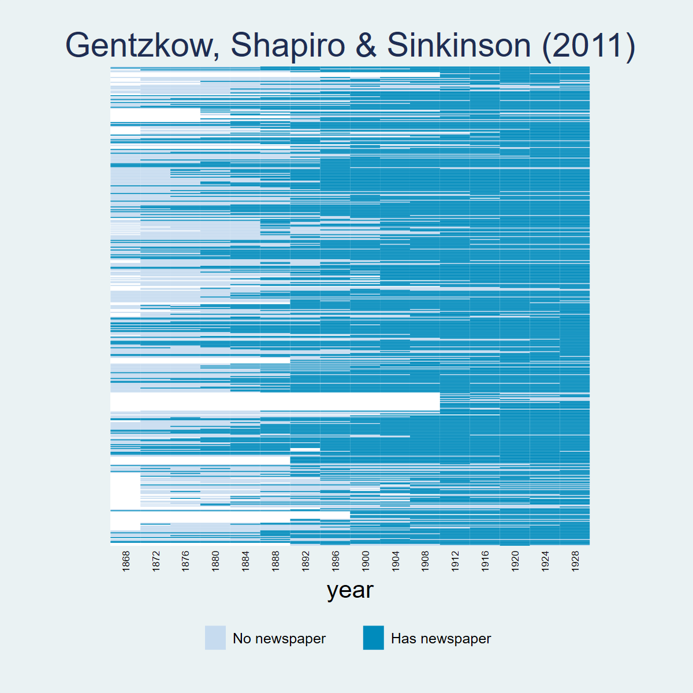
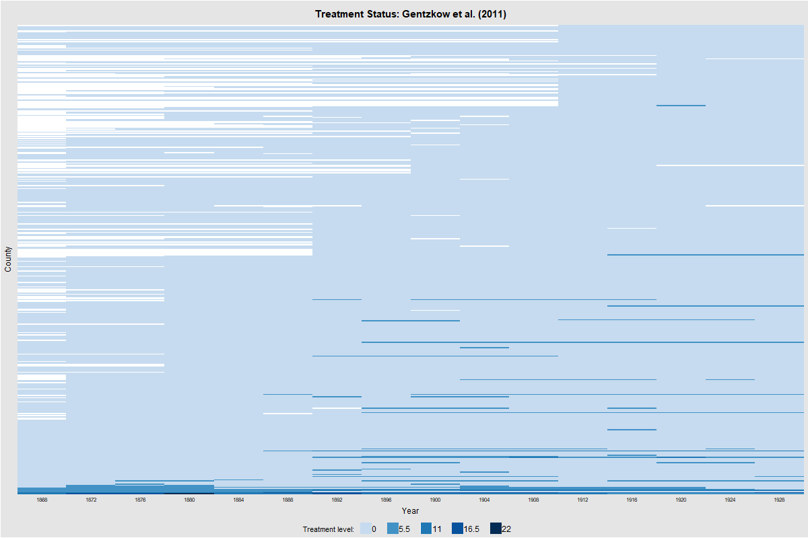
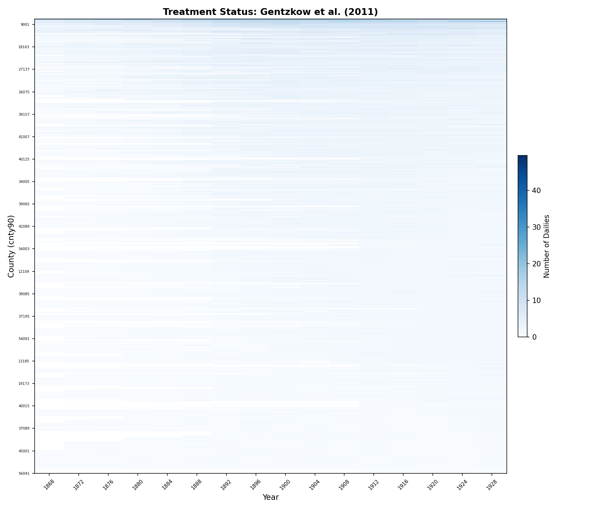
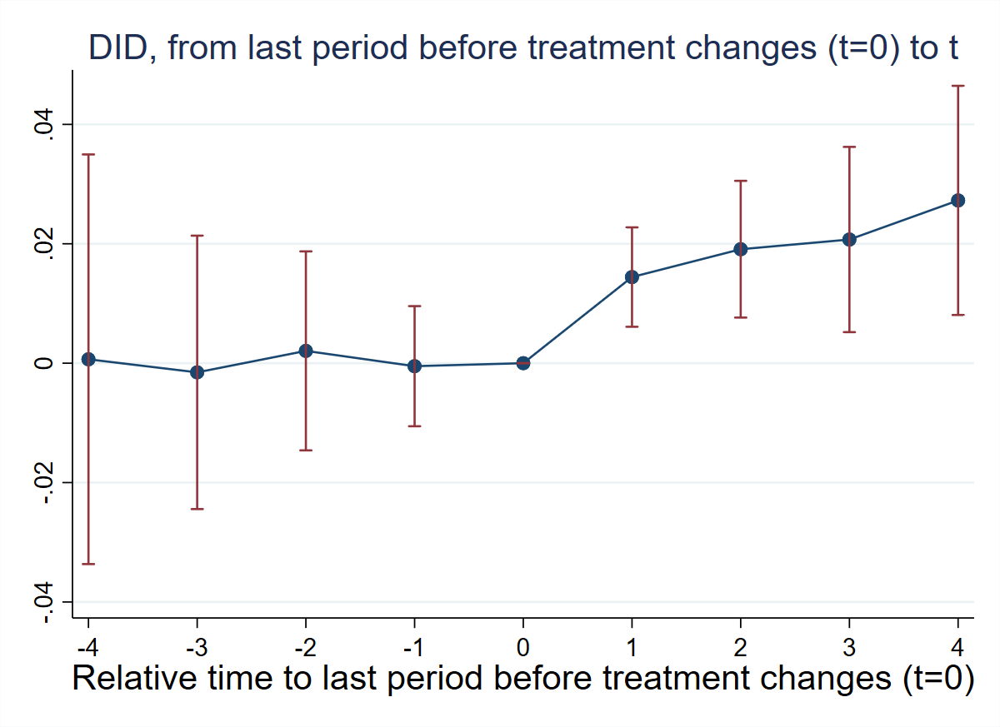
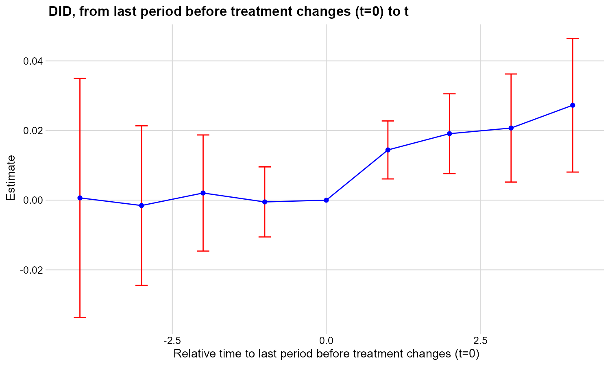
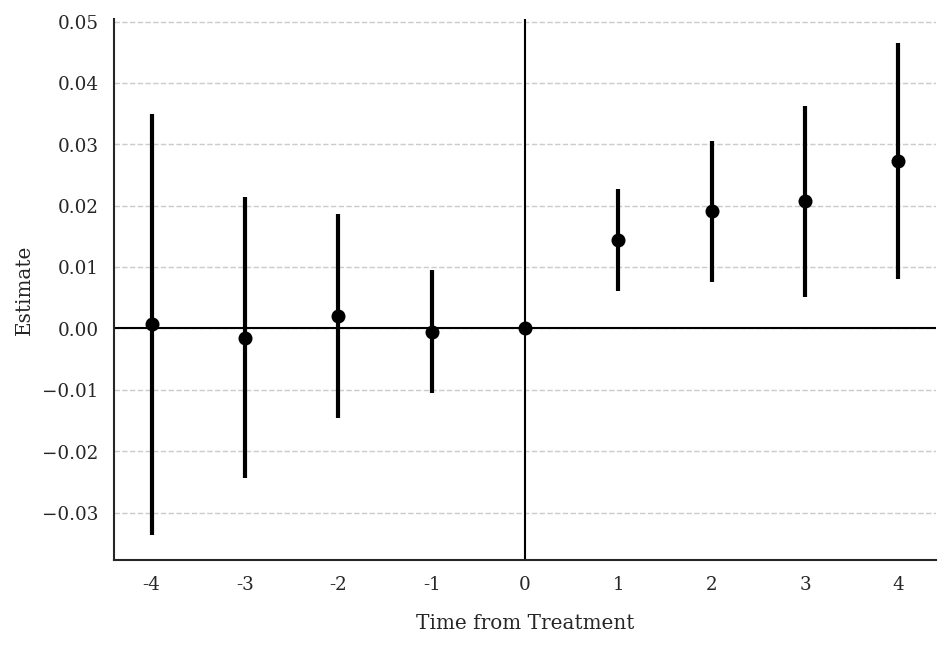
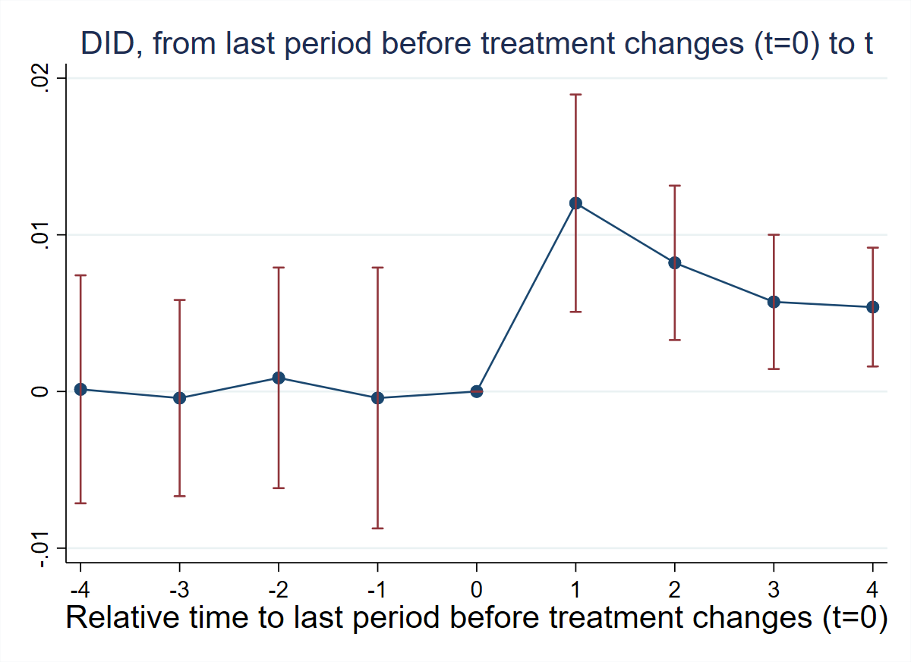
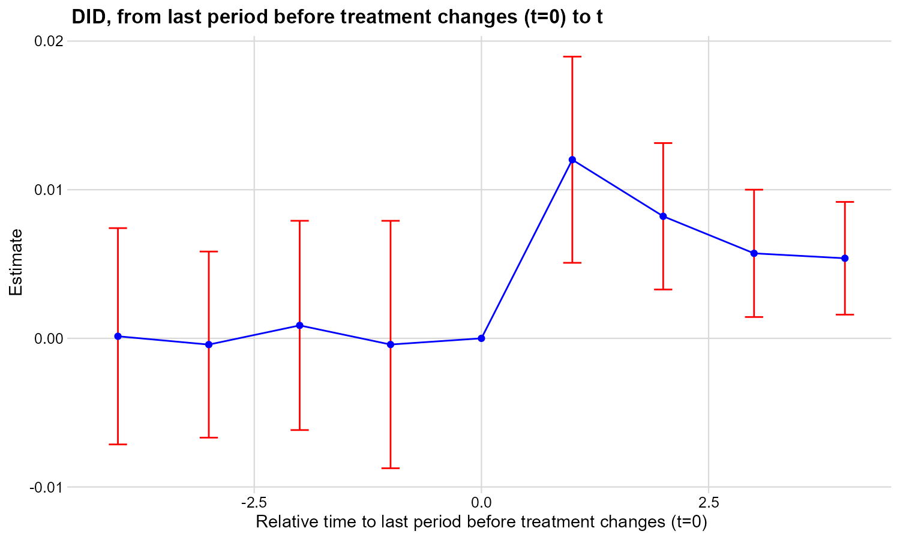
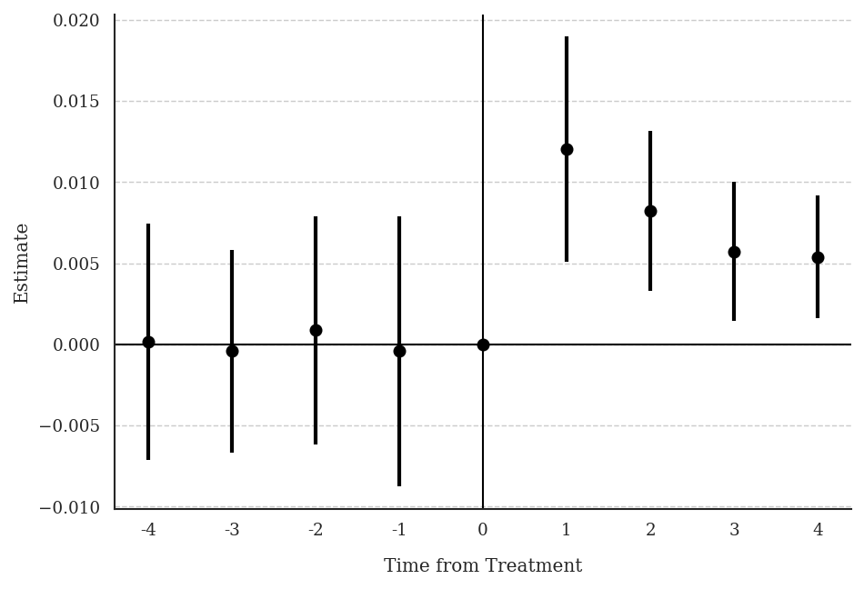

## Overview

Dataset: **Gentzkow, Shapiro & Sinkinson (2011)** — `gentzkowetal_didtextbook.dta` (16,872 observations, 1,195 counties, 16 election years 1868–1928)

This chapter studies **general designs** where the treatment may be non-binary (taking values 0, 1, 2, …) and/or non-absorbing (groups can enter and exit treatment), and where treatment lags may affect the outcome. The running example measures the effect of the number of daily newspapers (`numdailies`) on presidential voter turnout (`prestout`).

Key topics: static TWFE decompositions with multiple treatments (`twowayfeweights`), non-normalized and normalized event-study estimators (`did_multiplegt_dyn`), treatment-path descriptions (`design` option), and heterogeneity-robust estimators ruling out dynamic effects (`did_multiplegt_stat`).

7 Green Questions + 2 Figures + 1 Bonus test.

**Packages used:**

| Task | Stata | R | Python |
|------|-------|---|--------|
| PanelView | `panelview` (SSC) | `panelView` (CRAN) | `matplotlib` (manual) |
| OLS / TWFE | `reg`, `areg` | `fixest`, `sandwich` | `statsmodels` |
| Weight decomposition | `twowayfeweights` (SSC) | `TwoWayFEWeights` (CRAN) | Not available (`other_treatments`) |
| Event-study DID | `did_multiplegt_dyn` (SSC) | `DIDmultiplegtDYN` (CRAN) | `py-did-multiplegt-dyn` (PyPI) |
| Static DID (ATS/WATS) | `did_multiplegt_stat` (SSC) | `DIDmultiplegtSTAT` (GitHub) | `py_did_multiplegt_stat` (local) |

**Installation notes:**

- **R `DIDmultiplegtSTAT`:** `devtools::install_github("chaisemartinPackages/did_multiplegt_stat/R", force = TRUE)`
- **R `DIDmultiplegtDYN`:** The `design()` option works with `design=c(0.8,"console")`. Effects match across platforms.
- **Python `did_multiplegt_dyn`:** `pip install py-did-multiplegt-dyn`. Requires `polars` DataFrames.
- **Python `did_multiplegt_stat`:** Local notebook-based translation; see `py_did_multiplegt_stat`.

**Note on cross-platform differences:** GQ1–GQ4 and GQ6 match exactly between Stata and R to 7 decimals. GQ7 (`did_multiplegt_stat`) shows small differences between Stata, R, and Python due to internal implementation variations. N, switchers, and stayers counts are identical across all three.

---

## PanelView

::: {.panel-tabset}

### Stata

```stata
* ssc install panelview, replace
copy "https://raw.githubusercontent.com/anzonyquispe/did_book/main/cc_xd_didtextbook_2025_9_30/Data%20sets/Gentzkow%20et%20al%202011/gentzkowetal_didtextbook.dta" "gentzkowetal_didtextbook.dta", replace
use "gentzkowetal_didtextbook.dta", clear
panelview prestout numdailies, i(cnty90) t(year) type(treat) title("Gentzkow et al. (2011)") legend(off) ylabel(none) ytitle("")
graph export "figures/ch05_panelview_stata.png", replace width(1200)
```



### R

```r
library(panelView)
load(url("https://raw.githubusercontent.com/anzonyquispe/did_book/main/cc_xd_didtextbook_2025_9_30/Data%20sets/Gentzkow%20et%20al%202011/gentzkowetal_didtextbook.RData"))
png("figures/ch08_panelview_R.png", width = 1000, height = 600)
panelview(prestout ~ numdailies, data = df, index = c("cnty90", "year"), type = "treat",
          main = "Gentzkow, Shapiro & Sinkinson (2011)", ylab = "")
dev.off()
```



### Python

```python
import pandas as pd
import matplotlib.pyplot as plt
import matplotlib.colors as mcolors
from matplotlib.patches import Patch

df = pd.read_parquet("https://raw.githubusercontent.com/anzonyquispe/did_book/main/cc_xd_didtextbook_2025_9_30/Data%20sets/Gentzkow%20et%20al%202011/gentzkowetal_didtextbook.parquet")
df["has_newspaper"] = (df["numdailies"] > 0).astype(int)
pv = df.pivot_table(index="cnty90", columns="year", values="has_newspaper", aggfunc="first")
pv_sorted = pv.loc[pv.mean(axis=1).sort_values(ascending=False).index]
cmap = mcolors.ListedColormap(["#D4E6F1", "#2171B5"])
fig, ax = plt.subplots(figsize=(12, 10))
ax.imshow(pv_sorted.values, aspect="auto", cmap=cmap, interpolation="nearest", vmin=0, vmax=1)
for i in range(0, len(pv_sorted), 10):
    ax.axhline(y=i - 0.5, color="white", linewidth=0.15)
ax.set_xticks(range(0, len(pv_sorted.columns), 2))
ax.set_xticklabels([int(c) for c in pv_sorted.columns[::2]], rotation=45, ha="right", fontsize=8)
ax.set_yticks([])
ax.set_xlabel("Year")
ax.set_title("Gentzkow et al. (2011)", fontsize=16)
ax.legend(handles=[Patch(facecolor="#D4E6F1", edgecolor="gray", label="No newspaper"),
                   Patch(facecolor="#2171B5", edgecolor="gray", label="Has newspaper")],
          loc="lower center", bbox_to_anchor=(0.5, -0.12), ncol=2)
plt.tight_layout()
plt.savefig("figures/ch08_panelview_Python.png", dpi=150, bbox_inches="tight")
plt.show()
```



:::

---

## GQ3 (§8.2): Distributed-Lag TWFE + Weight Decomposition

> Regress turnout on the number of newspapers and its lag, with county and year FEs, clustering at the county level. Then decompose $\hat\beta_0^{dl}$ and $\hat\beta_1^{dl}$ using `twowayfeweights` with the `other_treatments` option.

::: {.panel-tabset}

### Stata

```stata
copy "https://raw.githubusercontent.com/anzonyquispe/did_book/main/cc_xd_didtextbook_2025_9_30/Data%20sets/Gentzkow%20et%20al%202011/gentzkowetal_didtextbook.dta" "gentzkowetal_didtextbook.dta", replace
use "gentzkowetal_didtextbook.dta", clear
areg prestout i.year numdailies lag_numdailies, absorb(cnty90) cluster(cnty90)
```

```
                               (Std. err. adjusted for 1,195 clusters in cnty90)
--------------------------------------------------------------------------------
               |               Robust
       prestout | Coefficient  std. err.      t    P>|t|     [95% conf. interval]
----------------+----------------------------------------------------------------
    numdailies  |  -.0007962   .0014419    -0.55   0.581    -.0036257    .0020333
 lag_numdailies |   .0050348   .0015052     3.34   0.001     .0020814    .0079882
--------------------------------------------------------------------------------
N = 15,629
```

```stata
* ssc install twowayfeweights, replace
copy "https://raw.githubusercontent.com/anzonyquispe/did_book/main/cc_xd_didtextbook_2025_9_30/Data%20sets/Gentzkow%20et%20al%202011/gentzkowetal_didtextbook.dta" "gentzkowetal_didtextbook.dta", replace
use "gentzkowetal_didtextbook.dta", clear
* Decompose beta on numdailies
twowayfeweights prestout cnty90 year numdailies, other_treatments(lag_numdailies) type(feTR)

* Decompose beta on lag_numdailies
twowayfeweights prestout cnty90 year lag_numdailies, other_treatments(numdailies) type(feTR)
```

```
--- Decomposition of beta on numdailies (β = -0.0008) ---
Under the common trends assumption, beta estimates a weighted sum of 10,056 ATTs.
 5,754 ATTs receive a positive weight, and 4,302 receive a negative weight.
 Σ positive weights = 1.8541  |  Σ negative weights = -0.8541
 Other treatment (lag_numdailies):
   4,721 positive (Σ = 1.2137) | 4,618 negative (Σ = -1.2137)

--- Decomposition of beta on lag_numdailies (β = 0.0050) ---
Under the common trends assumption, beta estimates a weighted sum of 9,339 ATTs.
 5,273 ATTs receive a positive weight, and 4,066 receive a negative weight.
 Σ positive weights = 1.7820  |  Σ negative weights = -0.7820
 Other treatment (numdailies):
   4,933 positive (Σ = 1.3558) | 5,123 negative (Σ = -1.3558)
```

### R

```r
library(haven); library(fixest); library(TwoWayFEWeights)
load(url("https://raw.githubusercontent.com/anzonyquispe/did_book/main/cc_xd_didtextbook_2025_9_30/Data%20sets/Gentzkow%20et%20al%202011/gentzkowetal_didtextbook.RData"))
gq3 <- feols(prestout ~ numdailies + lag_numdailies | cnty90 + year,
             data = df, cluster = ~cnty90)
summary(gq3)

gq3a <- twowayfeweights(df, "prestout", "cnty90", "year", "numdailies",
                         type = "feTR", other_treatments = "lag_numdailies")
gq3b <- twowayfeweights(df, "prestout", "cnty90", "year", "lag_numdailies",
                         type = "feTR", other_treatments = "numdailies")
```

```
                 Estimate Std. Error  t value Pr(>|t|)
numdailies     -0.0007962  0.0013864 -0.5743   0.5658
lag_numdailies  0.0050348  0.0014472  3.4790   0.0005
N = 15,629

--- Decomposition of beta on numdailies (β = -0.0008) ---
 Σ positive weights = 1.8541 (5,754 ATTs)
 Σ negative weights = -0.8541 (4,302 ATTs)
 Other treatment: 4,721 pos (Σ = 1.2137) | 4,618 neg (Σ = -1.2137)

--- Decomposition of beta on lag_numdailies (β = 0.0050) ---
 Σ positive weights = 1.7820 (5,273 ATTs)
 Σ negative weights = -0.7820 (4,066 ATTs)
 Other treatment: 4,933 pos (Σ = 1.3558) | 5,123 neg (Σ = -1.3558)
```

### Python

```python
import pandas as pd
import pyfixest as pf
from twowayfeweights import twowayfeweights
df = pd.read_parquet("https://raw.githubusercontent.com/anzonyquispe/did_book/main/cc_xd_didtextbook_2025_9_30/Data%20sets/Gentzkow%20et%20al%202011/gentzkowetal_didtextbook.parquet")
# TWFE with county and year FEs
m8 = pf.feols("prestout ~ numdailies + lag_numdailies + C(year) | cnty90",
              data=df, vcov={"CRV1": "cnty90"},
              ssc=pf.ssc(adj=True, fixef_k="full", cluster_adj=True))

# Decomposition
res_a = twowayfeweights(df, "prestout", "cnty90", "year", "numdailies",
                         type="feTR", other_treatments="lag_numdailies")
res_b = twowayfeweights(df, "prestout", "cnty90", "year", "lag_numdailies",
                         type="feTR", other_treatments="numdailies")
```

```
  Variable                          Coef      Std.Err          t      P>|t|
  numdailies                  -0.0007962    0.0014419     -0.552     0.5810
  lag_numdailies               0.0050348    0.0015052      3.345     0.0008
  N = 15,629

Decomposition of beta on numdailies:
------------------------------------------------
Treat. var: numdailies  # ATTs      Σ weights
------------------------------------------------
Positive weights        5754        1.8541
Negative weights        4302        -0.8541
------------------------------------------------
Total                   10056       1.0000
------------------------------------------------

Other treat.: lag_numdailies
Positive weights        4721        1.2137
Negative weights        4618        -1.2137
Total                   9339        0.0000

Decomposition of beta on lag_numdailies:
------------------------------------------------
Treat. var: lag_numdailies # ATTs   Σ weights
------------------------------------------------
Positive weights        5273        1.7820
Negative weights        4066        -0.7820
------------------------------------------------
Total                   9339        1.0000
------------------------------------------------

Other treat.: numdailies
Positive weights        4933        1.3558
Negative weights        5123        -1.3558
Total                   10056       0.0000
```

:::

**Interpretation:** The distributed-lag TWFE regression gives $\hat\beta_0^{dl} = -0.0007962$ (insignificant) and $\hat\beta_1^{dl} = 0.0050348$ (significant). The `twowayfeweights` decomposition reveals that both coefficients are severely contaminated: the positive weights sum to 1.85, the negative weights to $-0.85$, and the cross-contamination from the other treatment sums to $\pm 1.21$. This means neither coefficient can be interpreted as a convex combination of causal effects.

---

## GQ4 (§8.3.5): Non-Normalized Event-Study Effects (Figure 8.1)

> Using `did_multiplegt_dyn`, compute non-normalized event-study estimates $\widehat{AVSQ}_\ell$ for $\ell \in \{1, \ldots, 4\}$ and pre-trend estimates for $\ell \in \{1, \ldots, 4\}$, clustering at the county level. Produce Figure 8.1.

::: {.panel-tabset}

### Stata

```stata
* ssc install did_multiplegt_dyn, replace
copy "https://raw.githubusercontent.com/anzonyquispe/did_book/main/cc_xd_didtextbook_2025_9_30/Data%20sets/Gentzkow%20et%20al%202011/gentzkowetal_didtextbook.dta" "gentzkowetal_didtextbook.dta", replace
use "gentzkowetal_didtextbook.dta", clear
did_multiplegt_dyn prestout cnty90 year numdailies, effects(4) placebo(4) cluster(cnty90)
graph export "$FIGDIR\ch08_fig81_nonnormalized_es.png", replace width(1200)
```

```
----------------------------------------------------------------------
       Estimation of treatment effects: Event-study effects
----------------------------------------------------------------------
             Estimate SE      LB CI   UB CI   N     Switchers
Effect_1     0.0144244 0.0042477 0.0060990 0.0227498 5,674 1,119
Effect_2     0.0190899 0.0058429 0.0076380 0.0305418 4,648 1,054
Effect_3     0.0207147 0.0079164 0.0051987 0.0362307 3,750   984
Effect_4     0.0272653 0.0097924 0.0080724 0.0464582 2,980   917

Test of joint nullity of the effects : p-value = 0.0068

----------------------------------------------------------------------
    Average cumulative (total) effect per treatment unit
----------------------------------------------------------------------
 Estimate        SE     LB CI     UB CI         N Switchers
  0.0160565   0.0047761   0.0067156   0.0253974     8,659     4,074
Average number of periods over which effect is accumulated: 2.4376

----------------------------------------------------------------------
     Testing the parallel trends and no anticipation assumptions
----------------------------------------------------------------------
             Estimate SE      LB CI    UB CI   N     Switchers
Placebo_1   -0.0005991 0.0056316 -0.0116370 0.0104388 4,418   902
Placebo_2    0.0014167 0.0045867 -0.0075731 0.0104065 2,764   746
Placebo_3   -0.0007862 0.0041218 -0.0088649 0.0072925 1,636   604
Placebo_4    0.0002207 0.0049558 -0.0094925 0.0099339   907   441

Test of joint nullity of the placebos : p-value = 0.9922
```



### R

```r
library(haven); library(DIDmultiplegtDYN)
load(url("https://raw.githubusercontent.com/anzonyquispe/did_book/main/cc_xd_didtextbook_2025_9_30/Data%20sets/Gentzkow%20et%20al%202011/gentzkowetal_didtextbook.RData"))
gq4 <- did_multiplegt_dyn(
    df = df, outcome = "prestout", group = "cnty90",
    time = "year", treatment = "numdailies",
    effects = 4, placebo = 4, cluster = "cnty90")
ggsave("figures/ch08_fig81_nonnormalized_es_R.png",
       plot = gq4$plot, width = 8, height = 5, dpi = 150)
```

```
             Estimate SE      LB CI   UB CI   N     Switchers
Effect_1     0.0144244 0.0042477 0.0060990 0.0227498 5,674 1,119
Effect_2     0.0190899 0.0058429 0.0076380 0.0305418 4,648 1,054
Effect_3     0.0207147 0.0079164 0.0051987 0.0362307 3,750   984
Effect_4     0.0272653 0.0097924 0.0080724 0.0464582 2,980   917

Joint nullity of effects : p = 0.0068
Av_tot_eff = 0.0160565 (SE = 0.0047761)

Placebo_1   -0.0005991 0.0056316   4,418   902
Placebo_2    0.0014167 0.0045867   2,764   746
Placebo_3   -0.0007862 0.0041218   1,636   604
Placebo_4    0.0002207 0.0049558     907   441

Joint nullity of placebos : p = 0.9922
```



### Python

```python
import pandas as pd
import polars as pl
import matplotlib.pyplot as plt
from did_multiplegt_dyn import DidMultiplegtDyn
df = pd.read_parquet("https://raw.githubusercontent.com/anzonyquispe/did_book/main/cc_xd_didtextbook_2025_9_30/Data%20sets/Gentzkow%20et%20al%202011/gentzkowetal_didtextbook.parquet")
df_pl = pl.from_pandas(df)
pd.set_option('display.float_format', lambda x: f'{x:.7f}')
gq4 = DidMultiplegtDyn(df=df_pl, outcome="prestout", group="cnty90",
    time="year", treatment="numdailies", effects=4, placebo=4, cluster="cnty90")
gq4.fit(); gq4.summary()
gq4.plot()
plt.savefig("figures/ch08_fig81_nonnormalized_es_Python.png", dpi=150, bbox_inches="tight")
```

```
               Block   Estimate        SE      LB CI     UB CI      N  Switchers
            Effect_1  0.0144244 0.0042477  0.0060992 0.0227497   5674      1119
            Effect_2  0.0190899 0.0058429  0.0076381 0.0305418   4648      1054
            Effect_3  0.0207147 0.0079164  0.0051989 0.0362305   3750       984
            Effect_4  0.0272653 0.0097924  0.0080727 0.0464580   2980       917
Average_Total_Effect  0.0160565 0.0047761  0.0066956 0.0254174   8659      4074
           Placebo_1 -0.0005025 0.0051322 -0.0105615 0.0095565   4471       902
           Placebo_2  0.0020594 0.0085031 -0.0146063 0.0187251   2778       746
           Placebo_3 -0.0015365 0.0116825 -0.0244337 0.0213607   1644       604
           Placebo_4  0.0006573 0.0175032 -0.0336483 0.0349628    910       441

Joint nullity of effects : p = 0.006814
Joint nullity of placebos : p = 0.992198
```



:::

**Interpretation:** All four non-normalized event-study effects are positive and significant, suggesting newspapers increase turnout. The effects grow with $\ell$, from 0.0144 at $\ell = 1$ to 0.0273 at $\ell = 4$. All placebo estimates are small and insignificant, with a joint p-value of 0.9922, strongly supporting the parallel-trends assumption. The average cumulative effect per treatment unit is 0.0161 (SE = 0.0048).

*Figure 8.1: Non-normalized DID estimates of the effect of being exposed to a weakly larger number of newspapers for $\ell$ periods on turnout. Standard errors clustered at the county level. 95% confidence intervals shown in red.*

---

## GQ5 (§8.3.5): Treatment Path Descriptions

> Rerun `did_multiplegt_dyn` with `design(0.8,console)` for $\ell = 1, 2, 4$. What are the three most common "actual-versus-status-quo" comparisons averaged in $AVSQ_\ell$?

::: {.panel-tabset}

### Stata

```stata
* ssc install did_multiplegt_dyn, replace
copy "https://raw.githubusercontent.com/anzonyquispe/did_book/main/cc_xd_didtextbook_2025_9_30/Data%20sets/Gentzkow%20et%20al%202011/gentzkowetal_didtextbook.dta" "gentzkowetal_didtextbook.dta", replace
use "gentzkowetal_didtextbook.dta", clear
did_multiplegt_dyn prestout cnty90 year numdailies, effects(1) design(0.8,console) graph_off

did_multiplegt_dyn prestout cnty90 year numdailies, effects(2) design(0.8,console) graph_off

did_multiplegt_dyn prestout cnty90 year numdailies, effects(4) design(0.8,console) graph_off
```

```
--- ℓ = 1 ---
             Estimate         SE      LB CI      UB CI          N  Switchers
Effect_1     .0144244   .0042477   .0060992   .0227497       5674       1119
Av_tot_eff   .0120186   .0035392   .0050819   .0189552       5674       1119

Detection of treatment paths - 1 periods after first switch (1,126 switchers):
  TreatPath1:  721 groups (64.03%), ℓ=0: 0, ℓ=1: 1
  TreatPath2:  139 groups (12.34%), ℓ=0: 0, ℓ=1: 2
  TreatPath3:   54 groups ( 4.80%), ℓ=0: 1, ℓ=1: 2
  Top 3 cover 81.17% of switchers

--- ℓ = 2 ---
             Estimate         SE      LB CI      UB CI          N  Switchers
Effect_1     .0144244   .0042477   .0060992   .0227497       5674       1119
Effect_2     .0190899   .0058429   .0076381   .0305418       4648       1054
Av_tot_eff   .0143270   .0039890   .0065087   .0221454       6754       2173
Joint nullity p-value = 0.0015

Detection of treatment paths - 2 periods after first switch (1,067 switchers):
  TreatPath1: 343 groups (32.15%), (0, 1, 1)
  TreatPath2: 187 groups (17.53%), (0, 1, 0)
  TreatPath3: 131 groups (12.28%), (0, 1, 2)
  ... 9 paths cover 81.54% of switchers

--- ℓ = 4 ---
             Estimate         SE      LB CI      UB CI          N  Switchers
Effect_1     .0144244   .0042477   .0060992   .0227497       5674       1119
Effect_2     .0190899   .0058429   .0076381   .0305418       4648       1054
Effect_3     .0207147   .0079164   .0051989   .0362305       3750        984
Effect_4     .0272653   .0097924   .0080727   .0464580       2980        917
Av_tot_eff   .0160565   .0047761   .0066956   .0254174       8659       4074
Joint nullity p-value = 0.0068

Detection of treatment paths - 4 periods after first switch (933 switchers):
  TreatPath1: 141 groups (15.11%), (0, 1, 1, 1, 1)
  TreatPath2: 127 groups (13.61%), (0, 1, 0, 0, 0)
  TreatPath3:  43 groups ( 4.61%), (0, 1, 2, 2, 2)
  ... 56 paths cover 80.17% of switchers
```

### R

```r
library(haven); library(polars); library(DIDmultiplegtDYN)
load(url("https://raw.githubusercontent.com/anzonyquispe/did_book/main/cc_xd_didtextbook_2025_9_30/Data%20sets/Gentzkow%20et%20al%202011/gentzkowetal_didtextbook.RData")); df <- as.data.frame(df)
gq5_l1 <- did_multiplegt_dyn(df=df, outcome="prestout", group="cnty90",
    time="year", treatment="numdailies", effects=1,
    design=c(0.8,"console"), graph_off=TRUE)
gq5_l2 <- did_multiplegt_dyn(df=df, outcome="prestout", group="cnty90",
    time="year", treatment="numdailies", effects=2,
    design=c(0.8,"console"), graph_off=TRUE)
gq5_l4 <- did_multiplegt_dyn(df=df, outcome="prestout", group="cnty90",
    time="year", treatment="numdailies", effects=4,
    design=c(0.8,"console"), graph_off=TRUE)
```

```
--- ℓ = 1 ---
 Estimate        SE     LB CI     UB CI         N Switchers
  0.0144244   0.0042477   0.0060992   0.0227497     5,674     1,119
Av_tot_eff = 0.0120186 (SE = 0.0035392)

Detection of treatment paths - 1 periods after first switch:
  TreatPath1: 721 (64.03%), (0, 1)
  TreatPath2: 139 (12.34%), (0, 2)
  TreatPath3:  54 ( 4.80%), (1, 2)
  Top 3 cover 81.17%

--- ℓ = 2 ---
             Estimate    SE          LB CI       UB CI   N     Switchers
Effect_1     0.0144244   0.0042477   0.0060992   0.0227497 5,674 1,119
Effect_2     0.0190899   0.0058429   0.0076381   0.0305418 4,648 1,054
Av_tot_eff = 0.0143270 (SE = 0.0039890). Joint nullity p = 0.0015

Detection of treatment paths - 2 periods after first switch:
  TreatPath1: 343 (32.15%), (0, 1, 1)
  TreatPath2: 187 (17.53%), (0, 1, 0)
  TreatPath3: 131 (12.28%), (0, 1, 2)
  ... 9 paths cover 81.54%

--- ℓ = 4 ---
             Estimate    SE          LB CI       UB CI   N     Switchers
Effect_1     0.0144244   0.0042477   0.0060992   0.0227497 5,674 1,119
Effect_2     0.0190899   0.0058429   0.0076381   0.0305418 4,648 1,054
Effect_3     0.0207147   0.0079164   0.0051989   0.0362305 3,750   984
Effect_4     0.0272653   0.0097924   0.0080727   0.0464580 2,980   917
Av_tot_eff = 0.0160565 (SE = 0.0047761). Joint nullity p = 0.0068

Detection of treatment paths - 4 periods after first switch:
  TreatPath1: 141 (15.11%), (0, 1, 1, 1, 1)
  TreatPath2: 127 (13.61%), (0, 1, 0, 0, 0)
  TreatPath3:  43 ( 4.61%), (0, 1, 2, 2, 2)
  ... 56 paths cover 80.17%
```

### Python

```python
import pandas as pd
import polars as pl
from did_multiplegt_dyn import DidMultiplegtDyn
df = pd.read_parquet("https://raw.githubusercontent.com/anzonyquispe/did_book/main/cc_xd_didtextbook_2025_9_30/Data%20sets/Gentzkow%20et%20al%202011/gentzkowetal_didtextbook.parquet")
df_pl = pl.from_pandas(df)
pd.set_option('display.float_format', lambda x: f'{x:.7f}')
for ell in [1, 2, 4]:
    model = DidMultiplegtDyn(df=df_pl, outcome="prestout", group="cnty90",
        time="year", treatment="numdailies", effects=ell, cluster="cnty90",
        design=[0.8, "console"])
    model.fit(); model.summary()
```

```
--- effects = 1 ---
================================================================================
  Detection of treatment paths - 1 periods after first switch
================================================================================
            #Groups    %Groups       l=0       l=1
TreatPath1      721 64.0319716 0.0000000 1.0000000
TreatPath2      139 12.3445826 0.0000000 2.0000000
TreatPath3       54  4.7957371 1.0000000 2.0000000
TreatPath4       54  4.7957371 2.0000000 3.0000000
================================================================================
Treatment paths detected in switching groups: 1126
Total % shown: 85.97%

             Estimate        SE      LB CI     UB CI      N  Switchers
Effect_1     0.0144244 0.0042477  0.0060992 0.0227497   5674      1119

--- effects = 2 ---
================================================================================
  Detection of treatment paths - 2 periods after first switch
================================================================================
             #Groups    %Groups       l=0       l=1       l=2
TreatPath1       343 32.1462043 0.0000000 1.0000000 1.0000000
TreatPath2       187 17.5257732 0.0000000 1.0000000 0.0000000
TreatPath3       131 12.2774133 0.0000000 1.0000000 2.0000000
TreatPath4        57  5.3420806 0.0000000 2.0000000 2.0000000
TreatPath5        47  4.4048735 0.0000000 2.0000000 1.0000000
TreatPath6        33  3.0927835 1.0000000 2.0000000 2.0000000
TreatPath7        30  2.8116214 0.0000000 1.0000000 3.0000000
TreatPath8        22  2.0618557 2.0000000 3.0000000 2.0000000
TreatPath9        20  1.8744142 2.0000000 1.0000000 1.0000000
================================================================================
Treatment paths detected in switching groups: 1067
Total % shown: 83.22%

             Estimate        SE      LB CI     UB CI      N  Switchers
Effect_1     0.0144244 0.0042477  0.0060992 0.0227497   5674      1119
Effect_2     0.0190899 0.0058429  0.0076381 0.0305418   4648      1054
Av_tot_eff   0.0143270 0.0039890  0.0065087 0.0221454   6754      2173

--- effects = 4 ---
================================================================================
  Detection of treatment paths - 4 periods after first switch
================================================================================
             #Groups    %Groups       l=0       l=1       l=2       l=3       l=4
TreatPath1       141 15.1125402 0.0000000 1.0000000 1.0000000 1.0000000 1.0000000
TreatPath2       127 13.6120043 0.0000000 1.0000000 0.0000000 0.0000000 0.0000000
TreatPath3        43  4.6087889 0.0000000 1.0000000 2.0000000 2.0000000 2.0000000
  ... (57 treatment paths total, top 3 cover 33.3%)
================================================================================
Treatment paths detected in switching groups: 933
Total % shown: 80.49%

             Estimate        SE      LB CI     UB CI      N  Switchers
Effect_1     0.0144244 0.0042477  0.0060992 0.0227497   5674      1119
Effect_2     0.0190899 0.0058429  0.0076381 0.0305418   4648      1054
Effect_3     0.0207147 0.0079164  0.0051989 0.0362305   3750       984
Effect_4     0.0272653 0.0097924  0.0080727 0.0464580   2980       917
Av_tot_eff   0.0160565 0.0047761  0.0066956 0.0254174   8659      4074

All effects and treatment paths match Stata/R.
```

:::

**Interpretation:** At $\ell = 1$, most switchers transition from 0 to 1 newspaper (64%). As $\ell$ increases, the treatment paths become more heterogeneous: by $\ell = 4$, the top 3 paths account for only about 34% of all effects. Some counties gain newspapers and keep them, others gain and lose them. This heterogeneity complicates interpretation of $AVSQ_\ell$ at longer horizons.

---

## GQ6 (§8.3.5): Normalized Event-Study Effects (Figure 8.2)

> Compute normalized event-study estimates $\widehat{AVSQ}^n_\ell$ for $\ell \in \{1, \ldots, 4\}$ and normalized pre-trends. Test whether all normalized effects are equal. Produce Figure 8.2.

::: {.panel-tabset}

### Stata

```stata
* ssc install did_multiplegt_dyn, replace
copy "https://raw.githubusercontent.com/anzonyquispe/did_book/main/cc_xd_didtextbook_2025_9_30/Data%20sets/Gentzkow%20et%20al%202011/gentzkowetal_didtextbook.dta" "gentzkowetal_didtextbook.dta", replace
use "gentzkowetal_didtextbook.dta", clear
did_multiplegt_dyn prestout cnty90 year numdailies, effects(4) placebo(4) normalized effects_equal(all) cluster(cnty90)
graph export "$FIGDIR\ch08_fig82_normalized_es.png", replace width(1200)
```

```
----------------------------------------------------------------------
       Estimation of treatment effects: Event-study effects
----------------------------------------------------------------------
             Estimate SE      LB CI   UB CI   N     Switchers
Effect_1     0.0120186 0.0035392 0.0050818 0.0189554 5,674 1,119
Effect_2     0.0082126 0.0025136 0.0032860 0.0131392 4,648 1,054
Effect_3     0.0057192 0.0021857 0.0014353 0.0100031 3,750   984
Effect_4     0.0053873 0.0019348 0.0015951 0.0091795 2,980   917

Test of joint nullity of the effects : p-value = 0.0068
Test of equality of the effects : p-value = 0.1653

Weights wℓ,k (effect of kth treatment lag):
  ℓ=1: w1,0 = 1.00
  ℓ=2: w2,0 = 0.48, w2,1 = 0.52
  ℓ=3: w3,0 = 0.35, w3,1 = 0.31, w3,2 = 0.33
  ℓ=4: w4,0 = 0.28, w4,1 = 0.26, w4,2 = 0.23, w4,3 = 0.24

Average cumulative (total) effect per treatment unit:
  0.0160565 (SE = 0.0047761)

----------------------------------------------------------------------
     Testing the parallel trends and no anticipation assumptions
----------------------------------------------------------------------
             Estimate SE      LB CI    UB CI   N     Switchers
Placebo_1   -0.0004159 0.0042471 -0.0087401 0.0079083 4,418   902
Placebo_2    0.0008718 0.0035930 -0.0061704 0.0079140 2,764   746
Placebo_3   -0.0004199 0.0031938 -0.0066796 0.0058398 1,636   604
Placebo_4    0.0001368 0.0037130 -0.0071406 0.0074142   907   441

Test of joint nullity of the placebos : p-value = 0.9922
```



### R

```r
library(haven); library(DIDmultiplegtDYN)
load(url("https://raw.githubusercontent.com/anzonyquispe/did_book/main/cc_xd_didtextbook_2025_9_30/Data%20sets/Gentzkow%20et%20al%202011/gentzkowetal_didtextbook.RData"))
gq6 <- did_multiplegt_dyn(
    df = df, outcome = "prestout", group = "cnty90",
    time = "year", treatment = "numdailies",
    effects = 4, placebo = 4,
    normalized = TRUE, effects_equal = TRUE, cluster = "cnty90")
ggsave("figures/ch08_fig82_normalized_es_R.png",
       plot = gq6$plot, width = 8, height = 5, dpi = 150)
```

```
             Estimate SE      LB CI   UB CI   N     Switchers
Effect_1     0.0120186 0.0035392 0.0050818 0.0189554 5,674 1,119
Effect_2     0.0082126 0.0025136 0.0032860 0.0131392 4,648 1,054
Effect_3     0.0057192 0.0021857 0.0014353 0.0100031 3,750   984
Effect_4     0.0053873 0.0019348 0.0015951 0.0091795 2,980   917

Joint nullity of effects : p = 0.0068
Equality of effects : p = 0.1653
Av_tot_eff = 0.0160565 (SE = 0.0047761)

Placebo_1   -0.0004159 0.0042471   4,418   902
Placebo_2    0.0008718 0.0035930   2,764   746
Placebo_3   -0.0004199 0.0031938   1,636   604
Placebo_4    0.0001368 0.0037130     907   441

Joint nullity of placebos : p = 0.9922
```



### Python

```python
import pandas as pd
import polars as pl
import matplotlib.pyplot as plt
from did_multiplegt_dyn import DidMultiplegtDyn
df = pd.read_parquet("https://raw.githubusercontent.com/anzonyquispe/did_book/main/cc_xd_didtextbook_2025_9_30/Data%20sets/Gentzkow%20et%20al%202011/gentzkowetal_didtextbook.parquet")
df_pl = pl.from_pandas(df)
pd.set_option('display.float_format', lambda x: f'{x:.7f}')
gq6 = DidMultiplegtDyn(df=df_pl, outcome="prestout", group="cnty90",
    time="year", treatment="numdailies", effects=4, placebo=4,
    normalized=True, effects_equal=True, cluster="cnty90")
gq6.fit(); gq6.summary()
gq6.plot()
plt.savefig("figures/ch08_fig82_normalized_es_Python.png", dpi=150, bbox_inches="tight")
```

```
               Block   Estimate        SE      LB CI     UB CI      N  Switchers
            Effect_1  0.0120186 0.0035392  0.0050818 0.0189554   5674      1119
            Effect_2  0.0082126 0.0025136  0.0032860 0.0131392   4648      1054
            Effect_3  0.0057192 0.0021857  0.0014353 0.0100031   3750       984
            Effect_4  0.0053873 0.0019348  0.0015951 0.0091795   2980       917
Average_Total_Effect  0.0160565 0.0047761  0.0066956 0.0254174   8659      4074
           Placebo_1 -0.0004159 0.0042471 -0.0087401 0.0079083   4471       902
           Placebo_2  0.0008718 0.0035920 -0.0061704 0.0079140   2778       746
           Placebo_3 -0.0004199 0.0031938 -0.0066796 0.0058398   1644       604
           Placebo_4  0.0001390 0.0037130 -0.0071380 0.0074160    910       441

Joint nullity of effects : p = 0.006814
Joint nullity of placebos : p = 0.992198
Equality of effects : p = 0.165258
```



:::

**Interpretation:** Normalized effects are decreasing with $\ell$ (from 0.0120 to 0.0054), but the equality test cannot reject the null ($p = 0.1653$). The weights $w_{\ell,k}$ are approximately equal across lags within each $\ell$: for $\ell = 4$, the weight on contemporaneous newspapers ($w_{4,0} = 0.28$) is similar to that on the third lag ($w_{4,3} = 0.24$). The decreasing pattern of normalized effects may suggest that lagged newspapers have a smaller effect than contemporaneous newspapers.

*Figure 8.2: Normalized DID estimates of effects of newspapers on turnout. Standard errors clustered at the county level. 95% confidence intervals shown in red.*

---

## GQ7 (§8.4.10): ATS and WATS Estimators (`did_multiplegt_stat`)

> Using `did_multiplegt_stat`, compute the ATS and WATS estimators with `exact_match` and one placebo. Compare to the normalized event-study effects.

::: {.panel-tabset}

### Stata

```stata
* ssc install did_multiplegt_stat, replace
copy "https://raw.githubusercontent.com/anzonyquispe/did_book/main/cc_xd_didtextbook_2025_9_30/Data%20sets/Gentzkow%20et%20al%202011/gentzkowetal_didtextbook.dta" "gentzkowetal_didtextbook.dta", replace
use "gentzkowetal_didtextbook.dta", clear
did_multiplegt_stat prestout cnty90 year numdailies, placebo(1) exact_match
```

```
-----------------------------------
N                =            15466
WAOSS Method     =  Reg. Adjustment
Common Support   =   Exact Matching
-----------------------------------

----------------------------------------------------------------------
                    Estimation of AOSS(s)
----------------------------------------------------------------------
     Estimate    SE      LB CI   UB CI   Switchers Stayers
AOSS 0.0060678 0.0016463 0.0028411 0.0092945 4,423  11,043

----------------------------------------------------------------------
               Estimation of AOSS(s) - Placebo
----------------------------------------------------------------------
     Estimate     SE      LB CI    UB CI   Switchers Stayers
AOSS -0.0011278 0.0025056 -0.0060387 0.0037831 2,349   7,764

----------------------------------------------------------------------
                    Estimation of WAOSS(s)
----------------------------------------------------------------------
      Estimate    SE      LB CI   UB CI   Switchers Stayers
WAOSS 0.0057351 0.0015079 0.0027796 0.0086906 4,423  11,043

----------------------------------------------------------------------
               Estimation of WAOSS(s) - Placebo
----------------------------------------------------------------------
      Estimate     SE      LB CI    UB CI   Switchers Stayers
WAOSS -0.0000123 0.0022931 -0.0045067 0.0044821 2,349   7,764

141 switchers dropped (baseline treatment not in stayers' support)
22 stayers dropped (baseline treatment not in switchers' support)
```
:::

**Interpretation:** The ATS ($\approx 0.006$) and WATS ($\approx 0.006$) are significant and positive. The placebo estimates are small and insignificant, supporting the parallel-trends assumption. These estimates are roughly half the magnitude of $\widehat{AVSQ}^n_1 = 0.012$, which suggests a non-linear treatment response.

---

## Bonus: Joint Test of No Dynamic Effects

> Restrict to counties whose treatment does not change between $F_g$ and $F_g + 1$, and test whether the first and second non-normalized effects are equal.

::: {.panel-tabset}

### Stata

```stata
* ssc install did_multiplegt_dyn, replace
copy "https://raw.githubusercontent.com/anzonyquispe/did_book/main/cc_xd_didtextbook_2025_9_30/Data%20sets/Gentzkow%20et%20al%202011/gentzkowetal_didtextbook.dta" "gentzkowetal_didtextbook.dta", replace
use "gentzkowetal_didtextbook.dta", clear
did_multiplegt_dyn prestout cnty90 year numdailies if year<first_change | same_treat_after_first_change==1, effects(2) effects_equal(all) same_switchers graph_off
```

```
--------------------------------------------------------------------------------
             Estimation of treatment effects: Event-study effects
--------------------------------------------------------------------------------
             |  Estimate         SE      LB CI      UB CI          N  Switchers
-------------+------------------------------------------------------------------
    Effect_1 |    .01525   .0058956   .0036949   .0268052       5019        512
    Effect_2 |  .0164091   .0073633   .0019773   .0308409       4101        512
--------------------------------------------------------------------------------
Test of joint nullity of the effects : p-value = .0291303
Test of equality of the effects : p-value = .83016664
--------------------------------------------------------------------------------
               Average cumulative (total) effect per treatment unit
--------------------------------------------------------------------------------
             |  Estimate         SE      LB CI      UB CI          N  Switch x Periods
-------------+--------------------------------------------------------------------------
  Av_tot_eff |  .0138306   .0053281   .0033878   .0242734       5605       1024
--------------------------------------------------------------------------------
Average number of time periods over which a treatment's effect is accumulated = 1.5
```

### R

```r
library(haven); library(DIDmultiplegtDYN)
load(url("https://raw.githubusercontent.com/anzonyquispe/did_book/main/cc_xd_didtextbook_2025_9_30/Data%20sets/Gentzkow%20et%20al%202011/gentzkowetal_didtextbook.RData"))
df_sub <- subset(df, year < first_change | same_treat_after_first_change == 1)
bonus <- did_multiplegt_dyn(
    df = df_sub, outcome = "prestout", group = "cnty90",
    time = "year", treatment = "numdailies",
    effects = 2, effects_equal = TRUE,
    same_switchers = TRUE, graph_off = TRUE)
```

```
----------------------------------------------------------------------
       Estimation of treatment effects: Event-study effects
----------------------------------------------------------------------
             Estimate SE      LB CI   UB CI   N     Switchers
Effect_1     0.01525  0.00590 0.00369 0.02681 5,019 512
Effect_2     0.01641  0.00736 0.00198 0.03084 4,101 512

Test of joint nullity of the effects : p-value = 0.0291
Test of equality of the effects : p-value = 0.8302

----------------------------------------------------------------------
    Average cumulative (total) effect per treatment unit
----------------------------------------------------------------------
 Estimate        SE     LB CI     UB CI         N Switchers
  0.01383   0.00533   0.00339   0.02427     5,605     1,024
Average number of time periods over which a treatment effect is accumulated: 1.5000
```

### Python

```python
import pandas as pd
import polars as pl
from did_multiplegt_dyn import DidMultiplegtDyn
df = pd.read_parquet("https://raw.githubusercontent.com/anzonyquispe/did_book/main/cc_xd_didtextbook_2025_9_30/Data%20sets/Gentzkow%20et%20al%202011/gentzkowetal_didtextbook.parquet")
df_sub = df[(df['year'] < df['first_change']) | (df['same_treat_after_first_change'] == 1)].copy()
df_pl = pl.from_pandas(df_sub)
bonus = DidMultiplegtDyn(df=df_pl, outcome="prestout", group="cnty90",
    time="year", treatment="numdailies", effects=2,
    same_switchers=True, effects_equal=True, cluster="cnty90")
bonus.fit(); bonus.summary()
```

```
               Block  Estimate       SE     LB CI    UB CI      N  Switchers
            Effect_1  0.015250 0.005896  0.003695 0.026805 5019.0      512.0
            Effect_2  0.016409 0.007363  0.001977 0.030841 4101.0      512.0
Average_Total_Effect  0.013831 0.005328  0.003388 0.024273 5605.0     1024.0

Test of joint nullity of the effects: p-value = 0.029130
Test of equality of the effects: p-value = 0.830167
```

:::

**Interpretation:** In the subsample of 512 counties whose treatment does not change between $F_g$ and $F_g + 1$, the first and second event-study effects are very close (0.015 vs 0.016) and not significantly different ($p = 0.83$). This is consistent with the joint null that the first lag of newspapers does not affect turnout and that treatment effects are constant over time.

---

## Summary of Results

| GQ | Method | Key Finding |
|:---:|:------:|:------------|
| GQ1 | OLS | $\Delta D$ and $D_1$ are correlated ($\beta = -0.0420$, $p = 0.008$) → possible OVB |
| GQ2 | OLS | Urbanization predicts $\Delta D$ ($\beta = -0.1422$, $p < 0.001$) → not as-good-as-random |
| GQ3 | Distributed-lag TWFE | Current effect NS ($-0.0008$), lag significant ($0.0050$); severe negative weights ($\Sigma = -0.85$) and cross-contamination ($\Sigma = \pm 1.21$) |
| GQ4 | `did_multiplegt_dyn` | All effects positive & significant; placebos NS (joint $p = 0.992$) |
| GQ5 | `design` option | Treatment paths increasingly heterogeneous as $\ell$ grows |
| GQ6 | Normalized ES | Decreasing effects; cannot reject equality ($p = 0.165$); roughly equal lag weights |
| GQ7 | `did_multiplegt_stat` | ATS ≈ WATS ≈ 0.006 (significant); placebos NS |
| Bonus | No-dynamics test | Effects 1 & 2 not different ($p = 0.83$) → consistent with no dynamic effects |
